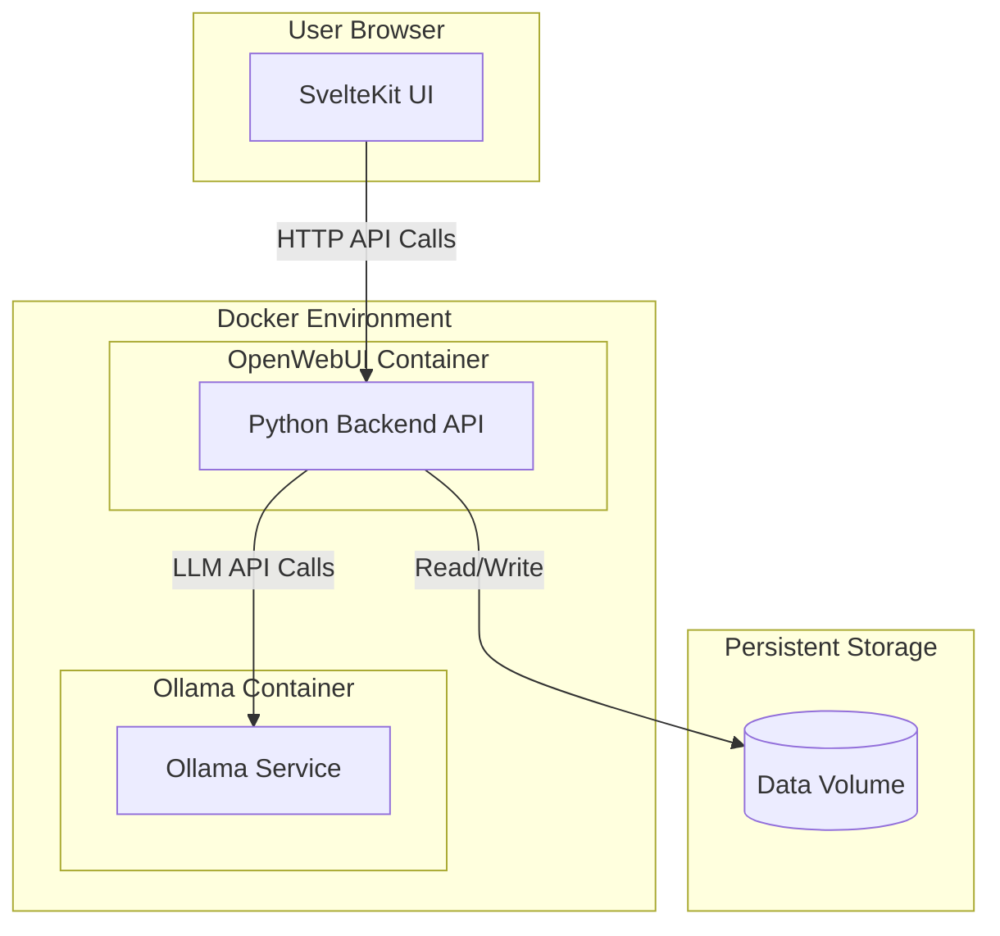

# Architecture: GPTPortal (Based on Open WebUI)

## Status: Draft (Reverse Engineered)

## Technical Summary
GPTPortal utilizes the Open WebUI platform, providing a web interface for interacting with Large Language Models (LLMs). The core architecture consists of a frontend UI, a backend API server, and an LLM service (typically Ollama). These components are containerized using Docker for ease of deployment and scalability. The system is designed to be extensible, particularly regarding information retrieval (RAG) capabilities, as outlined in the OpenWebUI roadmap. Communication between the frontend and backend is via HTTP requests, and the backend communicates with the LLM service over its API.

## Technology Stack
| Technology  | Component/Purpose              | Notes                                      |
|-------------|--------------------------------|--------------------------------------------|
| SvelteKit   | Frontend Framework             | Provides the reactive web user interface   |
| TypeScript  | Frontend/Backend Language      | Used for type safety in the frontend       |
| TailwindCSS | Frontend Styling               | Utility-first CSS framework                |
| Python      | Backend Language               | Handles API requests, business logic, LLM integration |
| FastAPI/Starlette | Backend Framework (likely) | High-performance Python web framework      |
| Ollama      | LLM Service                    | Primary backend for LLM interaction        |
| Docker      | Containerization               | Packages application components            |
| Docker Compose | Orchestration (Development)  | Defines and runs multi-container services  |
| Kubernetes  | Orchestration (Production)     | Support available for deployment           |
| SQLite/Files| Data Storage (Default)         | Persists user data/configs via volume mount|

## Architecture Diagrams
(High-level diagram to be added - illustrating Frontend -> Backend -> Ollama flow)


*Note: Diagram shows typical Docker Compose setup.*

## Project Structure (Key Components)
```
/src/                # Frontend SvelteKit application source
/backend/            # Backend Python application source
/static/             # Static assets for frontend
/Dockerfile          # Builds the combined frontend/backend container
/docker-compose*.yaml # Docker Compose files for service orchestration
/kubernetes/         # Kubernetes deployment manifests
/.ai/                # AI-assisted development documentation (PRD, Arch, Stories)
```

## Data Models/Schemas
- Primarily managed by the backend service.
- User data, chat history, settings, RAG documents stored in the `/app/backend/data` volume within the `open-webui` container.
- Specific schema details reside within the backend codebase (e.g., database models if using an ORM).

## Change Log
| Date        | Change                            | Story | Notes                                    |
|-------------|-----------------------------------|-------|------------------------------------------|
| $(date +%Y-%m-%d) | Initial Reverse Engineering       | -     | Draft architecture based on codebase analysis |
| ...         | ...                               | ...   | ...                                      |

*For more detailed component interactions and features, please refer to the official OpenWebUI documentation.*
