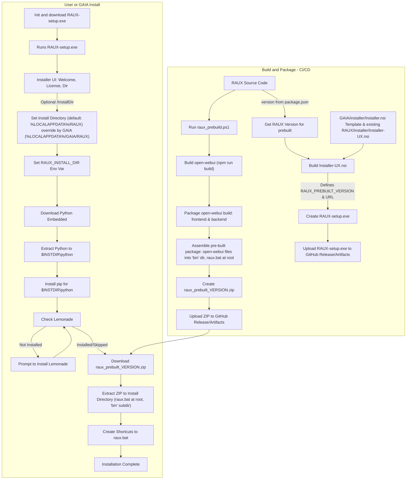

# RAUX Installer Refactoring Plan

## Goal
To create a stable and reliable installer for RAUX that deploys a pre-built, versioned package of the application, including a self-contained Python environment. This will simplify the user installation process and improve consistency.

## Phases

The process is divided into two main phases:
1.  **Build and Package:** Steps performed during CI/CD to prepare RAUX for distribution.
2.  **User Install:** Steps performed when a user runs the RAUX installer.

## Mermaid Flow Diagram



## Detailed Plan & Tasks

### Phase 1: Build and Package (CI/CD Pipeline)

- [ ] **1. Create `RAUX/installer/raux_prebuild.ps1` script:**
    This should use steps identify steps from current "build-release.yaml" and place them "raux_prebuild.ps1"

    - [ ] Takes RAUX application version as input (e.g., from `package.json` via GHA).
    - [ ] will build open-webui
    - [ ] Creates a temporary packaging directory (e.g., `_package`).
    - [ ] Creates `_package/bin/` directory.
    - [ ] Copies the built `open-webui` frontend assets into `_package/bin/open-webui/frontend/`.
    - [ ] Copies the `open-webui` backend Python code into `_package/bin/open-webui/backend/`.
    - [ ] Creates `raux.bat` (details in Task 3) and places it in `_package/raux.bat` (at the root of the ZIP contents).
    - [ ] Archives the contents of `_package` (which are `raux.bat` and the `bin/` directory) into a versioned ZIP file (e.g., `raux_prebuilt_vX.Y.Z.zip`). The ZIP structure should be:
        ```
        raux_prebuilt_vX.Y.Z.zip
        |- raux.bat
        |- bin/
            |- open-webui/
                |- frontend/
                    |- ... (static assets)
                |- backend/
                    |- main.py
                    |- ... (other backend python files)
        ```
    - [ ] Output: `raux_prebuilt_vX.Y.Z.zip`.
    - [ ] Update "build-release.yaml" to invoke "raux_prebuild.ps1" and create artifact and release


- [ ] **2. Update `RAUX/installer/Installer-UX.nsi` (NSIS Script):**
    - [ ] Remove GAIA-specific product names, GUIDs, and logic. Retain logging mechanisms.
    - [ ] **Define constants:**
        - `RAUX_PREBUILT_VERSION` (e.g., "v0.6.5+raux.0.1.1") - this will determine which prebuilt ZIP to download. This value will be passed from GHA, derived from `package.json`.
        - `RAUX_PREBUILT_URL_BASE` (e.g., GitHub release asset URL).
        - `PYTHON_EMBED_URL` (e.g., "https://www.python.org/ftp/python/3.11.X/python-3.11.X-embed-amd64.zip").
        - `GET_PIP_URL` (e.g., "https://bootstrap.pypa.io/get-pip.py").
        - `PRODUCT_NAME "RAUX"`.
        - `PROJECT_NAME "RAUX"`.
        - `PROJECT_NAME_CONCAT "raux"`.
        - `INSTALL_DIR_DEFAULT "$LOCALAPPDATA\RAUX"`.
        - Icon file path (e.g., `static/raux.ico`).
    - [ ] **Installer Pages:** Welcome, License, Directory (configurable via `/InstallDir` or UI), InstFiles, Finish.
    - [ ] **`.onInit` function:**
        - [ ] Parse `/InstallDir` command-line argument to override default install path.
    - [ ] **Main Installation Section (`Section "Install"`)**
        - [ ] Create the installation directory (`$INSTDIR`).
        - [ ] Set `RAUX_INSTALL_DIR` user environment variable to `$INSTDIR`.
        - [ ] Download and Install Python - do what we did in GAIA
        - [ ] **Lemonade Installation Check:**
            - [ ] Adapt logic from `GAIA/installer/Installer.nsi` to check if `lemonade-server` is available.
            - [ ] If not found, prompt the user to download and execute `Lemonade_Server_Installer.exe`.
        - [ ] **Download RAUX Pre-built Package:**
            - [ ] Construct download URL: `${RAUX_PREBUILT_URL_BASE}/raux_prebuilt_${RAUX_PREBUILT_VERSION}.zip`.
            - [ ] Download the ZIP to a temporary file (e.g., `$INSTDIR\raux_temp.zip`).
            - [ ] Follow GAIA python unzip steps for python; do the same for RAUX
            - [ ] Delete the temporary `raux_temp.zip`.
        - [ ] Add `$INSTDIR` to the user's PATH environment variable.
        - [ ] Implement robust logging for all steps.
    - [ ] **Shortcuts:**
        - [ ] Create Desktop shortcut for RAUX pointing to `$INSTDIR\raux.bat`.
        - [ ] Optionally, create Start Menu shortcut.

- [ ] **3. Create `raux.bat` launcher script:**
    - [ ] This script will be part of the `raux_prebuilt_VERSION.zip`.
    - [ ] **Location after extraction:** `$RAUX_INSTALL_DIR\raux.bat`.
    - [ ] **Content:**
        ```batch
        @echo off
        setlocal
        REM Get the directory of the batch script itself
        set "SCRIPT_DIR=%~dp0"
        REM Construct paths relative to the script's location
        set "PYTHON_EXE=%SCRIPT_DIR%python\python.exe"
        set "OPENWEBUI_ENTRY_POINT=%SCRIPT_DIR%bin\open-webui\backend\main.py" 

        REM Execute open-webui serve, passing all arguments
        echo Starting RAUX (Open WebUI)...
        "%PYTHON_EXE%" "%OPENWEBUI_ENTRY_POINT%" serve %*
        endlocal
        ```
    - *Sub-task: Verify `backend/main.py` is the correct entry point for `open-webui serve` command via the embedded python.*

- [ ] **4. Update GitHub Actions (`RAUX/.github/workflows/build-pr.yml` and `RAUX/.github/workflows/build-release.yml`):**
    - [ ] **Versioning:** Note that `package.json:version` is the source of truth. GHA workflows (`build-release.yml` already does this) will extract this version.
    - [ ] **Modify `build-and-package` job (or equivalent in both YML files):**
        - [ ] Existing `open-webui` build steps (`npm run build`) will be leveraged. The output is a set of files/directories, not a wheel.
        - [ ] Add step to execute `RAUX/installer/raux_prebuild.ps1` using the version from `package.json`. This script will consume the `open-webui` build outputs and Python to generate `raux_prebuilt_vX.Y.Z.zip`.
        - [ ] Upload `raux_prebuilt_vX.Y.Z.zip` as a workflow artifact.
        - [ ] For `build-release.yml`: Upload `raux_prebuilt_vX.Y.Z.zip` to the GitHub Release assets.
    - [ ] **Modify `publish-installer` job (Windows runner in both YML files):**
        - [ ] Ensure NSIS is installed.
        - [ ] Determine the `RAUX_PREBUILT_VERSION` (from `package.json`).
        - [ ] Build `RAUX/installer/Installer-UX.nsi` using `makensis.exe`.
            - Pass `RAUX_PREBUILT_VERSION` and `RAUX_PREBUILT_URL_BASE` (GitHub release URL for the ZIP) to `makensis` (e.g., `makensis /DRAUX_PREBUILT_VERSION=vX.Y.Z /DRAUX_PREBUILT_URL_BASE=https://... Installer-UX.nsi`).
        - [ ] Rename the output installer (e.g., `RAUX-Installer-vA.B.C.exe`).
        - [ ] Upload the `RAUX-Installer-vA.B.C.exe` as a workflow artifact / GitHub Release asset.

- [ ] **5. Remove Obsolete Files:**
    - [ ] Delete `RAUX/installer/launch_raux.ps1`.
    - [ ] Delete `RAUX/installer/launch_raux.cmd`.
    - [ ] Delete `RAUX/installer/raux_installer.py` (as its functionality is replaced by the pre-built ZIP and simplified NSIS script).

### Phase 2: User Install (Handled by `RAUX-Installer-vA.B.C.exe`)

- This phase is primarily about the execution of the NSIS installer built in Phase 1.
- [ ] **Testing User Experience:**
    - [ ] Test running `RAUX-Installer-vA.B.C.exe` standalone.
    - [ ] Test command-line installation with `/InstallDir`.
    - [ ] Test scenario where Lemonade is not installed.
    - [ ] Test scenario where Lemonade is already installed.
    - [ ] Verify `RAUX_INSTALL_DIR` environment variable is set correctly.
    - [ ] Verify PATH environment variable is updated correctly.
    - [ ] Verify RAUX launches and functions correctly from the installed location using `raux.bat`.
    - [ ] (If applicable) Test integration if GAIA's installer needs to call this RAUX installer.

This plan provides a detailed roadmap. We can break these down further as we start implementing each part.
