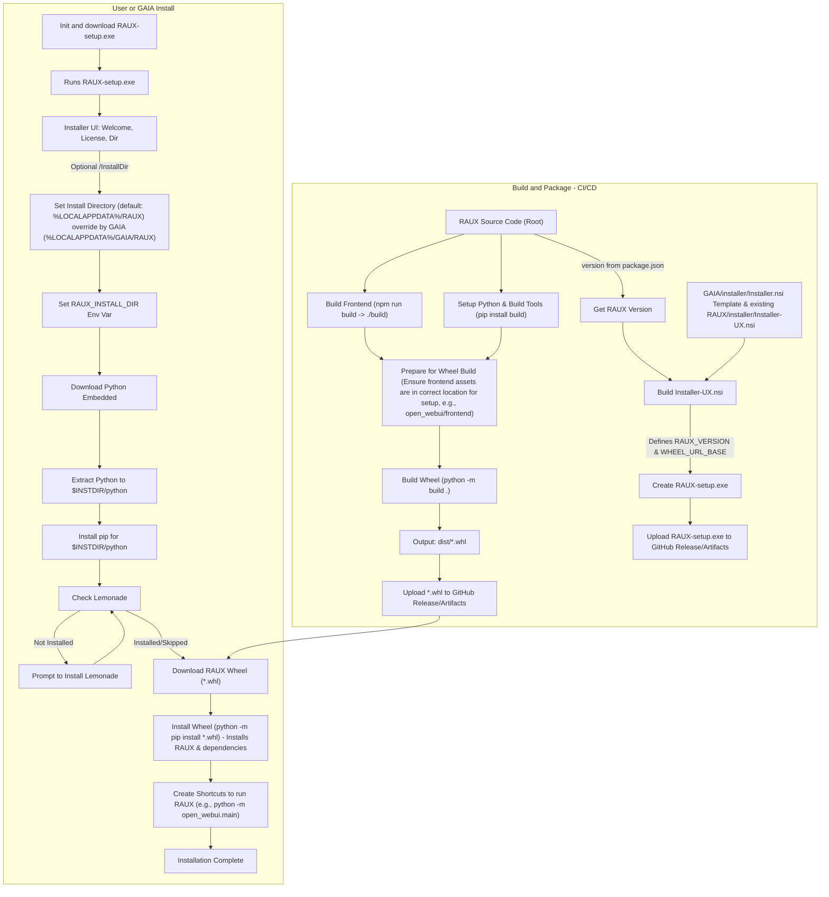

# Plan for Packaging RAUX using Python Wheels for Installer

## Goal
Create a standard Python wheel (`.whl`) file for RAUX (OpenWebUI) that includes the backend code and the built frontend assets. This wheel will be used by the NSIS-based installer (`Installer-UX.nsi` and associated scripts) for deployment, leveraging `pip` for installation and dependency management.

## Phases

1.  **Build and Package:** Steps performed during CI/CD to prepare the RAUX wheel.
2.  **User Install:** Steps performed when a user runs the RAUX installer (`RAUX-setup.exe`).

## Mermaid Flow Diagram (Revised for Wheel Approach)



## Detailed Plan & Tasks (Wheel Approach)

### Phase 1: Build and Package (CI/CD Pipeline)

- [ ] **1. Configure Wheel Build (`pyproject.toml` / `hatch_build.py`):**
    - [ ] Ensure `pyproject.toml` correctly defines metadata (package name, version, author, description).
    - [ ] **Crucially, ensure all runtime Python dependencies** (like `fastapi`, `uvicorn`, `numpy`, etc., from `backend/requirements.txt`) are listed in the `[project]` section's `dependencies` array in `pyproject.toml`. This allows `pip` to install them automatically when the wheel is installed.
    - [ ] **Frontend Integration:** The build process (likely customized in `hatch_build.py` or similar build backend hook) must ensure that the built frontend assets (from `RAUX/build/`) are copied into the correct location *within the wheel* (e.g., `open_webui/frontend/`) before the wheel is finalized. *The current `hatch_build.py` seems set up for this.*

- [ ] **2. Refine `RAUX/installer/raux_prebuild` Script:**
    - [ ] **`build_frontend`:** Remains the same (`npm run build` in root).
    - [ ] **`build_backend`:** Can likely be simplified or removed if `python -m build` handles dependency installation for the build environment itself. Its primary role now is potentially just validating `requirements.txt` if needed, as the actual dependency list for distribution comes from `pyproject.toml`.
    - [ ] **`package_solution`:** This function is **no longer needed** for creating a custom ZIP. The wheel building command will handle packaging.

- [ ] **3. Update GitHub Actions (`build-release.yml`):**
    - [ ] **`prebuild` Job:**
        - [ ] Runs `bash installer/raux_prebuild --build-frontend`.
        - [ ] (Optional) Runs `bash installer/raux_prebuild --build-backend` if still needed for validation/caching.
        - [ ] **Does NOT run `package_solution`.**
    - [ ] **`build-and-package` Job:**
        - [ ] Installs build dependencies (`pip install build`).
        - [ ] **Runs the wheel build command:** `python -m build .` (assuming `pyproject.toml` is in the root and configured correctly). This generates the `.whl` file in `dist/`.
        - [ ] **Upload Wheel Artifact:** Uploads the generated `dist/*.whl` file using `actions/upload-artifact@v4` (e.g., name `wheel-artifact`).
        - [ ] **Upload Wheel to Release:** Uploads `dist/*.whl` to GitHub Release assets using `softprops/action-gh-release` or equivalent.
    - [ ] **`publish-installer` Job:**
        - [ ] Installs NSIS.
        - [ ] Determines `RAUX_VERSION` (from `package.json`).
        - [ ] **Build Installer (`Installer-UX.nsi`):**
            - Use `makensis.exe`.
            - Pass `RAUX_VERSION` and the base URL for downloading the wheel from the release (e.g., `WHEEL_URL_BASE`) to `makensis` (e.g., `makensis /DRAUX_VERSION=vX.Y.Z /DWHEEL_URL_BASE=https://... Installer-UX.nsi`).
        - [ ] Rename the output installer (`RAUX-Installer-vA.B.C.exe`).
        - [ ] Upload the installer `.exe` as a workflow artifact / GitHub Release asset.

- [ ] **4. Update `RAUX/installer/Installer-UX.nsi` (NSIS Script):**
    - [ ] Define constants:
        - `RAUX_VERSION` (passed from GHA).
        - `WHEEL_URL_BASE` (GitHub release asset URL base, passed from GHA).
        - Python embed/pip URLs, Product Name, etc. (as before).
    - [ ] **Main Installation Section:**
        - [ ] Install Python and pip (as before).
        - [ ] Check/Prompt for Lemonade (as before).
        - [ ] **Download RAUX Wheel:**
            - Construct wheel download URL (e.g., `${WHEEL_URL_BASE}/open_webui-${RAUX_VERSION}-py3-none-any.whl`). *Note: Exact filename format depends on the build.*
            - Download the `.whl` file to `$INSTDIR\raux_package.whl`.
        - [ ] **Install RAUX Wheel:**
            - Execute: `"$INSTDIR\python\python.exe" -m pip install "$INSTDIR\raux_package.whl"`
            - `pip` will automatically read metadata from the wheel and install required dependencies from PyPI.
        - [ ] Delete the downloaded `$INSTDIR\raux_package.whl`.
        - [ ] Add Python Scripts dir to PATH? (Or rely on launcher script).
    - [ ] **Shortcuts:**
        - [ ] Create shortcuts (Desktop/Start Menu) that execute the installed RAUX application. This likely involves calling the installed Python environment and using the package's entry point. See Task 5.

- [ ] **5. Define `raux.bat` (or equivalent launcher):**
    - [ ] A launcher script is still useful to ensure the correct Python environment is used.
    - [ ] **Location:** Could be placed in `$INSTDIR` by the NSIS installer (not part of the wheel).
    - [ ] **Content:**
        ```batch
        @echo off
        setlocal
        REM Get the directory of the batch script itself (%INSTDIR%)
        set "SCRIPT_DIR=%~dp0"
        REM Path to the Python installed by this installer
        set "PYTHON_EXE=%SCRIPT_DIR%python\python.exe"

        REM Check if Python exists
        if not exist "%PYTHON_EXE%" (
            echo ERROR: Python executable not found at "%PYTHON_EXE%"
            pause
            exit /b 1
        )

        REM Execute the installed open_webui package's main entry point
        echo Starting RAUX (Open WebUI)...
        "%PYTHON_EXE%" -m open_webui.main serve %* 

        REM Optional: Check exit code if needed
        REM if %ERRORLEVEL% neq 0 (
        REM     echo RAUX exited with error code %ERRORLEVEL%
        REM     pause
        REM )
        endlocal
        ```
    - *NSIS needs to create this file during installation.*

- [ ] **6. Remove Obsolete Files:** (As before, if not already done)
    - [ ] Delete `RAUX/installer/launch_raux.ps1`, `launch_raux.cmd`, `raux_installer.py`.

### Phase 2: User Install (Handled by `RAUX-Installer-vA.B.C.exe`)

- Installer downloads and installs Python.
- Installer downloads the specific RAUX `.whl` file from the release.
- Installer runs `pip install <downloaded_wheel_file>.whl`.
- Installer creates shortcuts pointing to `raux.bat` (or directly to `python -m open_webui.main` if PATH is reliably set).
- [ ] **Testing User Experience:** (Similar to previous plan, but verify pip dependency installation works correctly).

## Considerations
*   **`pyproject.toml` is Key:** The accuracy of the `dependencies` list in `pyproject.toml` is critical for `pip` to install everything correctly.
*   **Network Access:** The user install process now relies on network access during `pip install <wheel>` to fetch dependencies. Offline installation would require pre-downloading wheels for all dependencies, which is more complex.
*   **Build Backend Hooks:** Ensure the `hatch_build.py` (or alternative) correctly includes the frontend assets *before* the wheel is built.
*   **Launcher Script:** The `raux.bat` script assumes `open_webui.main` is the correct module entry point. Verify this.

