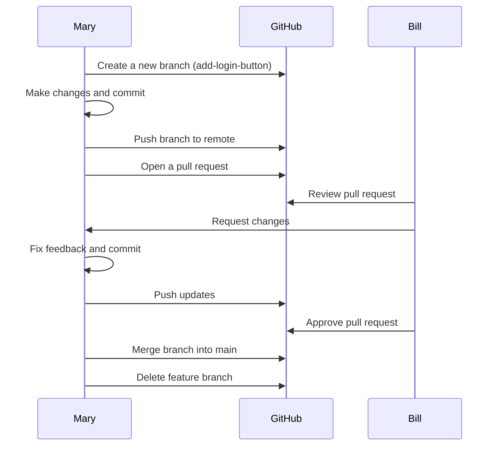

# Contributing Guide

## Development Guidelines

### Code Quality Tools

1. Pre-commit setup:
   ```bash
   pre-commit install
   ```

2. Configured hooks:
   - YAML checking
   - End-of-file fixer
   - Trailing whitespace removal
   - Ruff (linting + formatting)
   - MyPy (type checking)

### Coding Standards
- Follow PEP 8 guidelines.
- Use type hints consistently.
- Maximum line length: 130 characters.
- Use single quotes for strings.

### Commit Guidelines
Use Commitizen for standardized commits:
```bash
git cz
```

## Git Strategy: Feature branch

The **Git Feature Branch Workflow** is a way to work on new features in a project without messing up the main code. Instead of working directly on the `main` branch (the "official" code), you create a separate branch for each feature. This keeps the `main` branch clean and stable.

---

## How It Works (Diagram)


**Example:**
```bash
git branch -d add-login-button
git push origin --delete add-login-button
```


**Example Workflow (Diagram)**

Here’s an example of how Mary uses this workflow:



---

## General Step-by-Step Instructions

### 1. Start with the main branch
Make sure your local main branch is up-to-date with the latest code from the central repository.

```bash
git checkout main
git fetch origin
git reset --hard origin/main
```

### 2. Create a new branch for your feature
Create a branch for your feature. Use a clear name that describes what you’re working on, like `add-login-button` or `fix-bug-123`.

```bash
git checkout -b your-branch-name
```

**Example:**
```bash
git checkout -b add-login-button
```

### 3. Work on your feature
Make changes to the code. After making changes, save your work by following these steps:

- Check what files you’ve changed:
  ```bash
  git status
  ```

- Add the files you want to save:
  ```bash
  git add <file-name>
  ```

  **Example:**
  ```bash
  git add index.html
  ```

- Save your changes with a message:
  ```bash
  git commit -m "Describe what you changed"
  ```

  **Example:**
  ```bash
  git commit -m "Added login button to homepage"
  ```

### 4. Push your branch to the remote repository
To back up your work and share it with others, push your branch to the central repository.

```bash
git push -u origin your-branch-name
```

**Example:**
```bash
git push -u origin add-login-button
```

### 5. Open a pull request
Go to your Git hosting platform (like GitLab) and open a pull request. This is how you ask your team to review your changes and approve them before adding them to the main branch.

### 6. Fix feedback from reviewers
If your teammates suggest changes, follow these steps to update your branch:

- Make the changes locally.
- Save the changes:
  ```bash
  git add <file-name>
  git commit -m "Fixed feedback"
  git push
  ```

### 7. Merge your branch into main
Once your pull request is approved, it’s time to merge your branch into the main branch.

- Switch to the main branch:
  ```bash
  git checkout main
  ```

- Update your local main branch:
  ```bash
  git pull
  ```

- Merge your feature branch into main:
  ```bash
  git merge your-branch-name
  ```

- Push the updated main branch to the remote repository:
  ```bash
  git push
  ```

### 8. Delete your feature branch
After merging, delete your feature branch to keep things clean.

- Delete the branch locally:
  ```bash
  git branch -d your-branch-name
  ```

- Delete the branch from the remote repository:
  ```bash
  git push origin --delete your-branch-name
  ```


## Summary

- Create a branch for each feature.
- Work on your branch without touching `main`.
- Push your branch to back up your work.
- Open a pull request to get feedback and approval.
- Merge your branch into `main` when it’s ready.
- Delete your branch after merging.

By following these steps, you’ll keep the `main` branch clean and make it easy for your team to collaborate.
