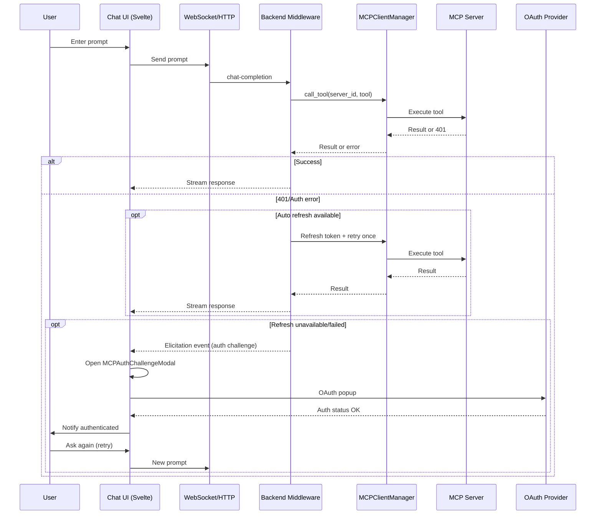

### MCP_IMPLEMENTATION

This document explains the end-to-end MCP integration in Open WebUI: how servers and tools are defined, how tool calls flow through the backend to the frontend, and how authentication challenges (401) are surfaced and handled in the UI.

### Overview

- Backend adds MCP servers (HTTP Stream transport), manages OAuth and tokens, syncs tools into the tool registry, and injects dynamic MCP tool callables into the chat toolset.
- Frontend exposes:
  - Workspace UI to add/test/sync MCP servers and tools with OAuth support.
  - Chat UI that invokes tools; on 401 or auth errors it shows an MCP auth modal and supports retry after authentication.
  - Opt in by enabling the MCP option in Admin -> General

## Backend

- MCP core and client manager
  - `backend/open_webui/utils/mcp/manager.py`: Connection lifecycle and client registry (`MCPClientManager`) for MCP HTTP-stream clients by `server_id`.
  - `backend/open_webui/utils/mcp/core.py`, `.../auth.py`, `.../common.py`, `.../exceptions.py`, `.../validation.py`: Core protocol helpers, auth management, common utilities, domain exceptions, and validations.
  - `backend/open_webui/utils/mcp_client_official.py`: Compatibility shim re-exporting the modular MCP package surface; referenced by routers. Keep.

- Tool injection into chat
  - `backend/open_webui/utils/middleware.py`:
    - Function: `chat_completion_tools_handler(...)` injects callables for tools whose `tool_id` starts with `mcp:` in the current tool set.
    - For each `mcp:{server_id}:{tool_name}` tool, gets a client from `MCPClientManager` and attaches an async callable that calls `client.call_tool(...)`.
    - On exceptions, detects `MCPAuthenticationError` and emits an elicitation payload back through the normal chat eventing so the frontend can prompt for auth.
      - Elicitation fields used:
        - `type: 'elicitation'`
        - `data: { elicitation_type: 'oauth_authentication' | 'manual_authentication', title, message, server_id, server_name, tool_name, challenge_type, requires_reauth, can_auto_auth, auth_url?, instructions?, error_message }`

- MCP servers API (management)
  - `backend/open_webui/routers/mcp_servers.py`: CRUD for MCP servers; validates HTTP Stream URL and allowlist; encrypts headers; runs connection test; non-blocking tool sync; endpoints for OAuth start/status/test flows.
  - `backend/open_webui/models/mcp_servers.py`: DB models and forms (`MCPServer`, `MCPServerForm`, `MCPServerUpdateForm`), OAuth configuration schema, server status.
  - `backend/open_webui/utils/mcp_tools.py`: Sync MCP tools to DB and generate wrappers; provides server tool synchronization logic.
  - Validation utilities for server connection and error reporting (`.../validation.py`), plus dedicated encryption-mismatch handling.

- MCP tools API (execution)
  - `backend/open_webui/routers/mcp_tools.py`:
    - `GET /servers/{server_id}/tools`: list available tools from a connected server.
    - `POST /servers/{server_id}/tools/{tool_name}/call`: run tool. Supports streaming (SSE-like) or non-stream responses. Errors propagate with detail; encryption mismatch uses structured error.
    - Streaming endpoint yields start/progress/complete/error events.

- Integration with chat tools
  - `backend/open_webui/utils/middleware.py` is the central path where chat requests are assembled and tools are injected; MCP tools become dynamically callable in the same tool framework as other tools.

- Token refresh (background)
  - On 401/auth errors during a tool call, the MCP client attempts a transparent token refresh and a single retry automatically (see `backend/open_webui/utils/mcp/client.py`: logs "Attempting token refresh and retry"). If refresh succeeds, the call proceeds without user interaction. If refresh fails or no refresh token is available, an `MCPAuthenticationError` is raised, which is translated into an elicitation event so the frontend can prompt the user to authenticate.

- Admin allowlist (domain restrictions)
  - When creating or updating an MCP server, the HTTP URL is validated against an admin-configured domain allowlist. Enforcement occurs via `validate_mcp_allowlist(request, url)` in `backend/open_webui/utils/mcp/common.py`, called from `backend/open_webui/routers/mcp_servers.py`. If the allowlist is set (`request.app.state.config.MCP_SERVER_ALLOWLIST`) and the server domain is not an exact or subdomain match, the request is rejected with 403. This ensures only approved domains can be added by users.

## Frontend

- APIs
  - `src/lib/apis/mcp_servers/index.ts`:
    - Lists, creates, updates, toggles, and deletes MCP servers; supports test endpoints, OAuth discovery/start/status, and batch sync APIs.
    - Returns structured error responses for authentication challenges so the UI can show the modal.

- Workspace UI (server management)
  - `src/lib/components/workspace/MCPServers.svelte`: Main UI for listing servers, opening the server modal, testing connections, syncing tools, and showing the MCP auth challenge modal on structured auth errors. Uses:
    - `src/lib/components/mcp/MCPServerModal.svelte`: Create/update modal; integrates:
    - `src/lib/components/mcp/DynamicOAuthConfig.svelte`: Connect/test flow, OAuth discovery and start, status polling, and manual header configuration. Also visual feedback for connection and tools.
    - `src/lib/components/mcp/MCPAuthChallengeModal.svelte`: Generic auth modal for OAuth/manual challenges (accepts `elicitationData` shape described above). On successful OAuth, dispatches `authenticated`.
  - Routes:
    - `src/routes/(app)/workspace/mcp-servers/+page.svelte` imports the workspace component.

- Chat UI (auth challenges and retry)
  - `src/lib/components/chat/Chat.svelte`:
    - Hooks to socket `'chat-events'`; when a `type: 'elicitation'` message arrives, uses MCP auth handler to detect auth challenge and open the modal.
    - `src/lib/utils/mcp-auth-handler.ts`:
      - `isAuthChallenge(...)` checks for `elicitation_type` or 401 and other indicative flags.
      - `handleAuthChallenge(...)` standardizes state and triggers the modal (`MCPAuthChallengeModal`).
      - `handleAuthSuccess` and `handleAuthSuccessWithRetry` support closing the modal and signaling a retry through a preserved event callback.
    - After authentication, the user can ask again (retry) from the chat UI.

- Chat modal
  - `src/lib/components/mcp/MCPAuthChallengeModal.svelte`:
    - Props: `show`, `elicitationData` (standardized structure).
    - Supports OAuth flow via popup and status polling (`/api/v1/mcp-servers/{server_id}/oauth/status`).
    - Emits:
      - `authenticated` (user then asks again)
      - `cancelled`

## Data flow

1. User message is sent; chat backend assembles tools set.
2. Middleware injects MCP tool callables for `mcp:{server_id}:{tool_name}` from `MCPClientManager`.
3. When a tool is invoked:
   - Success: returns content that is merged into chat stream.
   - Auth error (e.g., 401, expired token): backend raises `MCPAuthenticationError`; middleware packages elicitation details; event streamed to frontend.
4. Frontend chat receives `type: 'elicitation'` event and opens the MCP auth modal.
5. User authenticates (OAuth popup) or acknowledges manual instructions.
6. On successful OAuth, user can ask again.
7. Tool result is delivered; chat continues as normal.

## Diagram

## Files index

Backend
- `backend/open_webui/utils/mcp/manager.py`: MCP client manager.
- `backend/open_webui/utils/mcp/*.py`: core, auth, validation, exceptions, common helpers.
- `backend/open_webui/utils/mcp_tools.py`: tool sync and wrappers.
- `backend/open_webui/routers/mcp_servers.py`: server CRUD + OAuth endpoints.
- `backend/open_webui/routers/mcp_tools.py`: list tools, call tool (stream/non-stream).
- `backend/open_webui/utils/middleware.py`: injects MCP tools and translates auth exceptions into elicitation events.
- `backend/open_webui/models/mcp_servers.py`: models and forms.
- `backend/open_webui/utils/mcp_client_official.py`: compatibility shim.

Frontend
- APIs: `src/lib/apis/mcp_servers/index.ts`
- Workspace:
  - `src/lib/components/workspace/MCPServers.svelte`
  - `src/lib/components/mcp/MCPServerModal.svelte`
  - `src/lib/components/mcp/DynamicOAuthConfig.svelte`
  - `src/lib/components/mcp/MCPAuthChallengeModal.svelte`
  - Route: `src/routes/(app)/workspace/mcp-servers/+page.svelte`
- Chat:
  - `src/lib/components/chat/Chat.svelte` (elicitation handling, modal wiring)
  - `src/lib/utils/mcp-auth-handler.ts` (auth detection and modal state)

Summary
- MCP is integrated by dynamically injecting MCP tools into the chat toolset.
- Auth challenges are surfaced via elicitation messages from backend to the chat.
- Workspace provides server/OAuth management and sync utilities.
- The chat displays an MCP auth challenge modal. After successful authentication, the user asks again to retry.