# Open WebUI Automation Features - Architecture

## Overview

This document describes the architecture of three new automation features for Open WebUI:

1. **N8N Integration**: Workflow automation via N8N webhooks
2. **Auto Memory**: Automatic conversation fact extraction using NER
3. **AutoTool Filter**: Semantic tool matching and suggestion

---

## System Architecture

### High-Level Component Diagram

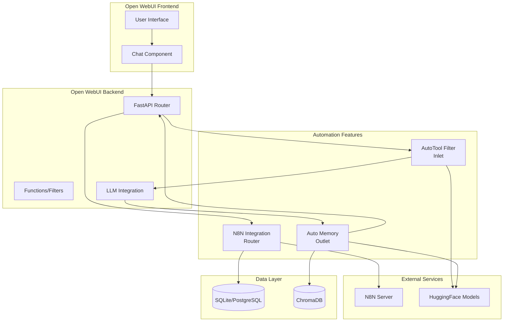

---

## Request Flow

### Complete Request/Response Cycle

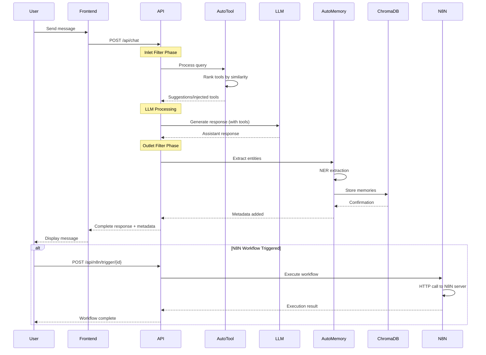

---

## N8N Integration Architecture

### Component Structure

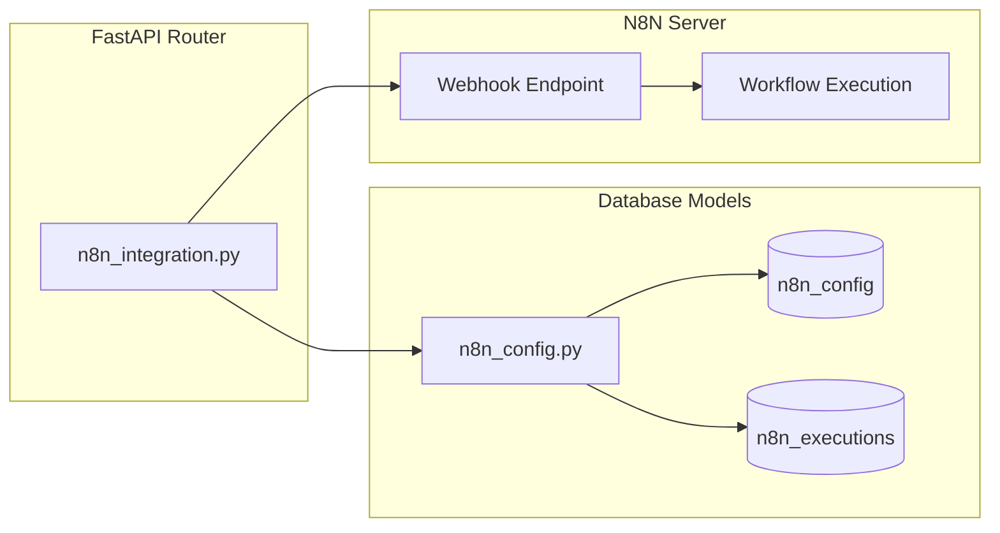

### N8N Trigger Flow (Non-Streaming)

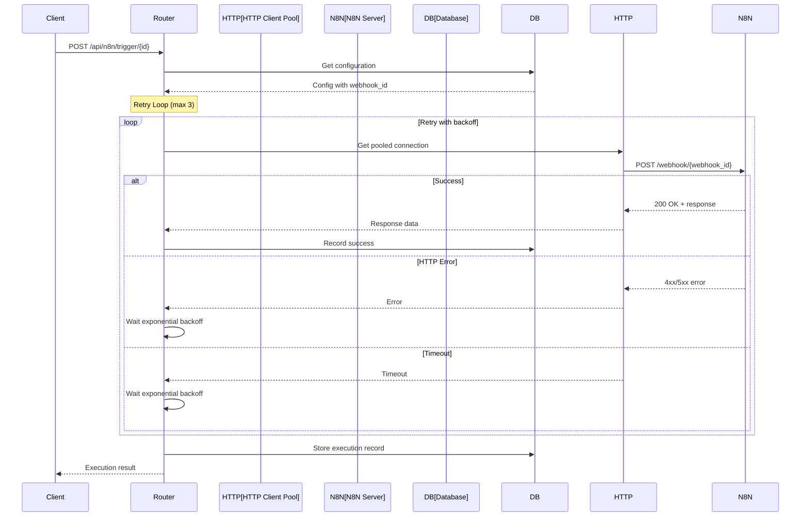

### N8N Streaming Flow (SSE)

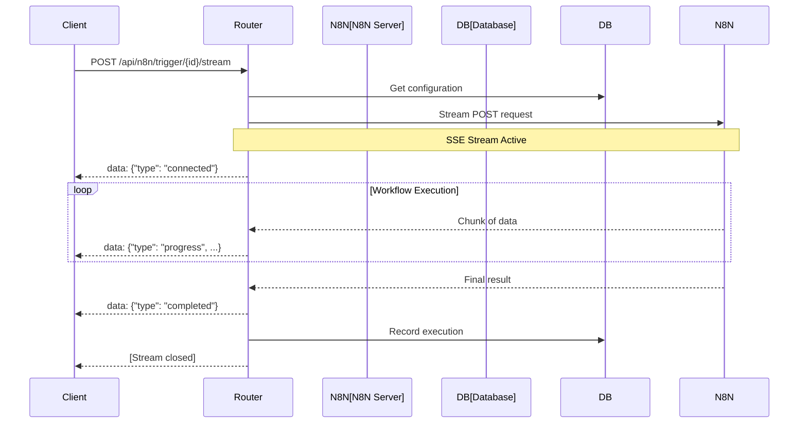

### Database Schema

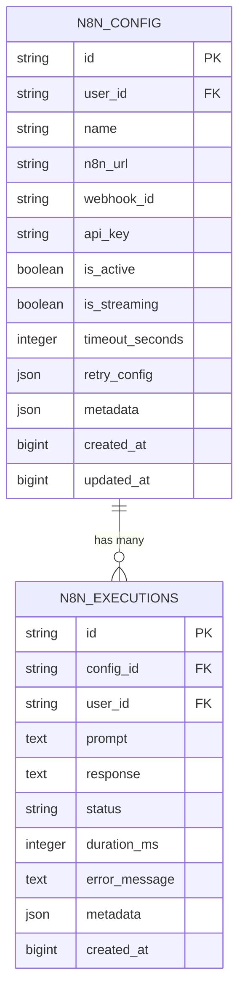

---

## Auto Memory Architecture

### Component Structure

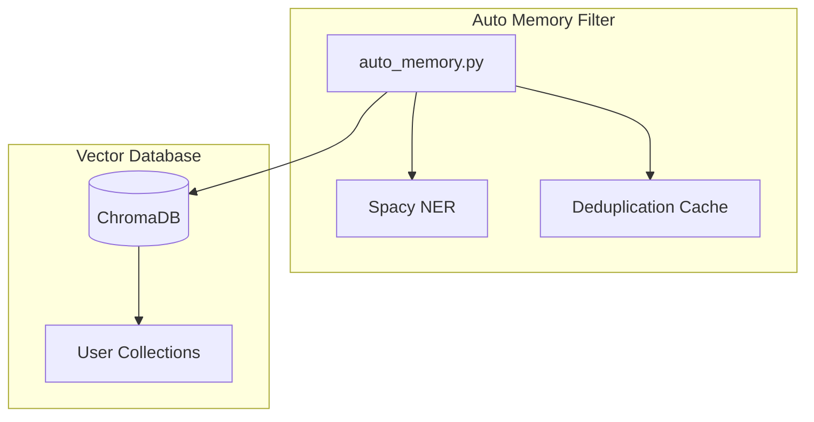

### Memory Extraction Flow

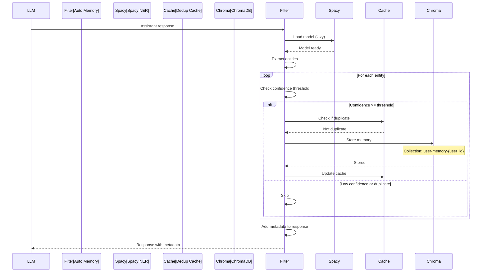

### Entity Extraction Process

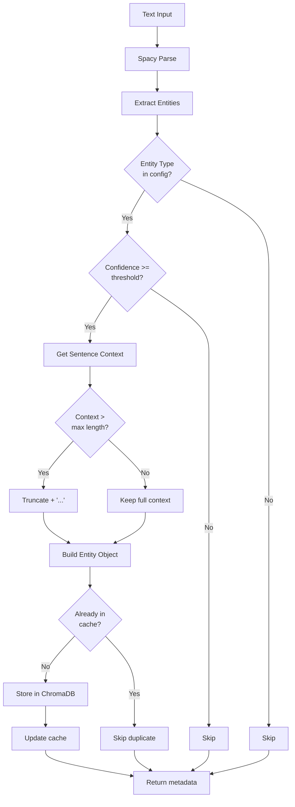

### ChromaDB Storage Structure

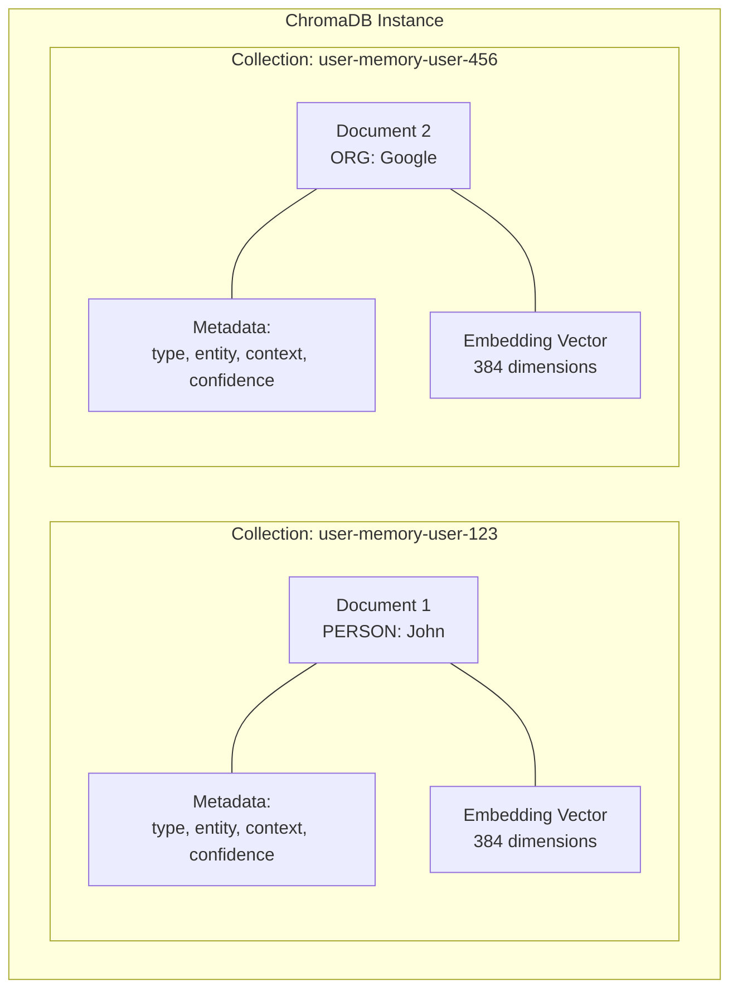

---

## AutoTool Filter Architecture

### Component Structure

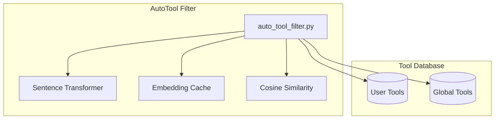

### Tool Matching Flow

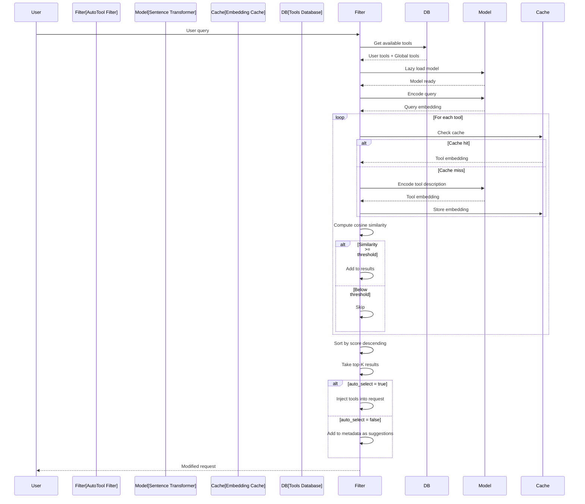

### Similarity Computation

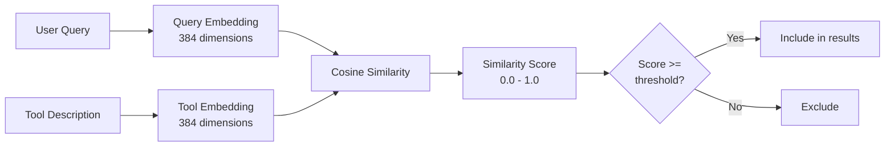

### Cache Eviction Strategy

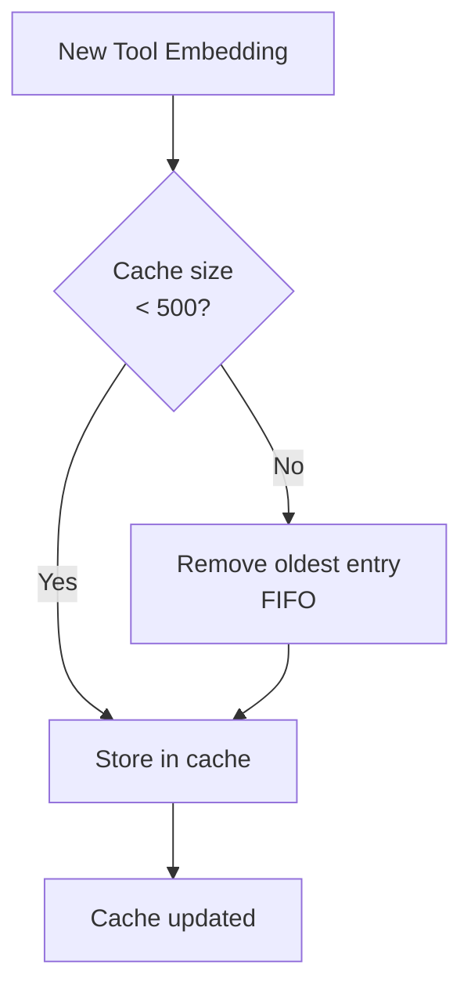

---

## Integration Points

### Filter Execution Order

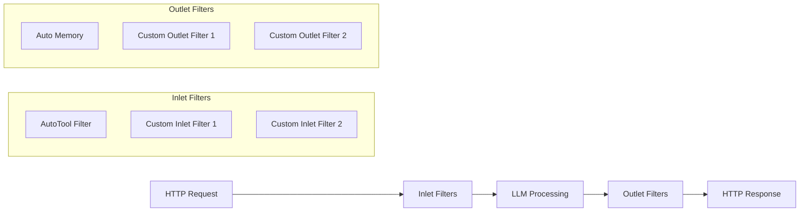

### Database Integration

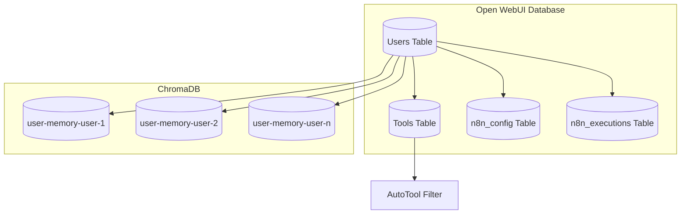

---

## Performance Characteristics

### Latency Breakdown

```mermaid
gantt
    title Request Processing Timeline (typical)
    dateFormat X
    axisFormat %L ms

    section AutoTool Filter
    Get tools from DB    :a1, 0, 20ms
    Encode query         :a2, after a1, 50ms
    Compute similarities :a3, after a2, 30ms

    section LLM Processing
    LLM API call        :b1, after a3, 1000ms

    section Auto Memory
    NER extraction      :c1, after b1, 150ms
    ChromaDB storage    :c2, after c1, 50ms
```

### Memory Usage

| Component | Memory | Notes |
|-----------|--------|-------|
| Spacy Model (`en_core_web_sm`) | ~40MB | Lazy loaded |
| Sentence Transformer (`all-MiniLM-L6-v2`) | ~80MB | Lazy loaded |
| Auto Memory Cache | ~100KB | Max 1000 entries |
| AutoTool Cache | ~750KB | Max 500 entries, 384-dim vectors |
| N8N HTTP Client | ~5MB | Connection pool |
| **Total Overhead** | **~125MB** | Per worker process |

---

## Scaling Considerations

### Horizontal Scaling

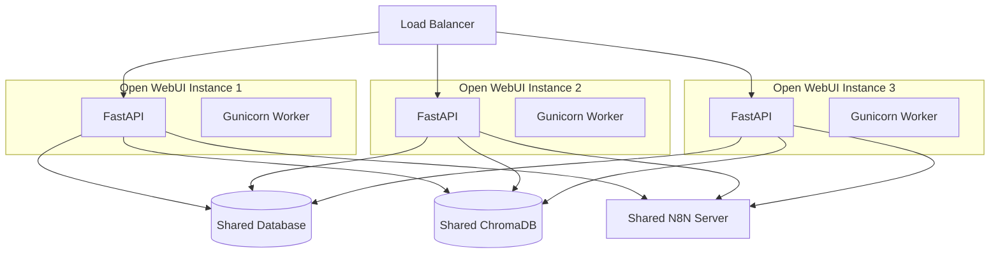

### Caching Strategy

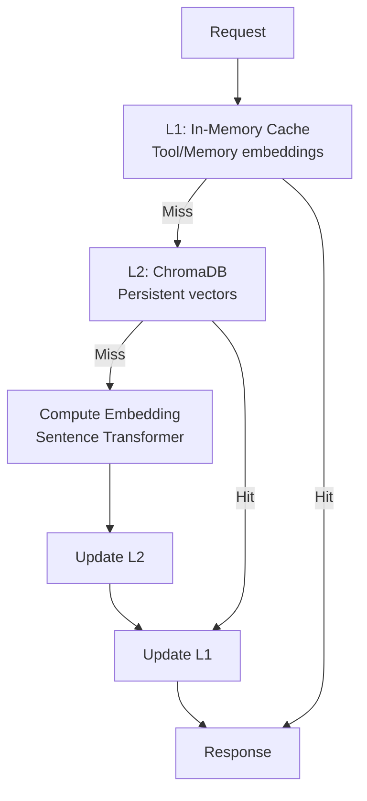

---

## Security Architecture

### Authentication Flow

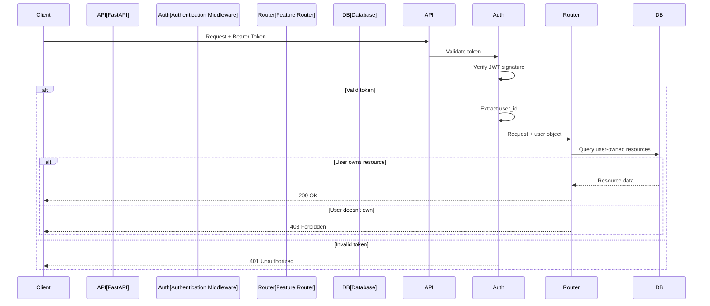

### Data Isolation

```mermaid
graph TB
    subgraph "User A"
        A_Request[Request]
        A_N8N[N8N Configs]
        A_Memory[ChromaDB Collection]
    end

    subgraph "User B"
        B_Request[Request]
        B_N8N[N8N Configs]
        B_Memory[ChromaDB Collection]
    end

    subgraph "Database"
        DB[(Database)]
    end

    subgraph "ChromaDB"
        Chroma[(ChromaDB)]
    end

    A_Request --> A_N8N
    A_Request --> A_Memory
    B_Request --> B_N8N
    B_Request --> B_Memory

    A_N8N --> DB
    B_N8N --> DB
    A_Memory --> Chroma
    B_Memory --> Chroma

    A_N8N -.x B_N8N
    A_Memory -.x B_Memory

    style A_N8N fill:#e1f5e1
    style A_Memory fill:#e1f5e1
    style B_N8N fill:#ffe1e1
    style B_Memory fill:#ffe1e1
```

---

## Deployment Architecture

### Production Deployment

```mermaid
graph TB
    subgraph "Frontend (Nginx)"
        Nginx[Nginx Reverse Proxy]
    end

    subgraph "Backend Cluster"
        API1[Open WebUI Instance 1]
        API2[Open WebUI Instance 2]
        API3[Open WebUI Instance 3]
    end

    subgraph "Data Layer"
        PG[(PostgreSQL<br/>Primary)]
        PG_Replica[(PostgreSQL<br/>Replica)]
        ChromaCluster[(ChromaDB Cluster)]
    end

    subgraph "External Services"
        N8N[N8N Server]
        HF[HuggingFace API]
    end

    Nginx --> API1
    Nginx --> API2
    Nginx --> API3

    API1 --> PG
    API2 --> PG
    API3 --> PG

    API1 --> PG_Replica
    API2 --> PG_Replica
    API3 --> PG_Replica

    API1 --> ChromaCluster
    API2 --> ChromaCluster
    API3 --> ChromaCluster

    API1 --> N8N
    API2 --> N8N
    API3 --> N8N

    API1 --> HF
    API2 --> HF
    API3 --> HF
```

---

## Error Handling

### N8N Retry Flow

```mermaid
flowchart TD
    Start[Trigger Workflow] --> Attempt1[Attempt 1: Immediate]

    Attempt1 --> Success1{Success?}
    Success1 -->|Yes| Done[Return Success]
    Success1 -->|No| Wait1[Wait 2^0 = 1s]

    Wait1 --> Attempt2[Attempt 2: After 1s]
    Attempt2 --> Success2{Success?}
    Success2 -->|Yes| Done
    Success2 -->|No| Wait2[Wait 2^1 = 2s]

    Wait2 --> Attempt3[Attempt 3: After 2s]
    Attempt3 --> Success3{Success?}
    Success3 -->|Yes| Done
    Success3 -->|No| Wait3[Wait 2^2 = 4s]

    Wait3 --> Attempt4[Attempt 4: After 4s]
    Attempt4 --> Success4{Success?}
    Success4 -->|Yes| Done
    Success4 -->|No| Failed[Return Failed]

    Failed --> Record[Record execution with error]
    Record --> End[End]

    Done --> Record2[Record execution as success]
    Record2 --> End
```

---

## Monitoring & Observability

### Metrics Collection Points

```mermaid
graph TB
    subgraph "Request Metrics"
        ReqRate[Request Rate]
        ReqLatency[Request Latency]
        ReqErrors[Error Rate]
    end

    subgraph "N8N Metrics"
        N8NSuccess[Success Rate]
        N8NLatency[Workflow Duration]
        N8NRetries[Retry Count]
    end

    subgraph "Auto Memory Metrics"
        MemExtracted[Entities Extracted]
        MemStored[Entities Stored]
        MemDedup[Deduplications]
    end

    subgraph "AutoTool Metrics"
        ToolSuggestions[Suggestions Made]
        ToolInjections[Auto-Injections]
        ToolCacheHits[Cache Hit Rate]
    end

    subgraph "Monitoring Stack"
        Prometheus[Prometheus]
        Grafana[Grafana Dashboard]
    end

    ReqRate --> Prometheus
    ReqLatency --> Prometheus
    ReqErrors --> Prometheus
    N8NSuccess --> Prometheus
    N8NLatency --> Prometheus
    N8NRetries --> Prometheus
    MemExtracted --> Prometheus
    MemStored --> Prometheus
    MemDedup --> Prometheus
    ToolSuggestions --> Prometheus
    ToolInjections --> Prometheus
    ToolCacheHits --> Prometheus

    Prometheus --> Grafana
```

---

## Future Enhancements

### Roadmap Architecture

```mermaid
timeline
    title Feature Roadmap

    section Q1 2025
        Multi-Language Support : Auto Memory NER for non-English
                                : AutoTool multi-language queries

    section Q2 2025
        Advanced Analytics : N8N workflow insights dashboard
                          : Memory relationship graph

    section Q3 2025
        Performance : Persistent embedding cache
                    : GPU acceleration for NER

    section Q4 2025
        AI Enhancements : LLM-powered tool selection
                        : Semantic memory search
```

---

## Conclusion

This architecture provides:

✅ **Modularity**: Each feature is independent and can be disabled
✅ **Scalability**: Horizontal scaling with shared data layer
✅ **Performance**: Caching and connection pooling optimize latency
✅ **Security**: User isolation and authentication at all layers
✅ **Extensibility**: Easy to add new filters or integrations

---

**Version**: 1.0.0
**Last Updated**: 2025-11-01
**Author**: Claude Code + Parker Dunn
