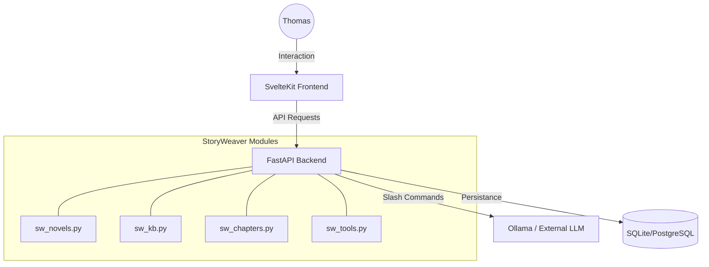

# StoryWeaver Architecture

StoryWeaver est une extension domaine-spécifique pour OpenWebUI, conçue pour transformer une interface de chat généraliste en une suite logicielle pour auteurs de romans.

## 1. Vue d'ensemble du système

StoryWeaver repose sur une architecture à trois piliers, parfaitement intégrée au backend FastAPI et au frontend SvelteKit d'OpenWebUI.

## 2. Structure des Données

Les données sont organisées de manière hiérarchique pour garantir que chaque roman dispose de son propre environnement isolé.

- **Novel (Roman)** : L'unité racine. Un utilisateur peut posséder plusieurs romans.
- **Knowledge Base (KB)** : Liée à un roman. Elle est divisée en 5 domaines :
    - `universe_docs` (Encyclopédie)
    - `characters` (Fiches personnages)
    - `locations` (Lieux)
    - `objects` (Objets magiques, artefacts)
    - `timeline` (Chronologie)
- **Chapter (Chapitre)** : Unité de texte atomique composant le manuscrit. Possède un texte Markdown, un ordre (`order`) et un statut.

## 3. Interception des Commandes Slash

L'assistance créative (`/brainstorm`, `/outline`, etc.) fonctionne via un intercepteur placé dans `backend/open_webui/routers/openai.py`.

1. L'utilisateur envoie un message commençant par `/`.
2. Le middleware détecte s'il s'agit d'une commande StoryWeaver.
3. Si oui, il récupère la **Knowledge Base active** du roman sélectionné en session.
4. Il injecte les données pertinentes de la KB dans le "System Prompt" destiné au LLM.
5. La réponse de l'IA est ainsi contextuellement riche, sans que l'utilisateur n'ait à copier-coller ses notes.

## 4. State Management (Frontend)

La gestion de l'état StoryWeaver est centralisée dans `src/lib/stores/sw.ts`.

- **Persistent Stores** : `currentNovel`, `editorMode`.
- **Reactive Stores** : `novels`, `activeKB`, `chapters`.
- **Layout Logic** : `ChapterEditor.svelte` adapte son rendu (Focus, Research, Outline) dynamiquement en fonction du store `editorMode`.

## 5. Exports

StoryWeaver utilise une approche hybride pour les exports :
- **Markdown** : Génération côté client vers un fichier `.md`.
- **PDF (Livre)** : Rendu DOM virtuel via `html2canvas-pro` transformé en PDF haute résolution via `jsPDF`.
