# Chat Flow: UI → Pipe (e.g. Portkey) → DB → Response → UI

End-to-end data flow for chat: how the **Pipe** class (e.g. from a portkey-style module) is loaded from the DB, how the app uses it to generate chat, and how the response is logged, stored, and shown in the UI.

---

## 1. Overview Diagram

### 1.1 Single-pod chat flow (Mermaid)

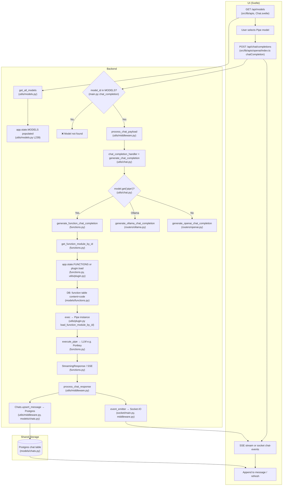

**File reference for diagram nodes**

| Node | File(s) | What happens |
|------|--------|----------------|
| GET /api/models | `main.py` (GET `/api/models`), `src/lib/apis` / Chat.svelte | UI requests model list. |
| get_all_models | `backend/open_webui/utils/models.py` | Builds list from `get_all_base_models` (includes `get_function_models`), custom/preset models, arena; sets `request.app.state.MODELS`. |
| app.state.MODELS populated | `utils/models.py` L239 | `request.app.state.MODELS = { model["id"]: model for model in models }`. |
| model_id in MODELS? | `main.py` `chat_completion()` | `if model_id not in request.app.state.MODELS: raise Exception("Model not found")`. |
| process_chat_payload | `backend/open_webui/utils/middleware.py` | Applies params, pipeline inlet, filters, features; injects event_emitter/event_call. |
| chat_completion_handler | `main.py` imports `generate_chat_completion` from `utils/chat.py` | Dispatches by model type (pipe / ollama / openai). |
| model.get('pipe')? | `utils/chat.py` `generate_chat_completion()` | Branch: pipe → `generate_function_chat_completion`, else ollama/openai. |
| generate_function_chat_completion | `backend/open_webui/functions.py` | Loads pipe via `get_function_module_by_id`, builds params, calls `execute_pipe`, returns stream or JSON. |
| get_function_module_by_id | `functions.py` | Uses `request.app.state.FUNCTIONS[pipe_id]` or calls `load_function_module_by_id(pipe_id)` and caches. |
| app.state.FUNCTIONS or plugin.load | `functions.py`, `utils/plugin.py` | Plugin: `Functions.get_function_by_id` → DB `function.content` → temp file → `exec(content, module.__dict__)` → return `module.Pipe()`. |
| DB function table | `models/functions.py` (table `function`, column `content`) | Stores Pipe Python source. |
| exec → Pipe instance | `utils/plugin.py` | After `exec`, returns `module.Pipe(), "pipe", frontmatter`. |
| execute_pipe → LLM | `functions.py` | `pipe(**params)` (body, __user__, etc.); Pipe calls external LLM (e.g. Portkey). |
| StreamingResponse / SSE | `functions.py` | Yields `data: {...}\n\n` SSE chunks. |
| process_chat_response | `utils/middleware.py` | Parses stream/response; calls `event_emitter`; calls `Chats.upsert_message_to_chat_by_id_and_message_id`. |
| event_emitter → Socket.IO | `socket/main.py` (get_event_emitter), `middleware.py` | Emits `chat:completion` etc. to client by session_id (in-process). |
| Chats.upsert_message | `utils/middleware.py`, `models/chats.py` | Updates `chat.chat["history"]["messages"][message_id]` in Postgres. |
| Postgres chat table | `models/chats.py` (table `chat`, JSON column `chat`) | Persisted messages. |

### 1.2 Pipe vs OpenAI vs Ollama routing

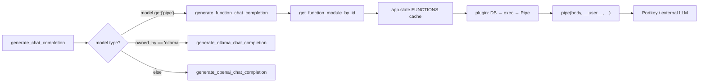

### 1.3 Response path: stream + persist

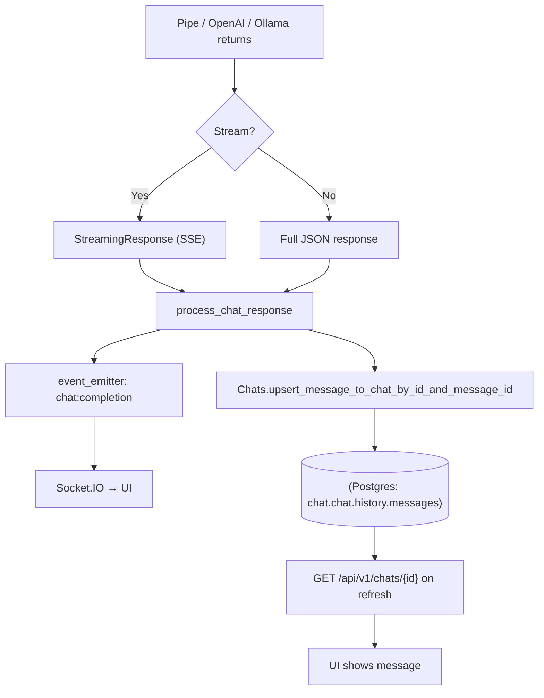

### 1.4 Legacy ASCII overview (condensed)

```
UI → GET /api/models → get_all_models() → app.state.MODELS
   → POST /api/chat/completions → main.chat_completion()
   → process_chat_payload → chat_completion_handler (chat.py)
   → [Pipe] get_function_module_by_id → plugin → DB function.content → exec → Pipe()
   → execute_pipe() → LLM (e.g. Portkey) → SSE
   → process_chat_response → event_emitter + Chats.upsert_message → Postgres
   → UI: SSE/socket + GET /api/v1/chats/{id} on load/refresh
```

---

## 2. Stage-by-stage: Files and APIs

### Stage 1: Models (including Pipe) loaded and shown in UI

| Step | Where | What |
|------|--------|------|
| UI requests model list | `src/lib/apis/openai/index.ts` or equivalent | Frontend calls **GET /api/models** (see main.py). |
| Backend endpoint | `backend/open_webui/main.py` → `get_models()` | Uses `get_all_models(request, user)` and filters by `get_filtered_models()` for non-admin users. |
| Build model list | `backend/open_webui/utils/models.py` → `get_all_models()` | Calls `get_all_base_models()` which includes **`get_function_models(request, user)`**. |
| Pipe models from DB | `backend/open_webui/functions.py` → `get_function_models()` | • **DB:** `Functions.get_functions_by_type("pipe", active_only=True)` → table **`function`** (id, name, type, **content**, meta, is_active, …).<br>• For each pipe: **RBAC:** only pipes whose models are in `accessible_pipe_ids` (from group-assigned models) are included.<br>• **Load module:** `get_function_module_by_id(request, pipe.id)` → see Stage 2.<br>• Single pipe → one model entry `{ id: pipe.id, name, pipe: { type: "pipe" } }`.<br>• Manifold (sub-pipes) → `function_module.pipes` (list or callable) → one model per sub-pipe, e.g. `id: f"{pipe.id}.{p['id']}"`. |
| Store in app state | `backend/open_webui/utils/models.py` | `request.app.state.MODELS = { model["id"]: model for model in models }`. |
| Response to UI | `main.py` → `get_models()` | Returns `{"data": models}`. Pipe models have `"pipe": {"type": "pipe"}` (or `"filter"` for filter pipelines). |

**DB:** Pipe definitions live in table **`function`** (id, type='pipe', content=Python code, meta, is_active, …). There is no separate “portkey_llm.py” file on disk for deployed pipes; the **content** column holds the Pipe class code (e.g. Portkey wrapper), which is executed in memory via `plugin.load_function_module_by_id`.

---

### Stage 2: Pipe class “loaded” from DB (when generating chat or listing models)

| Step | Where | What |
|------|--------|------|
| Resolve pipe_id | `functions.py` | From `form_data["model"]`: if model id is like `llm_portkey.@openai/gpt-4o`, **pipe_id** = `llm_portkey`; else pipe_id = model id. |
| Load/cache module | `backend/open_webui/functions.py` → `get_function_module_by_id(request, pipe_id)` | • If `pipe_id in request.app.state.FUNCTIONS`: return cached instance.<br>• Else: **`load_function_module_by_id(pipe_id)`** (from `open_webui.utils.plugin`). |
| DB + exec | `backend/open_webui/utils/plugin.py` → `load_function_module_by_id(function_id, content=None)` | • **DB:** `Functions.get_function_by_id(function_id)` → row with **content** (full Python source).<br>• Create module: `module = types.ModuleType(...)`, write content to temp file, **`exec(content, module.__dict__)`**.<br>• If **`hasattr(module, "Pipe")`** → return **`module.Pipe(), "pipe", frontmatter`**.<br>• So the “Pipe class” is whatever the stored **content** defines (e.g. a Portkey proxy). |
| Cache | `functions.py` | `request.app.state.FUNCTIONS[pipe_id] = function_module` (the object returned is the Pipe *instance*; the wrapper in functions.py keeps the module/instance for reuse). |
| Get pipe callable | `functions.py` → `generate_function_chat_completion()` | `function_module = get_function_module_by_id(request, pipe_id)` then **`pipe = function_module.pipe`** (attribute on the loaded module, typically the method that runs the LLM). |

So: **Pipe is not “portkey_llm.py” as a file path**; it’s **Python code in DB column `function.content`** that defines a class `Pipe` (and optionally `pipe` method or callable). That code is executed once per pipe_id and cached in `request.app.state.FUNCTIONS`.

---

### Stage 3: User sends message → chat completion request

| Step | Where | What |
|------|--------|------|
| UI send | `src/lib/apis/openai/index.ts` → `chatCompletion()` | **POST /api/chat/completions** with body: `{ model, messages, stream, chat_id, id (message_id), session_id, … }`. |
| Backend entry | `backend/open_webui/main.py` → `chat_completion()` | • Ensures `request.app.state.MODELS` (calls `get_all_models` if empty).<br>• Resolves `model = request.app.state.MODELS[model_id]`, `model_info = Models.get_model_by_id(model_id)`.<br>• Access check: `check_model_access(user, model)` for non-admin users.<br>• Builds **metadata** (user_id, chat_id, message_id, session_id, tool_ids, files, model, …).<br>• **`process_chat_payload(request, form_data, metadata, user, model)`** (middleware).<br>• **`response = await chat_completion_handler(request, form_data, user)`**.<br>• **`return await process_chat_response(request, response, form_data, user, events, metadata, tasks)`**. |

---

### Stage 4: Routing to Pipe vs OpenAI vs Ollama

| Step | Where | What |
|------|--------|------|
| Handler | `backend/open_webui/utils/chat.py` → `generate_chat_completion()` | Uses `request.app.state.MODELS` (or direct model). Dispatches by **model** dict: |
| Pipe branch | `chat.py` | **`if model.get("pipe"):`** → **`response = await generate_function_chat_completion(request, form_data, user=user, models=models)`**. |
| Preset with base pipe | `chat.py` | If `model.get("preset")` and base_model has `pipe` → same: `generate_function_chat_completion` with `form_data["model"] = base_model_id`. |
| Ollama | `chat.py` | **`elif model.get("owned_by") == "ollama":`** → `generate_ollama_chat_completion(...)`. |
| OpenAI / rest | `chat.py` | **`else:`** → `generate_openai_chat_completion(...)`. |

---

### Stage 5: Pipe execution (generate_function_chat_completion)

| Step | Where | What |
|------|--------|------|
| Params | `backend/open_webui/functions.py` → `generate_function_chat_completion()` | Builds **params** for the pipe: `body=form_data`, `__user__`, `__event_emitter__`, `__event_call__`, `__metadata__`, `__request__`, `__tools__`, etc. Model params (system prompt, etc.) applied from `Models.get_model_by_id(model_id)` if preset. |
| Load pipe | Same file | **`function_module = get_function_module_by_id(request, pipe_id)`** → Pipe instance from DB (Stage 2). **`pipe = function_module.pipe`**. |
| Execute | Same file | **`execute_pipe(pipe, params)`** → `await pipe(**params)` or `pipe(**params)` (sync). So the Pipe’s `pipe(body=..., __user__=..., ...)` is called. |
| Stream / non-stream | Same file | If `form_data.get("stream")`: **`stream_content()`** async generator: calls `execute_pipe`, then yields SSE lines (`data: {...}\n\n`). Handles return type: `StreamingResponse`, dict, str, Iterator, AsyncGenerator, Generator. Non-stream: same pipe call, then format full response as OpenAI-style JSON. |
| Return | Same file | Returns `StreamingResponse(stream_content(), ...)` or a dict response. |

So the **Pipe class** (e.g. Portkey) is invoked with `body` (messages, model, stream, etc.) and context; it talks to the external API and returns a stream or a full message.

---

### Stage 6: Response processing, logging, storage

| Step | Where | What |
|------|--------|------|
| Entry | `backend/open_webui/utils/middleware.py` → **`process_chat_response(request, response, form_data, user, events, metadata, tasks)`** | Handles both streaming and non-streaming. |
| Non-stream | Same | Reads `response["choices"][0]["message"]["content"]`, then **`event_emitter({ "type": "chat:completion", "data": { done: True, content, title } })`** (Socket.IO to UI). **`Chats.upsert_message_to_chat_by_id_and_message_id(metadata["chat_id"], metadata["message_id"], { "content": content })`** → updates **`chat.chat["history"]["messages"][message_id]`** in DB. Then `background_tasks_handler()` (title/tags, webhook). |
| Stream | Same | Wraps stream in `post_response_handler`: parses SSE, emits **`chat:completion`** events per chunk via **event_emitter**, and accumulates content. On finish: **`Chats.upsert_message_to_chat_by_id_and_message_id(..., { "content": full_content })`**. Same background tasks. |
| Logging | Throughout | Standard Python `log.debug` / `log.info` in main, middleware, functions, chat, routers. No separate “chat log” table; persistence is **chat document** (JSON) in `chat.chat`. |

**DB storage:** Table **`chat`**: `id`, `user_id`, `title`, **`chat`** (JSON). Inside `chat`: **`chat["history"]["messages"]** = map of message_id → `{ content, model, role, … }`. **`Chats.upsert_message_to_chat_by_id_and_message_id`** updates that map (in `backend/open_webui/models/chats.py`).

---

### Stage 7: UI shows the response and loads chat

| Step | Where | What |
|------|--------|------|
| During stream | `src/lib/components/chat/Chat.svelte` | Submits with **`chatCompletion(token, body, `${WEBUI_BASE_URL}/api`)`** → POST `/api/chat/completions`. Reads `res.body` (stream) and/or listens to **socket `chat-events`** for `chat:completion` to append to the current message. |
| After completion | `src/lib/apis/index.ts` | Optional **POST /api/chat/completed** (e.g. after stream done) for outlet filters / finalization. |
| Load chat | `src/lib/apis/chats/index.ts` → **`getChatById(token, id)`** | **GET /api/v1/chats/{id}** (backend: `routers/chats.py` → `get_chat_by_id()` → **`Chats.get_chat_by_id_and_user_id(id, user.id)`**). |
| Backend chat fetch | `backend/open_webui/models/chats.py` | **`get_chat_by_id(id)`** / **`get_chat_by_id_and_user_id(id, user_id)`** read from **`chat`** table; **`get_messages_by_chat_id(id)`** returns **`chat.chat["history"]["messages"]`**. |
| UI render | `src/lib/components/chat/*.svelte` | Chat object includes `chat.history.messages`; UI renders message list and content (including the assistant reply from the Pipe). |

---

## 3. Key files reference

| Purpose | File(s) |
|--------|---------|
| Pipe/function definitions in DB | `backend/open_webui/models/functions.py` (Function model, FunctionsTable), table **`function`** |
| Load Pipe from DB, get models | `backend/open_webui/utils/plugin.py` (`load_function_module_by_id`), `backend/open_webui/functions.py` (`get_function_models`, `get_function_module_by_id`, `generate_function_chat_completion`) |
| Model list and app.state.MODELS | `backend/open_webui/utils/models.py` (`get_all_models`, `get_all_base_models`), `backend/open_webui/main.py` (`get_models`) |
| Chat completion endpoint | `backend/open_webui/main.py` (`POST /api/chat/completions` → `chat_completion`) |
| Chat payload and response | `backend/open_webui/utils/middleware.py` (`process_chat_payload`, `process_chat_response`) |
| Route to Pipe vs OpenAI vs Ollama | `backend/open_webui/utils/chat.py` (`generate_chat_completion`, `generate_function_chat_completion`) |
| Chat/message persistence | `backend/open_webui/models/chats.py` (`Chats.upsert_message_to_chat_by_id_and_message_id`, `get_messages_by_chat_id`, `get_chat_by_id`) |
| Chats API for UI | `backend/open_webui/routers/chats.py` (e.g. GET `/{id}` → `get_chat_by_id`) |
| Frontend: send message | `src/lib/apis/openai/index.ts` (`chatCompletion` → POST `/api/chat/completions`) |
| Frontend: load chat | `src/lib/apis/chats/index.ts` (`getChatById` → GET `/api/v1/chats/{id}`) |
| Frontend: chat UI | `src/lib/components/chat/Chat.svelte`, MessageInput, etc. |

---

## 4. Concepts: app instance, model access, FUNCTIONS cache, temp files

### 4.1 FastAPI app instance (Q1)

- **What it is:** The FastAPI **app instance** is the single application object created at server startup (e.g. `app = FastAPI(...)` in `main.py`). It is **not** a variable stored per user; it is **one per process** and shared by all requests handled by that process.
- **All users on the same pod:** They all use the **same** `app` and the same `app.state` (e.g. `app.state.MODELS`, `app.state.FUNCTIONS`). So `app.state.MODELS` is a single dict for that process; any request that calls `get_all_models()` can overwrite or populate it for the next request.
- **Multi-replica:** Each pod runs its own process and thus has its **own** app instance and its own `app.state`. There is no sharing of `app.state` across pods. So in multi-replica, "overwritten" means: on a given pod, the last request that set `app.state.MODELS` wins for that pod only; other pods have their own copy.

#### 4.1.1 app.state.MODELS is user-dependent; overwriting and “Model not found”

- **Not “all models”:** `get_all_models(request, user)` builds a list that **depends on the user**:
  - `get_all_base_models(request, user)` includes `get_function_models(request, user)`, which filters pipes by the user’s groups (RBAC).
  - `Models.get_all_models(user.id, user.email)` adds that user’s custom/preset models and can remove or override base models.
- So the list that gets stored in `app.state.MODELS` can **differ per user** (different pipes, different custom models). The **response** from GET `/api/models` is that list, then for non-admin users further filtered by `get_filtered_models(models, user)` in `main.py` before sending to the UI.
- **Overwriting:** Whoever last triggered `get_all_models()` (e.g. GET `/api/models` or POST `/api/chat/completions` when `MODELS` was empty) sets `app.state.MODELS` for the **whole pod**. With concurrent use, different users overwrite the same dict.
- **Consequence – will this user find his model?** **No, not necessarily.** If User B tries to use a model that only B has access to (e.g. B’s private preset or a pipe only assigned to B’s group), but `app.state.MODELS` was last set by another user (e.g. User A) whose list does not include that model, then when B’s chat request runs, the check `model_id not in request.app.state.MODELS` uses the **current** dict (A’s list). B’s `model_id` is not in it → **B gets “Model not found”** even though B is allowed to use that model. So with shared `app.state.MODELS` and concurrent use, a user can fail to find their own model when someone else’s list is currently in state. The app supports concurrent use, but the single shared MODELS dict does not; it holds at most one user’s “view” at a time.

### 4.2 check_model_access – where and how (Q3)

- **Where it is used:**
  - `backend/open_webui/main.py`: in `chat_completion()`, after resolving `model` from `request.app.state.MODELS`, if the user is a normal user (not bypass) the code calls `check_model_access(user, model)`.
  - `backend/open_webui/utils/chat.py`: in `generate_chat_completion()`, for non-direct, non-arena models, it calls `check_model_access(user, model)` before calling the LLM.
- **Where it is defined:** `backend/open_webui/utils/models.py` → `def check_model_access(user, model):`.
- **How the check works (what determines access):**
  - **Arena models:** Uses `has_access(user.id, type="read", access_control=model["info"]["meta"]["access_control"])`. If not allowed, raises `"Model not found"`.
  - **Other models:** Loads `model_info = Models.get_model_by_id(model.get("id"))`. If no `model_info`, raises. Then:
    - If **user is creator** (`user.id == model_info.user_id`): access allowed (return).
    - If **model has no access_control** (`model_info.access_control is None`): treated as **private** (creator only) → raise `"Model not found"`.
    - If **group assignment**: `item_assigned_to_user_groups(user.id, model_info, "read")` (user in a group that has read access to this model) → allowed.
    - Else **explicit access_control**: `has_access(user.id, type="read", access_control=model_info.access_control)` → allowed if True.
    - Otherwise → raise `"Model not found"`.
- **Relevant code:** `utils/workspace_access.py` → `item_assigned_to_user_groups()` (groups the user is in vs model’s read/write group_ids; super_admin bypass).

#### 4.2.1 Flow: role == "user" (normal user)

When `user.role == "user"`, both `main.py` and `utils/chat.py` call `check_model_access(user, model)` before proceeding. The flow below shows the decision path inside `check_model_access` and where it is invoked.

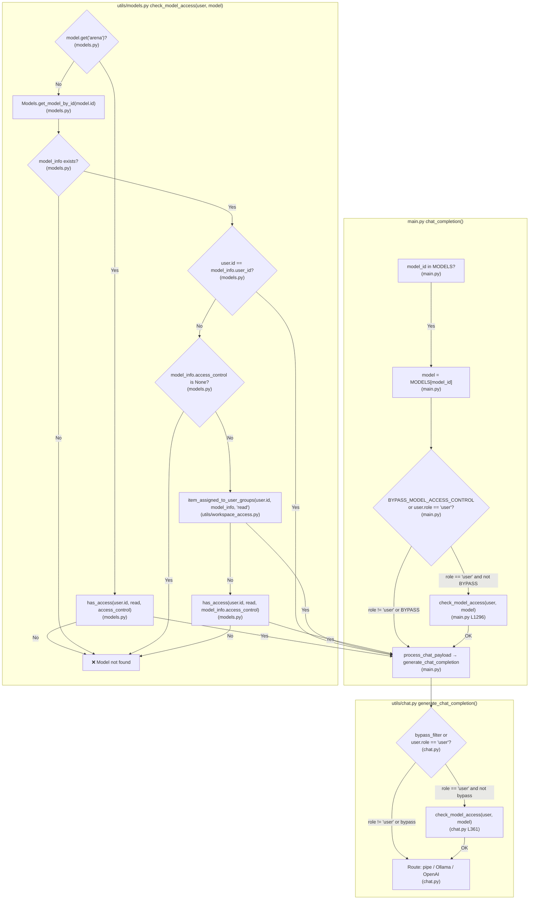

#### 4.2.2 Flow: role == "admin" (or role != "user")

When `user.role != "user"` (e.g. admin), `check_model_access` is **not** called in either place. Chat completion proceeds without the access check.

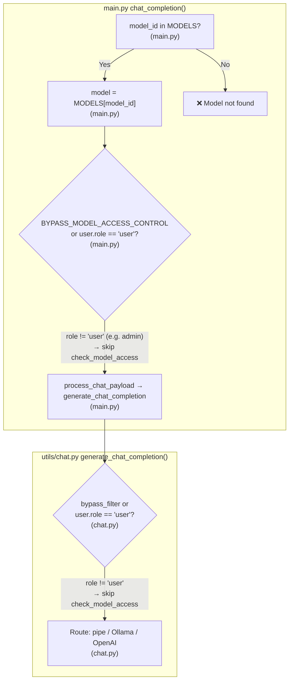

**File reference for check_model_access flow diagrams**

| Node | File(s) | What happens |
|------|--------|----------------|
| model_id in MODELS? | `main.py` `chat_completion()` | If not in `request.app.state.MODELS`, raise "Model not found". |
| BYPASS or role == 'user'? | `main.py` L1293 | Only if `not BYPASS_MODEL_ACCESS_CONTROL and user.role == "user"` do we call `check_model_access`. |
| check_model_access | `utils/models.py` L248 | Enforces read access: arena → `has_access`; else creator / access_control / group / has_access. |
| model.get('arena')? | `utils/models.py` | Arena models use `has_access` on `model["info"]["meta"]["access_control"]`. |
| has_access | `utils/access_control.py` | Returns whether user has read access given access_control dict. |
| Models.get_model_by_id | `models/models.py` | Loads model row from DB. |
| user.id == model_info.user_id | `utils/models.py` | Creator always has access. |
| access_control is None | `utils/models.py` | Treated as private (creator only) → raise. |
| item_assigned_to_user_groups | `utils/workspace_access.py` | True if user is in a group with read access to the model (or super_admin). |
| bypass_filter or role == 'user'? | `utils/chat.py` L359 | Only if `not bypass_filter and user.role == "user"` do we call `check_model_access` again. |

### 4.3 app.state.FUNCTIONS vs MODELS, Redis, temp files, concurrency (Q5)

- **Same as state.MODELS?** No. Both are **in-memory, per-process** attributes on the FastAPI app:
  - `app.state.MODELS`: dict of **model_id → model info dict** (built by `get_all_models()` in `utils/models.py`).
  - `app.state.FUNCTIONS`: dict of **pipe_id → Pipe instance** (the object returned by `module.Pipe()` in `utils/plugin.py`), populated by `get_function_module_by_id()` in `functions.py`.
- **Per user?** No. Both are **shared across all users** on that process. Access control (who can use which model) is enforced separately via `check_model_access()` and, for the model list, `get_filtered_models()` in the `/api/models` endpoint.
- **Should FUNCTIONS be in Redis?** The current design is in-memory per pod. Putting Pipe **instances** in Redis is not straightforward (they are Python objects). You could cache the **source code** or a serialized config in Redis and rebuild the Pipe per request or with a short-lived in-memory cache; that would require code changes.
- **Temp file safety when many users execute same/different pipes:**
  - In `utils/plugin.py`, `load_function_module_by_id()` uses `temp_file = tempfile.NamedTemporaryFile(delete=False)`, then writes `content` to it and passes `temp_file.name` to `module.__dict__["__file__"]`, then `exec(content, module.__dict__)`, and in `finally` does `os.unlink(temp_file.name)`.
  - **Evidence:** Python’s `tempfile.NamedTemporaryFile(delete=False)` creates a **unique** file per call (typically in the system temp dir with a unique name). So concurrent calls (same or different pipe_id) each get their **own** temp file; no overwrite between users or requests. The file is unlinked in `finally`, so it is removed after use.
  - **Not tied to a user:** The temp file is only used to set `__file__` for the executed module and is deleted immediately after `exec`. There is no user id in the path; concurrency safety comes from uniqueness of the temp file name, not from user isolation.
- **Multi-replica:** Each pod has its own `app.state.FUNCTIONS` and runs its own `load_function_module_by_id()` (and thus its own temp files) when the cache misses. So it holds up in multi-replica in the sense that each pod maintains its own cache and temp files; the only issue is cache **inconsistency** across pods (e.g. one pod has a pipe loaded, another doesn’t until the first request that needs it).

---

## 5. Summary: Pipe (e.g. Portkey) in one sentence

**Pipe** is a **function** row in the **`function`** table (type=pipe) whose **content** is Python code defining a **Pipe** class; that code is **loaded with `load_function_module_by_id(pipe_id)`** (which reads from DB and `exec`s it), and **used in `generate_function_chat_completion()`** by calling **`pipe(body=form_data, ...)`**; the response is then processed like any other chat (stream or non-stream), **persisted via `Chats.upsert_message_to_chat_by_id_and_message_id`** into **`chat.chat["history"]["messages"]`**, and **shown in the UI** via the same chat fetch (GET `/api/v1/chats/{id}`) and Socket/SSE events during streaming.

---

## 6. Multi‑replica (Kubernetes / OpenShift) view

This section explains the same flow **from the point of view of multiple pods**, focusing on:

- Per‑pod **in‑memory caches** (`app.state.MODELS`, `app.state.FUNCTIONS`)
- **Ingress / load balancer routing** (which pod handles what)
- **Sockets / streaming** and why chats sometimes only appear after refresh
- Why you see **`Model not found`** and **“chat only shows after refresh”** when multiple users share replicas

### 6.1 Per‑pod process model

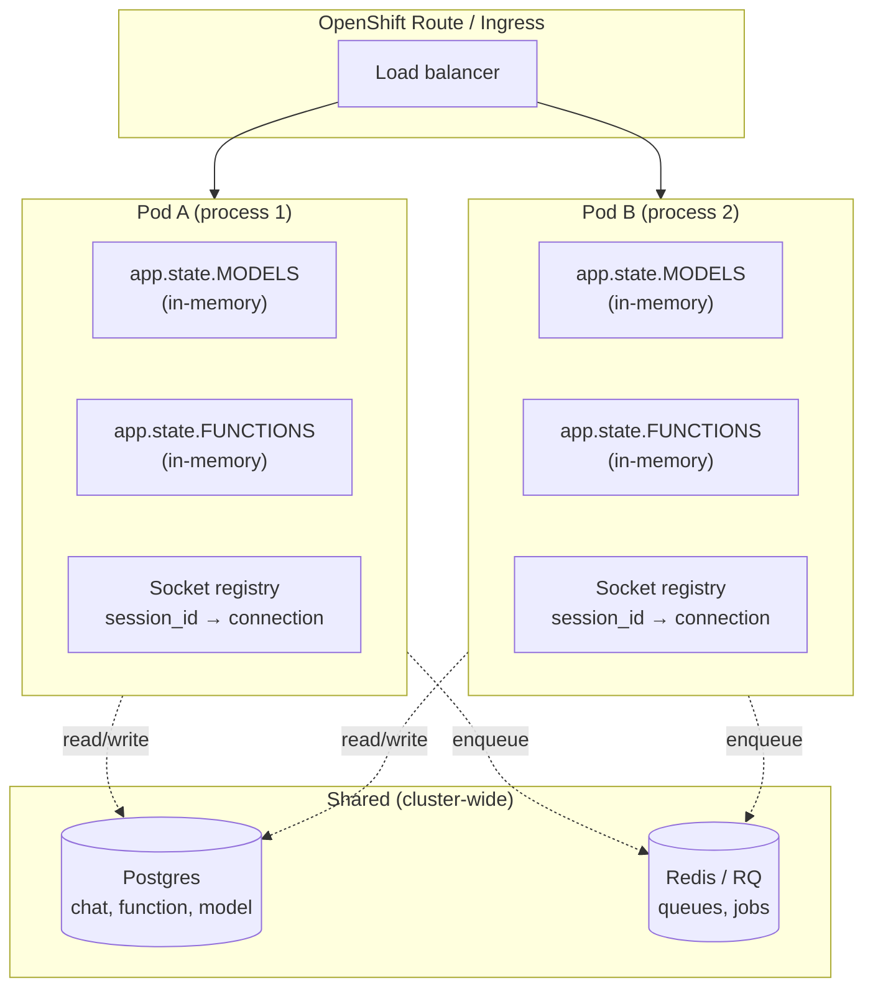

Per pod you have:

- One or more Python workers (uvicorn/gunicorn) running FastAPI (`backend/open_webui/main.py`)
- Each process has its own **`request.app.state`**, which holds:
  - `app.state.MODELS` (from `utils/models.py::get_all_models`)
  - `app.state.FUNCTIONS` (from `functions.py::get_function_module_by_id` and `utils/models.py` for actions)
  - Socket server state (via `socket/main.py`, imported in `main.py`)

These structures are **not shared across pods**. Only **Postgres** and **Redis / RQ** are shared cluster‑wide.

### 6.2 End‑to‑end flow per request in a multi‑replica setup

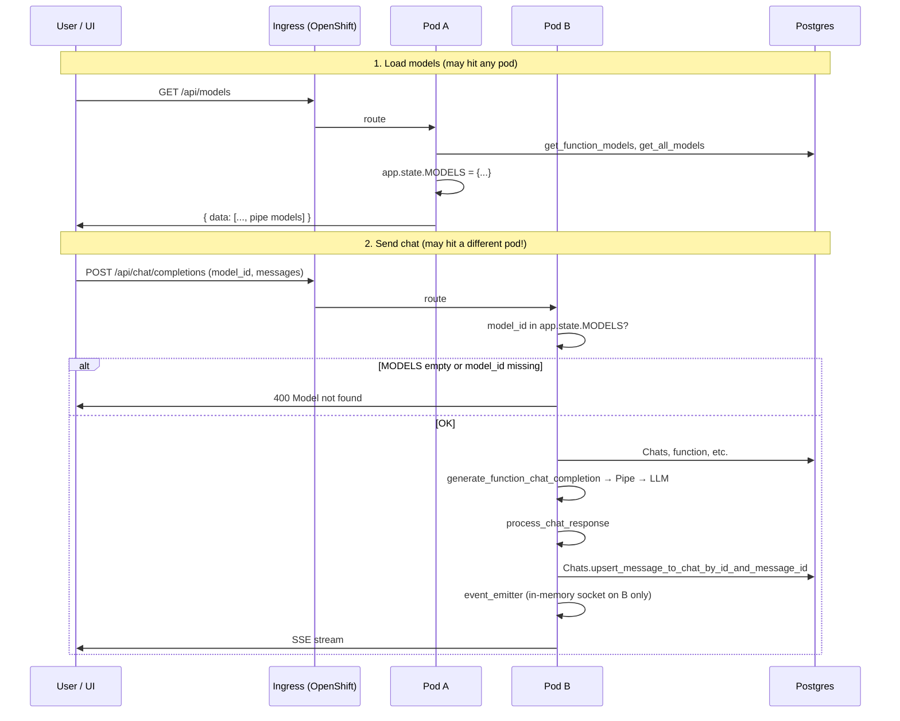

1. **User selects a model (including a Pipe model)**  
   - UI calls **`GET /api/models`** (hits *some* pod: say **pod A**).  
   - On pod A: `get_all_models(request, user)` fills **`request.app.state.MODELS`**; Pipe models from `get_function_models` (DB `function` table) are included.  
   - UI caches that list and shows model IDs (e.g. `llm_portkey.@vertexai/gemini-2.5-flash-lite`).

2. **User sends a chat**  
   - UI calls **`POST /api/chat/completions`**. The ingress picks a pod **per request**—often a **different** pod (e.g. **pod B**).

3. **Model lookup on the chosen pod**  
   - In `main.py::chat_completion`: if `not request.app.state.MODELS`, call `get_all_models`; then `if model_id not in request.app.state.MODELS: raise Exception("Model not found")`.  
   - Another pod can still have **empty** (no prior `get_all_models`) or **stale** MODELS → intermittent **Model not found**.

4. **Pipe execution and response**  
   - If the model is found, flow runs `generate_chat_completion` → `generate_function_chat_completion` → `process_chat_response`. LLM call is per-pod; only that pod’s code/env matter.

5. **Persistence vs live UI updates**  
   - `process_chat_response` **always** writes to Postgres via `Chats.upsert_message_to_chat_by_id_and_message_id`.  
   - Live updates go via SSE and/or `event_emitter` (Socket.IO), both **on the pod that handled the request**. If the browser’s WebSocket is on another pod, those events never reach the UI.

### 6.3 Why `Model not found` happens with multiple replicas

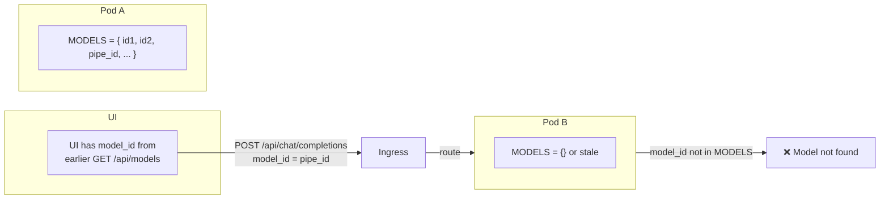

**Where the error is thrown:**  
`backend/open_webui/main.py` → `chat_completion`: `if model_id not in request.app.state.MODELS: raise Exception("Model not found")`.

**Multi‑replica failure modes:**

- **Cold cache:** Pod A served `/api/models` (MODELS full); Pod B has never run `get_all_models` (MODELS `{}`). Chat request hits B → **Model not found** (or B warms on first request; if that fails/races, still possible).
- **Stale / divergent:** `get_function_models` reads DB; a new/updated Pipe may be in DB but not yet in every pod’s MODELS. UI sends that `model_id`; request lands on a pod that doesn’t have it → **Model not found**.
- **Env differences:** Different `OPENAI_API_BASE_URLS` / keys per pod → `get_all_models` returns different IDs → same UI `model_id` missing on some pods.

**Key point:** `app.state.MODELS` is **per‑process**; inconsistent maps across pods cause **Model not found** when the chosen pod’s map doesn’t contain the UI’s `model_id`.

### 6.4 Why chats sometimes only appear after refresh

Symptom: **The LLM responded (logs show success), but the assistant message only appears after the user refreshes.**

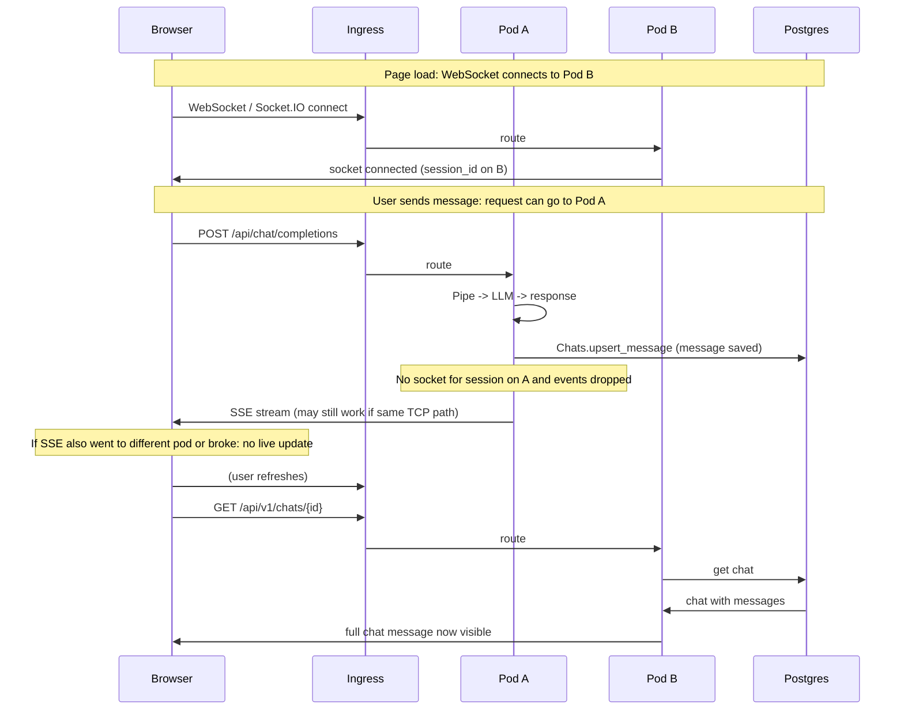

**What always happens:**  
On the pod that handles `/api/chat/completions`, `process_chat_response` emits `event_emitter("chat:completion", ...)` and calls `Chats.upsert_message_to_chat_by_id_and_message_id(...)` → message is **always** in Postgres.

**Where live updates are lost:**

- **Socket on different pod:**  
  WebSocket is connected to **pod B** (in-memory registry in `socket/main.py`). Chat request is handled on **pod A**. Pod A’s `event_emitter` looks up the session in **A’s** registry → no connection → events dropped. Message is still in DB, so **refresh** (GET `/api/v1/chats/{id}`) shows it.

- **Ingress/proxy:**  
  Long-lived SSE or WebSocket cut by timeouts/buffering → client stops receiving chunks; backend still writes to DB → message visible only after reload.

### 6.5 Where sockets and events are handled in code

- **Socket server and connection registry**  
  - `backend/open_webui/socket/main.py`  
    - Tracks connections per `session_id` / `user_id`.  
    - Exposes `get_event_emitter(metadata)` and `get_event_call(metadata)`.

- **Hooked into chat flow**  
  - `backend/open_webui/utils/middleware.py`:
    - `process_chat_payload`:
      - `event_emitter = get_event_emitter(metadata)`  
      - `event_call = get_event_call(metadata)`  
      - Injects these into `extra_params` for pipes/filters.
    - `process_chat_response`:
      - Re-derives `event_emitter` / `event_caller` from `metadata`.  
      - Uses them to send `chat:completion`, `chat:title`, `chat:tags`, etc.

All of this state is **in process memory** per pod. Without a distributed adapter (e.g. Redis pub/sub for Socket.IO) or sticky routing (session affinity), a pod that runs `event_emitter(...)` cannot reach sockets attached to another pod.

### 6.6 Practical implications and fixes (high level)

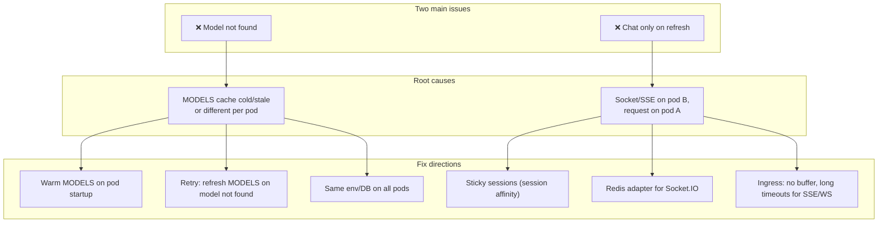

- **`Model not found`**  
  **Cause:** `app.state.MODELS` inconsistent across pods (cold or stale).  
  **Fixes:** Warm MODELS on pod startup; on "model not found" refresh MODELS and retry once; same env/DB on all pods; optionally cache model list in Redis/DB.

- **Chat only appears after refresh**  
  **Cause:** `event_emitter`/streaming on a different pod than the one holding the WebSocket/SSE, or proxy cutting the stream.  
  **Fixes:** **Session affinity** (sticky sessions) so WebSocket and `/api/chat/completions` hit the same pod; or **Redis pub/sub adapter** for Socket.IO; tune ingress for SSE/WebSocket (no buffering, long timeouts).

**Debugging:** For any failing chat, ask: **Which pod served `/api/models`? Which pod served `/api/chat/completions`? Which pod has the WebSocket?** Then check `app.state.MODELS`, `app.state.FUNCTIONS`, and socket state on that pod.

---

## 7. Solutioning – Action Plan

This section outlines the approach and action items to resolve both issues: **Model not found** (shared `app.state.MODELS` overwrite) and **Chat response only after refresh** (WebSocket on different pod than POST handler).

### 7.1 Q&A Summary (from design discussions)

| Question | Answer |
|----------|--------|
| **What causes "Model not found"?** | `app.state.MODELS` is a single shared dict per pod. `get_all_models(request, user)` is user-dependent (RBAC, custom models). Whichever request last called `get_all_models()` overwrites the dict. User B’s chat may see User A’s list → B’s `model_id` not in `MODELS` → "Model not found". |
| **Is `app.state.FUNCTIONS` causing overwrites?** | No. `FUNCTIONS` is keyed by `pipe_id`, not `user_id`. It stores Pipe instances (e.g. portkey_llm). Same for all users; additive cache. Overwrites do not occur. |
| **All our LLMs come from a Pipe (portkey_llm). Why "Model not found"?** | The Pipe is in `FUNCTIONS`. The *list of model IDs* each user can see (pipe models + custom presets) lives in `MODELS`. That list is user-specific and stored in a single shared dict → overwrite. |
| **If we use in-memory cache (Options 2/4), does the socket issue remain?** | Yes. Socket delivery depends on which pod holds the WebSocket vs which pod handles the POST. In-memory model cache does not fix that. Use a shared system (Redis) that helps both: model cache + Socket.IO Redis adapter. |
| **Should we move all `app.state` to Redis?** | No. Only `MODELS` needs per-user shared storage. `FUNCTIONS` and `TOOLS` are keyed by id (pipe_id, tool_id), not user; they can stay in-memory per pod. |
| **Does the codebase already support WebSocket over Redis?** | Yes. When `WEBSOCKET_MANAGER=redis` and `WEBSOCKET_REDIS_URL` are set, `socketio.AsyncRedisManager` is used. Events emitted on one pod are delivered to clients on another. No code changes needed—configuration only. |

### 7.2 Current vs Future State Structure

#### 7.2.1 `app.state.MODELS` (the problematic one)

**Current (in-memory, single shared dict):**

```
app.state.MODELS = {
    "llm_portkey.@gpt-4o/gpt-4o": { "id": "...", "pipe": true, "info": {...}, ... },
    "my-custom-preset": { "id": "...", "preset": true, "base_model_id": "llm_portkey.@gpt-4o/gpt-4o", ... },
    ...
}
```

- **Overwrite:** Last `get_all_models(request, user)` call wins. User A’s list replaces User B’s.
- **Scope:** One dict for the whole pod.

**Future (Redis-backed, per-user):**

Use Redis to store per-user model lists. Store as JSON (no extra encoding/obfuscation)—plain structure for readability and debugging.

**Key pattern:**
```
models:user:{user_id}
```

**Value:** JSON object (or JSON string)—the same structure as the current `{ model_id: model }` dict. No base64 or extra encoding; keep human-readable for debugging.

**Example:**
```json
{
  "llm_portkey.@gpt-4o/gpt-4o": { "id": "llm_portkey.@gpt-4o/gpt-4o", "pipe": true, "info": { "meta": {...} }, "object": "model", "created": 1234567890, ... },
  "my-custom-preset": { "id": "my-custom-preset", "preset": true, "base_model_id": "llm_portkey.@gpt-4o/gpt-4o", "info": {...}, ... }
}
```

**TTL:** e.g. 300–600 seconds (5–10 min). Invalidate on model/access changes.

**Flow:**
- **Read:** `models = redis.get(f"models:user:{user_id}")` → parse JSON → use for `model_id in models` and `model = models[model_id]`.
- **Write:** After `get_all_models(request, user)` returns, `redis.setex(f"models:user:{user_id}", ttl, json.dumps(models_dict))`.
- **Fallback:** On cache miss, call `get_all_models(request, user)`, write to Redis, then use.
- **Invalidation:** On create/update/delete of model or access control, delete `models:user:{user_id}` for affected users.

#### 7.2.2 Other `app.state` attributes

| Attribute | Current | Future | Rationale |
|-----------|---------|--------|-----------|
| **MODELS** | `{ model_id: model }` single dict | Redis `models:user:{user_id}` | Per-user; must not overwrite across users. |
| **FUNCTIONS** | `{ pipe_id: Pipe_instance }` | Keep in-memory | Keyed by pipe_id; additive; Pipe instances not serializable. |
| **TOOLS** | `{ tool_id: tool_module }` | Keep in-memory | Same as FUNCTIONS. |
| **OPENAI_MODELS** | `{ model_id: model }` | Keep in-memory | Provider list; same for all users; overwrite is harmless. |
| **OLLAMA_MODELS** | `{ model_id: model }` | Keep in-memory | Same as OPENAI_MODELS. |
| **SESSION_POOL, USER_POOL, USAGE_POOL** | RedisDict when `WEBSOCKET_MANAGER=redis` | No change | Already Redis-backed for socket coordination. |

### 7.3 WebSocket to Redis – Approach

**Status:** Implemented. No new code needed; configuration only.

**Required env vars:**
- `WEBSOCKET_MANAGER=redis`
- `WEBSOCKET_REDIS_URL=<redis_url>` (e.g. same as `REDIS_URL` or dedicated)

**Current code (socket/main.py):**
- When `WEBSOCKET_MANAGER == "redis"`: `socketio.AsyncRedisManager(WEBSOCKET_REDIS_URL)` is used as `client_manager`.
- `sio.emit("chat-events", ..., to=session_id)` is published via Redis; the pod that owns `session_id` delivers to the client.
- `SESSION_POOL`, `USER_POOL`, `USAGE_POOL` use `RedisDict` when Redis is enabled.

**Action:** Confirm `WEBSOCKET_MANAGER=redis` and `WEBSOCKET_REDIS_URL` are set correctly in the OpenShift deployment. If "chat only on refresh" persists, verify network connectivity between pods and Redis.

### 7.4 Action Items

#### Phase 1: WebSocket (configuration)

| # | Action | Approach | Effort |
|---|--------|----------|--------|
| 1.1 | Enable WebSocket Redis | Set `WEBSOCKET_MANAGER=redis` and `WEBSOCKET_REDIS_URL` in StatefulSet/Deployment env. | Config only |
| 1.2 | Verify cross-pod delivery | Test: WebSocket on pod A, POST on pod B → response should appear in UI without refresh. | 0.5 day |
| 1.3 | Document env vars | Add to deployment runbook: required env vars, Redis connectivity. | 0.5 day |

#### Phase 2: Redis model cache (per-user MODELS)

| # | Action | Approach | Effort |
|---|--------|----------|--------|
| 2.1 | Redis client/connection | Reuse existing `REDIS_URL` and connection utilities from `socket/utils.py` or env. | 0.5 day |
| 2.2 | `get_models_for_user(user_id)` | Read `models:user:{user_id}` from Redis. Parse JSON. Return `{ model_id: model }` or `None` on miss. | 0.5 day |
| 2.3 | `set_models_for_user(user_id, models_dict, ttl)` | Write `json.dumps(models_dict)` to `models:user:{user_id}` with TTL (e.g. 300s). No extra encoding. | 0.5 day |
| 2.4 | Integrate into `chat_completion` (main.py) | Before `model_id in MODELS`, try `models = get_models_for_user(user.id)`. On miss, call `get_all_models(request, user)`, set `request.app.state.MODELS`, call `set_models_for_user(user.id, models, ttl)`. Use that dict for the check and `model = models[model_id]`. | 1 day |
| 2.5 | Integrate into `get_all_models` (models.py) | After building `models`, call `set_models_for_user(user.id, {m["id"]: m for m in models}, ttl)`. Keep `request.app.state.MODELS` for backward compatibility during transition. | 0.5 day |
| 2.6 | Update all readers of `app.state.MODELS` | Ensure chat path (main.py, chat.py, middleware, facilities, tasks) reads from Redis-backed source when available. | 1 day |
| 2.7 | Invalidation on model/access change | On create/update/delete of model or access control, delete `models:user:{user_id}` for affected users. Identify write paths (models CRUD, group assignments). | 1 day |
| 2.8 | Testing | Unit tests for get/set; multi-user overwrite test; multi-pod test (different pods serving different users). | 1 day |

**Total Phase 2 estimate:** 4–5 days.

#### Phase 3: Optional refinements

| # | Action | Approach | Effort |
|---|--------|----------|--------|
| 3.1 | Warm model cache on pod startup | Optional: call `get_all_models` for a bootstrap user and populate Redis for common users. | 0.5 day |
| 3.2 | Refresh-and-retry on "Model not found" | When `model_id not in models`, call `get_all_models`, update Redis, re-check before raising. | 0.5 day |

### 7.5 Redis Key Summary

| Key | Value type | TTL | Purpose |
|-----|------------|-----|---------|
| `models:user:{user_id}` | JSON string (dict of model_id → model) | 300–600s | Per-user model list for chat and model resolution |
| `open-webui:session_pool` | Redis hash | 3600s | Session metadata (existing) |
| `open-webui:user_pool` | Redis hash | 3600s | User → session_ids (existing) |
| `open-webui:usage_pool` | Redis hash | 1800s | Usage tracking (existing) |

### 7.6 Files to Modify (Redis Model Cache)

- `backend/open_webui/main.py` – chat_completion: read models from Redis, fallback to get_all_models, write to Redis
- `backend/open_webui/utils/models.py` – get_all_models: write to Redis after building; add get/set helpers
- `backend/open_webui/utils/chat.py` – chat_completed and other readers: use Redis-backed models when available
- `backend/open_webui/utils/middleware.py` – process_chat_payload: pass models from request context
- `backend/open_webui/routers/facilities.py` – use Redis-backed models
- `backend/open_webui/routers/tasks.py` – use Redis-backed models
- New or existing: `backend/open_webui/utils/redis_models.py` – get_models_for_user, set_models_for_user, invalidate_models_for_user

---

## 8. Full Trace: UI → Socket / Redis → Backend → Chat Events

This section documents the **complete trace** for chat generation, socket management, and event delivery—to help debug why the chat UI may not show responses until refresh.

### 8.1 End-to-end flow diagram

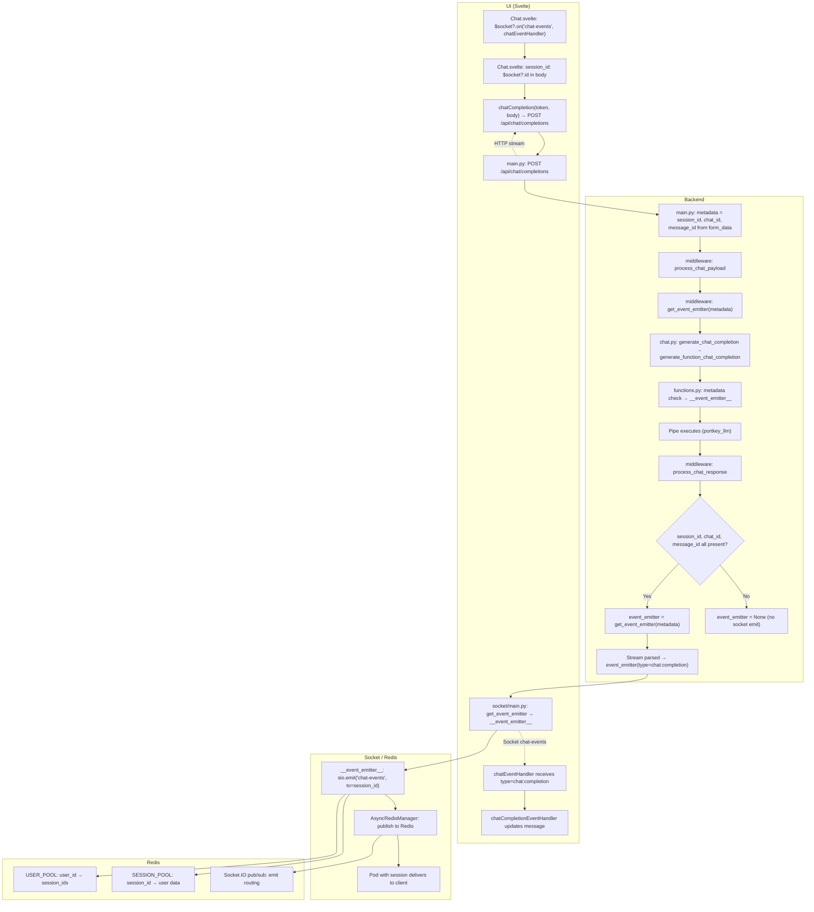

### 8.2 File and function reference for socket/chat-event trace

| Step | File | Function / Location | What happens |
|------|------|--------------------|--------------|
| 1 | `src/lib/components/chat/Chat.svelte` | `onMount` | `$socket?.on('chat-events', chatEventHandler)` – listens for chat-events |
| 2 | `Chat.svelte` | `sendPromptSocket` / body | `session_id: $socket?.id` – sent in POST body (undefined if socket not connected) |
| 3 | `src/lib/apis/openai/index.ts` | `chatCompletion` | `fetch(url/chat/completions, { body: JSON.stringify(body) })` |
| 4 | `backend/open_webui/main.py` | `chat_completion` | Receives request; extracts `session_id`, `chat_id`, `message_id` from `form_data` into `metadata` |
| 5 | `main.py` | `metadata = {...}` | `session_id: form_data.pop("session_id", None)` – **if missing here, no events later** |
| 6 | `utils/middleware.py` | `process_chat_payload` | Calls `get_event_emitter(metadata)`, `get_event_call(metadata)`; passes to pipe |
| 7 | `utils/chat.py` | `generate_chat_completion` | Routes to pipe (Portkey); passes `form_data` with `metadata` |
| 8 | `functions.py` | `generate_function_chat_completion` | Checks `all(k in metadata for k in ("session_id","chat_id","message_id"))`; sets `__event_emitter__` |
| 9 | `socket/main.py` | `get_event_emitter(request_info)` | Factory; returns `__event_emitter__` closure that uses `request_info["session_id"]` |
| 10 | `utils/middleware.py` | `process_chat_response` | Re-checks `session_id`, `chat_id`, `message_id` in metadata; sets `event_emitter` or `None` |
| 11 | `middleware` | streaming path | If `event_emitter`: parses stream, calls `event_emitter({"type":"chat:completion",...})` |
| 12 | `socket/main.py` | `__event_emitter__(event_data)` | `sio.emit("chat-events", {chat_id, message_id, data}, to=session_id)` |
| 13 | Socket.IO | `AsyncRedisManager` | Publishes emit to Redis; pod holding `session_id` delivers to client |
| 14 | `Chat.svelte` | `chatEventHandler` | Receives `{type: "chat:completion", data}`; calls `chatCompletionEventHandler` |

### 8.3 Debug log placement (numbered for sequence tracing)

All logs use: `log.debug("[DEBUG] [WS-CHAT N] ...")` so you can grep for `WS-CHAT` and see the sequence. If the flow breaks, the last number you see indicates where it stopped.

| N | File | Function | Log content |
|---|------|----------|-------------|
| 0 | `socket/main.py` | `connect` | websocket connected on this pod; session_id, user_id |
| 0a | `socket/main.py` | `user_join` | session registered on this pod; session_id, user_id |
| 1 | `main.py` | `chat_completion` | POST /api/chat/completions handled; pod, user |
| 2 | `main.py` | `chat_completion` | extracted from form_data: session_id, chat_id, message_id (CRITICAL: if session_id is None, UI will not update) |
| 3 | `middleware.py` | `process_chat_payload` | entry; user, model_id, chat_id, session_id |
| 4 | `middleware.py` | `process_chat_payload` | metadata before get_event_emitter; session_id, chat_id, message_id |
| 5 | `socket/main.py` | `get_event_emitter` | factory called with request_info; session_id, chat_id, message_id, user_id |
| 6 | `socket/main.py` | `get_event_call` | factory called with request_info; session_id, chat_id, message_id |
| 7 | `chat.py` | `generate_chat_completion` | routing to pipe (generate_function_chat_completion) |
| 8 | `functions.py` | `generate_function_chat_completion` | metadata has session_id/chat_id/message_id; __event_emitter__ set |
| 9 | `functions.py` | `generate_function_chat_completion` | metadata missing or invalid; __event_emitter__=None (BROKE: no emitter for pipe) |
| 10 | `functions.py` | `generate_function_chat_completion` | got function module; executing pipe |
| 11 | `middleware.py` | `process_chat_response` | entry; pod, user, chat_id, message_id, session_id, is_stream |
| 12 | `middleware.py` | `process_chat_response` | event_emitter/event_caller set; responses will be emitted |
| 13 | `middleware.py` | `process_chat_response` | no valid session_id/chat_id/message_id; event_emitter=None (BROKE: no emitter) |
| 14 | `middleware.py` | `process_chat_response` | streaming path: event_emitter is None; fallback without socket emit |
| 15 | `middleware.py` | `process_chat_response` | streaming path: persisting message to DB |
| 16 | `middleware.py` | `process_chat_response` | non-streaming: about to emit chat:completion |
| 17 | `socket/main.py` | `__event_emitter__` | emitting chat-events from pod to session_ids; chat_id, message_id, event_type |

**How to read the logs on OpenShift:** Grep for `WS-CHAT` to see the sequence. Example success path: 0 or 0a → 1 → 2 → 3 → 4 → 5 → 6 → 7 → 8 → 10 → 11 → 12 → 15 → 17 (repeated for each chunk). If you see 9 or 13 or 14, the flow broke (no emitter). The last number before the gap is where it stopped.
