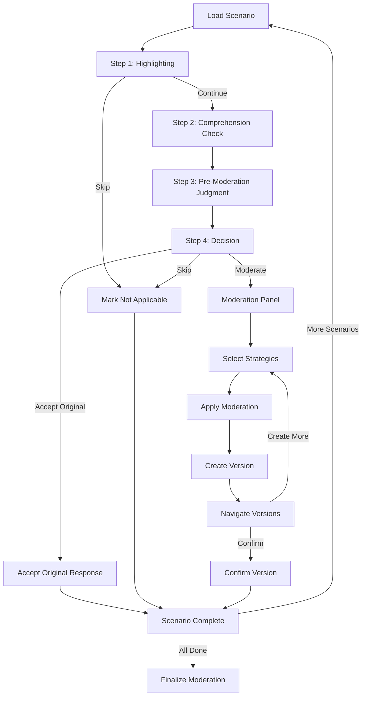

# Moderation Survey Flow Documentation

## Overview

The moderation survey flow allows parents to review AI responses to child prompts and apply moderation strategies. This document outlines how questions are selected, how moderation decisions are made, and where data is saved.

## 1. Question/Scenario Selection Flow

### Scenario Sources

- **Personality-based scenarios**: Generated from child profile characteristics using `generateScenariosFromPersonalityData()` in `src/lib/data/personalityQuestions.ts` (primary source)
- **Custom scenario**: User-created scenario option (always appears last)

**Note**: Hardcoded default scenarios have been deprecated and are no longer used. The system now relies entirely on personality-based scenarios generated from child profile characteristics. The old hardcoded scenarios (previously at lines 80-92 in `moderation-scenario/+page.svelte`) have been commented out.

### Scenario Selection Process

**Backend Endpoint**: `GET /moderation/scenarios/available`

- Location: `backend/open_webui/routers/moderation_scenarios.py` (lines 168-221)
- Returns unseen scenario indices (0-11) for the current session
- Filters out scenarios already seen by the user for the given child_id
- Randomly shuffles available scenarios

**Frontend Flow** (`moderation-scenario/+page.svelte`):

1. On mount (lines 1962-2311):
   - Loads child profiles via `loadChildProfiles()` (line 500)
   - For Prolific users: Fetches available scenarios from backend (lines 2055-2109)
   - Generates personality-based scenarios via `generatePersonalityScenarios()` (line 546)
   - Applies attention check marker to one random scenario (line 317)
   - Ensures custom scenario is always last (line 301)

2. Scenario Package Persistence:
   - Scenarios are packaged and stored in localStorage with key `scenarioPkg_{childId}_{sessionNumber}`
   - Package includes: version, childId, sessionNumber, list of [question, response] pairs, createdAt
   - Once locked for a session, scenarios don't regenerate (prevents re-ordering)

3. Scenario List Building:
   - Base scenarios come exclusively from personality data (no fallback to hardcoded defaults)
   - Attention check is randomly injected into one response (line 317)
   - Custom scenario is appended at the end (line 301)

## 2. Moderation Decision Tree Flow

### UI Panels and Visibility

The moderation workflow uses two main panels that control the user experience:

#### 1. Initial Decision Pane (`showInitialDecisionPane`)

**Purpose**: Unified 4-step workflow for initial decision making

**Visibility Conditions**:

- Shown when: `!step4Completed && !markedNotApplicable && (initialDecisionStep >= 1 && initialDecisionStep <= 4) && (!isCustomScenario || customScenarioGenerated)`
- Hidden when:
  - Scenario is completed (`step4Completed === true`)
  - Scenario is marked as not applicable (`markedNotApplicable === true`)
  - Scenario is in an end state (accepted original, confirmed version, or skipped)
  - Custom scenario hasn't been generated yet

**States**:

- **Step 1**: Highlighting mode - User can drag to highlight concerning text
- **Step 2**: Comprehension check - User answers "What is the child trying to accomplish?" and "What is the GenAI Chatbot mainly doing?"
- **Step 3**: Pre-moderation judgment - User rates concern level (1-5) and decides if they would show to child (yes/no)
- **Step 4**: Decision point - User can accept original, moderate, or mark not applicable

#### 2. Moderation Panel (`moderationPanelVisible`)

**Purpose**: Strategy selection and version management

**Visibility Conditions**:

- Shown when: `initialDecisionStep === 4 && confirmedVersionIndex === null && !markedNotApplicable && step3Completed`
- Hidden when:
  - Not in Step 4
  - Version is confirmed (`confirmedVersionIndex !== null`)
  - Scenario is marked as not applicable
  - Step 3 is not completed
  - Scenario is in an end state

**Features**:

- Strategy selection (up to 3 strategies from grouped categories)
- Custom instruction input
- Version creation and navigation
- Side-by-side comparison view

### 4-Step Unified Flow

The moderation workflow follows a structured 4-step process:

#### Step 1: Highlighting (`initialDecisionStep === 1`)

**Function**: `completeStep1(skipped: boolean)`

**Actions**:

- User can drag to highlight concerning text in prompt or response
- Highlights stored in `highlightedTexts1` array
- Text selections automatically saved to `/selections` endpoint
- User can skip highlighting and proceed, or mark scenario as not applicable

**Completion**:

- `completeStep1(skipped: false)`: Proceeds to Step 2, saves highlights to backend
- `completeStep1(skipped: true)`: Marks as not applicable, skips all remaining steps

**Endpoints**:

- `POST /selections` - Save highlighted text selections
- `POST /moderation/sessions` - Save highlights with `version_number: 0`

**Data Saved**:

- `highlighted_texts`: Array of highlighted phrases
- `initial_decision`: `undefined` (no decision yet) or `'not_applicable'` (if skipped)

#### Step 2: Comprehension Check (`initialDecisionStep === 2`)

**Function**: `completeStep2()`

**Actions**:

- User fills two required text fields:
  - `childAccomplish`: "What is the child trying to accomplish?"
  - `assistantDoing`: "What is the GenAI Chatbot mainly doing?"
- Both fields must be filled to proceed

**Completion**:

- `completeStep2()`: Validates both fields, proceeds to Step 3

**Endpoints**:

- `POST /moderation/sessions` - Save comprehension check data

**Data Saved**:

- `session_metadata.child_accomplish`: User's answer
- `session_metadata.assistant_doing`: User's answer
- `highlighted_texts`: Preserved from Step 1

#### Step 3: Pre-Moderation Judgment (`initialDecisionStep === 3`)

**Function**: `completeStep3()`

**Actions**:

- User answers two questions:
  - `concernLevel`: 1-5 Likert scale (concern level)
  - `wouldShowChild`: 'yes' | 'no' (would show to child)
- Both questions must be answered to proceed

**Completion**:

- `completeStep3()`: Validates both fields, navigates to Step 4

**Endpoints**:

- `POST /moderation/sessions` - Save pre-moderation judgment

**Data Saved**:

- `concern_level`: 1-5 number (direct column)
- `would_show_child`: 'yes' | 'no' (direct column)
- `session_metadata.child_accomplish`: Re-saved for consistency
- `session_metadata.assistant_doing`: Re-saved for consistency

#### Step 4: Decision and Moderation (`initialDecisionStep === 4`)

**Actions**:

- User can:
  1. **Accept Original**: `acceptOriginalResponse()` - Accepts without moderation
  2. **Moderate**: Create moderated versions using moderation panel
  3. **Mark Not Applicable**: `markNotApplicable()` - Skip scenario (can be done from any step)

**Moderation Panel Features** (when visible):

- Select up to 3 moderation strategies from grouped options:
  - Refuse and Remove (4 options)
  - Investigate and Empathize (2 options)
  - Correct their Understanding (5 options)
  - Match their Age (1 option)
  - Defer to Support (2 options)
  - Attention Check (1 option - "I read the instructions")
  - Custom (user-defined instructions)
- Add custom instructions via text input
- Apply moderation to generate new version (`applySelectedModerations()`)
- Navigate between versions (`navigateToVersion()`)
- Confirm a version as final (`confirmCurrentVersion()`)

**Endpoints**:

- `POST /moderation/apply` - Generate moderated response
- `POST /moderation/sessions` - Save each version (version_number: 1, 2, 3...)
- `POST /moderation/sessions` - Save final decision with `is_final_version: true`

**Data Saved**:

- For accepted original:
  - `initial_decision`: 'accept_original'
  - `version_number`: 0
  - `is_final_version`: false (set to true on finalization)
- For moderated versions:
  - `strategies`: Array of strategy names
  - `custom_instructions`: Array of custom instruction texts
  - `refactored_response`: Generated moderated response
  - `version_number`: 1, 2, 3... (increments for each version)
- For confirmed version:
  - `is_final_version`: true
  - `initial_decision`: 'moderate' or 'accept_original'

## 3. Data Persistence Flow

### Frontend State Management

**Local Storage Keys** (child-specific):

- `moderationScenarioStates_{childId}`: Map of scenario index -> ScenarioState
- `moderationScenarioTimers_{childId}`: Map of scenario index -> time in seconds
- `moderationCurrentScenario_{childId}`: Current scenario index
- `scenarioPkg_{childId}_{sessionNumber}`: Canonical scenario package

**ScenarioState Interface** (line 1203):

```typescript
interface ScenarioState {
	// Version management
	versions: ModerationVersion[];
	currentVersionIndex: number;
	confirmedVersionIndex: number | null;

	// Highlighting
	highlightedTexts1: string[];

	// Strategy selection
	selectedModerations: Set<string>;
	customInstructions: Array<{ id: string; text: string }>;

	// UI state
	showOriginal1: boolean;
	showComparisonView: boolean;
	hasInitialDecision: boolean;
	acceptedOriginal: boolean;
	markedNotApplicable: boolean;
	attentionCheckSelected: boolean;

	// Unified initial decision flow
	initialDecisionStep: 1 | 2 | 3 | 4;
	step1Completed: boolean;
	step2Completed: boolean;
	step3Completed: boolean;
	step4Completed: boolean;
	childAccomplish: string; // Step 2: "What is the child trying to accomplish?"
	assistantDoing: string; // Step 2: "What is the GenAI Chatbot mainly doing?"
	initialDecisionChoice: 'accept_original' | 'moderate' | null;
	concernLevel: number | null; // Step 3: 1-5 Likert scale
	wouldShowChild: 'yes' | 'no' | null; // Step 3: Would show to child

	// Custom scenario
	customPrompt?: string;
}
```

### Completion States

A scenario is **completed** when any of the following conditions are met:

- `markedNotApplicable === true` (skipped)
- `acceptedOriginal === true` (accepted original)
- `confirmedVersionIndex !== null && confirmedVersionIndex >= 0` (confirmed moderated version)
- `step4Completed === true` (final decision made)

### Backend Database Schema

**Table**: `moderation_session`

- Location: `backend/open_webui/models/moderation.py` (lines 12-53)
- Key fields:
  - `scenario_index`: Which scenario (0-based)
  - `attempt_number`: Usually 1
  - `version_number`: Increments for each moderated version (0 = original decision)
  - `session_number`: Session identifier
  - `initial_decision`: 'accept_original' | 'moderate' | 'not_applicable'
  - `is_final_version`: Boolean marking final choice
  - `strategies`: JSON array of strategy names
  - `custom_instructions`: JSON array of custom instruction texts
  - `highlighted_texts`: JSON array of highlighted phrases
  - `refactored_response`: Final moderated response text
  - `session_metadata`: JSON object with:
    - `child_accomplish`: Step 2 comprehension check answer
    - `assistant_doing`: Step 2 comprehension check answer
    - `decision`: Final decision type ('accept_original', 'moderate', 'not_applicable')
    - `decided_at`: Timestamp when decision was made
    - `highlights_saved_at`: Timestamp when highlights were saved
    - `saved_at`: Timestamp when step data was saved

### Save Operations

**Immediate Saves** (via `saveModerationSession()`):

1. **Step 1** (`completeStep1()` - line 2664):
   - When skipped: Saves `initial_decision='not_applicable'`, `version_number: 0`
   - When continued: Saves `highlighted_texts` only, `version_number: 0`

2. **Step 2** (`completeStep2()` - line 2761):
   - Saves `child_accomplish` and `assistant_doing` to `session_metadata`
   - Updates `version_number: 0` row
   - Preserves highlights from Step 1

3. **Step 3** (`completeStep3()` - line 2822):
   - Saves `concern_level` and `would_show_child` to DIRECT COLUMNS
   - Re-saves Step 2 data to `session_metadata` for consistency
   - Updates `version_number: 0` row

4. **Step 4 Final Decisions**:
   - `acceptOriginalResponse()`: Saves `initial_decision='accept_original'` + all step data
   - `markNotApplicable()`: Saves `initial_decision='not_applicable'` + all step data (if completed)
   - `confirmCurrentVersion()`: Saves `is_final_version=true` + all step data on specific version row

5. **Version Creation** (`applySelectedModerations()`):
   - Creates NEW row with `version_number: currentVersionIndex + 1`
   - Includes all step data (concern_level, would_show_child, child_accomplish, assistant_doing)
   - Saves strategies, custom_instructions, highlighted_texts, refactored_response
   - `is_final_version: false` until finalized

6. **State persistence** (`saveCurrentScenarioState()` - line 1559):
   - Saves to localStorage on every state change
   - Reactive statement triggers on key state changes

**Finalization** (`finalizeModeration()` - line 1936):

- Endpoint: `POST /workflow/moderation/finalize`
- Location: `backend/open_webui/routers/workflow.py` (lines 382-435)
- Called when user completes all scenarios and proceeds to exit survey
- Groups sessions by (child_id, scenario_index, attempt_number, session_number)
- Marks the latest created row as `is_final_version: true` for each scenario
- Clears `is_final_version` on all other versions for that scenario

### Session Activity Tracking

**Endpoint**: `POST /moderation/session-activity`

- Location: `backend/open_webui/routers/moderation_scenarios.py` (lines 96-115)
- Tracks active time spent on moderation session
- Syncs every 30 seconds (line 239)
- Uses idle threshold of 60 seconds (line 207)

## 4. Attention Check Flow

**Detection**:

- One scenario randomly selected to have attention check marker appended to response
- Marker: `<!--ATTN-CHECK-->` (line 96)
- Suffix includes instruction: "Please moderate this question. Follow these steps: 1) Step 1: Click \"Continue\" (you can skip highlighting). 2) Step 2: In the \"I feel...\" field, enter \"test\" and in the \"because...\" field, enter \"test\", then click \"Continue\". 3) Step 3: Choose \"Moderate\" (not \"Accept\"). 4) Then select 'I read the instructions' from the \"Attention Check\" dropdown before generating a moderated version."

**Behavior**:

- `isAttentionCheckScenario` reactive variable (line 1052) - detects `<!--ATTN-CHECK-->` marker
- When user selects "I read the instructions" from the Attention Check dropdown (line 2309):
  1. Immediately saves attention check as passed to backend (`attention_check_passed: true`)
  2. Sets completion flags: `hasInitialDecision = true`, `acceptedOriginal = true`, `step3Completed = true`
  3. Closes panels: `moderationPanelVisible = false`, `showInitialDecisionPane = false`
  4. Saves state to localStorage for persistence
  5. Automatically navigates to next scenario after 1 second delay
  6. Shows success message: "✓ Passed attention check! Moving to next scenario..."
- Tracks: `attention_check_selected`, `attention_check_passed` in database
- State persists when navigating back - scenario shows as completed

**Endpoint**: `POST /moderation/sessions`

- `is_attention_check`: true
- `attention_check_selected`: true
- `attention_check_passed`: true

## 5. Custom Scenario Flow

**Generation** (`generateCustomScenarioResponse()` - line 1070):

- User enters custom prompt (minimum 10 characters)
- Calls `/moderation/apply` with empty strategies to generate baseline response
- Response becomes the "original_response" for moderation
- Custom prompt stored in `scenarioState.customPrompt`
- Treated like any other scenario after generation - goes through same 4-step flow

**Endpoint**: `POST /moderation/apply`

- `moderation_types`: [] (empty - just generate response)
- `child_prompt`: User's custom prompt

## 6. Backend API Endpoints

### Session Management

1. **Create/Update Session**: `POST /moderation/sessions`
   - Creates or updates a moderation session version row
   - Version identified by: `(user_id, child_id, scenario_index, attempt_number, version_number, session_number)`
   - Used for all step saves and version creation
   - Location: `backend/open_webui/routers/moderation_scenarios.py` (line 50)

2. **List Sessions**: `GET /moderation/sessions?child_id={child_id}`
   - Returns all sessions for user, optionally filtered by child_id
   - Location: `backend/open_webui/routers/moderation_scenarios.py` (line 122)

3. **Get Session**: `GET /moderation/sessions/{session_id}`
   - Returns specific session by ID
   - Location: `backend/open_webui/routers/moderation_scenarios.py` (line 136)

4. **Delete Session**: `DELETE /moderation/sessions/{session_id}`
   - Deletes a session
   - Location: `backend/open_webui/routers/moderation_scenarios.py` (line 154)

### Moderation

5. **Apply Moderation**: `POST /moderation/apply`
   - Generates moderated response using selected strategies
   - Returns: `refactored_response`, `system_prompt_rule`, `moderation_types`
   - Location: `backend/open_webui/routers/moderation.py` (line 32)
   - Uses: `multi_moderations_openai()` in `backend/open_webui/utils/moderation.py`

### Scenarios

6. **Get Available Scenarios**: `GET /moderation/scenarios/available?child_id={child_id}`
   - Returns unseen scenario indices for current session
   - Filters out scenarios already seen by user
   - Location: `backend/open_webui/routers/moderation_scenarios.py` (line 172)

### Activity Tracking

7. **Post Session Activity**: `POST /moderation/session-activity`
   - Tracks active time spent on moderation session
   - Syncs every 30 seconds
   - Uses idle threshold of 60 seconds
   - Location: `backend/open_webui/routers/moderation_scenarios.py` (line 100)

### Finalization

8. **Finalize Moderation**: `POST /workflow/moderation/finalize`
   - Marks latest version as `is_final_version: true` for each scenario
   - Groups by: `(child_id, scenario_index, attempt_number, session_number)`
   - Called when user completes all scenarios
   - Location: `backend/open_webui/routers/workflow.py` (line 382)

## Key Files Reference

- **Frontend Main Component**: `src/routes/(app)/moderation-scenario/+page.svelte`
- **Backend Session Router**: `backend/open_webui/routers/moderation_scenarios.py`
- **Backend Moderation Router**: `backend/open_webui/routers/moderation.py`
- **Moderation Utils**: `backend/open_webui/utils/moderation.py`
- **Database Models**: `backend/open_webui/models/moderation.py`
- **Workflow Router**: `backend/open_webui/routers/workflow.py` (finalization)
- **API Client**: `src/lib/apis/moderation/index.ts`

## Flow Diagram



## Scenario Endpoints

### 1. Accept Original Response

**Function**: `acceptOriginalResponse()`

**Flow**:

1. Sets `acceptedOriginal = true`, `confirmedVersionIndex = -1`
2. Sets `step4Completed = true`
3. Closes panels (`moderationPanelVisible = false`, `showInitialDecisionPane = false`)
4. Saves to backend with `initial_decision: 'accept_original'`

**Endpoint**: `POST /moderation/sessions`

- `version_number`: 0
- `initial_decision`: 'accept_original'
- Includes all Step 2-3 data (concern_level, would_show_child, child_accomplish, assistant_doing)

### 2. Mark Not Applicable

**Function**: `markNotApplicable()` or `completeStep1(skipped: true)`

**Flow**:

1. Sets `markedNotApplicable = true`
2. Sets all step completion flags to true
3. Closes panels
4. Saves to backend with `initial_decision: 'not_applicable'`

**Endpoint**: `POST /moderation/sessions`

- `version_number`: 0
- `initial_decision`: 'not_applicable'
- `concern_level`: undefined (if skipped early)
- `would_show_child`: undefined (if skipped early)

### 3. Create Moderated Version

**Function**: `applySelectedModerations()`

**Flow**:

1. Validates at least one strategy selected
2. Calls `/moderation/apply` to generate moderated response
3. Creates new version in `versions` array
4. Sets `currentVersionIndex` to new version
5. Saves to backend as new row with incremented `version_number`

**Endpoints**:

- `POST /moderation/apply` - Generate moderated response
- `POST /moderation/sessions` - Save version (version_number: 1, 2, 3...)

**Data Saved**:

- `strategies`: Selected strategy names
- `custom_instructions`: Custom instruction texts
- `highlighted_texts`: User-highlighted phrases
- `refactored_response`: Generated moderated response
- `version_number`: Incremented (1, 2, 3...)

### 4. Confirm Version

**Function**: `confirmCurrentVersion()`

**Flow**:

1. Sets `confirmedVersionIndex` to current version
2. Sets `step4Completed = true`
3. Closes moderation panel
4. Saves to backend with `is_final_version: true`

**Endpoint**: `POST /moderation/sessions`

- `is_final_version`: true
- `initial_decision`: 'moderate' (if version) or 'accept_original' (if original)
- `version_number`: 0 (original) or 1+ (moderated version)
