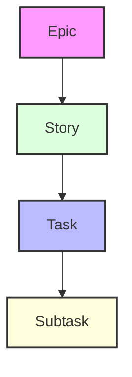

# Cursor Agile Workflow Documentation

> Last Updated: 2025-04-16

This document provides comprehensive documentation for the Agile workflow system integrated with Cursor's AI capabilities. The workflow is designed to maintain project focus and memory and ensure consistent progress through a structured approach to development.

## Overview

The Agile-Cursor workflow combines traditional Agile methodologies with AI-assisted development to create a powerful, efficient development process. It can be utilized in two primary ways:

1. **Rule-Based Implementation** (Automatic)

   - Uses `.cursor/rules/workflows/workflow-agile-manual` and `.cursor/templates`
   - Automatically applies standards to matching files
   - Provides consistent structure enforcement

## Work Item Hierarchy



1. **Epics**

   - Large, self-contained features
   - Only one active at a time
   - Example: "Online Matchmaking System"

2. **Stories**

   - Smaller, implementable work units
   - Must belong to an Epic
   - Example: "User Profile Creation"

3. **Tasks**

   - Technical implementation steps
   - Clear completion criteria
   - Example: "Implement Database Schema"

4. **Subtasks**
   - Granular work items
   - Often includes test requirements
   - Example: "Write Unit Tests"

## AI Project Plan and Memory Structure the Workflow will result in

```
.ai/
├── prd.md                 # Product Requirements Document
├── arch.md               # Architecture Decision Record
├── epic-1/              # Current Epic directory
│   ├── story-1.story.md  # Story files for Epic 1
│   ├── story-2.story.md
│   └── story-3.story.md
├── epic-2/              # Future Epic directory
│   └── ...
└── epic-3/              # Future Epic directory
    └── ...
```

## Workflow Phases

### 1. Initial Planning

- Focus on documentation and planning
- Only modify `.ai/`, docs, readme, and rules
- Required approvals for PRD and then the Architecture

### 2. Development Phase

- Generates the first or next story and waits on approval
- Implementation of approved in progress story
- Task-by-task story execution
- Continuous testing and validation

```mermaid
graph LR
    subgraph PLAN Phase
        A[Project Idea] --> B[PRD Creation]
        B --> C[Architecture Design]
        C --> D[Epic Planning]
        D --> E[Story Definition]
    end

    subgraph ACT Phase
        E --> F[Story Implementation]
        F --> G[Testing & Validation]
        G --> H[Story Completion]
    end

    subgraph Iteration
        H --> |Next Story|E
        H --> |Epic Complete|I[Epic Completion]
        I --> |Next Epic|D
        I --> |Project Complete|J[Release]
    end

    style A fill:#f9f,stroke:#333,stroke-width:2px
    style B fill:#dfd,stroke:#333,stroke-width:2px
    style C fill:#dfd,stroke:#333,stroke-width:2px
    style D fill:#f9f,stroke:#333,stroke-width:2px
    style E fill:#bbf,stroke:#333,stroke-width:2px
    style F fill:#bbf,stroke:#333,stroke-width:2px
    style G fill:#bbf,stroke:#333,stroke-width:2px
    style H fill:#bbf,stroke:#333,stroke-width:2px
    style I fill:#f9f,stroke:#333,stroke-width:2px
    style J fill:#f9f,stroke:#333,stroke-width:2px
```



## Implementation Guidelines

### Story Implementation Process

1. **Initialization**

   - Verify `.ai` directory exists
   - Locate approved architecture and current story
   - Ensure story is properly marked as in-progress

2. **Development Flow**

   - Follow Test-Driven Development (TDD)
   - Update task/subtask status regularly
   - Document all implementation notes
   - Record significant commands used

3. **Completion Requirements**
   - All tests must pass
   - Documentation must be updated
   - User must approve completion

### Critical Rules

> 🚨 **Critical Rules:**
>
> - Never creates first story without PRD and Architecture approval
> - Only one Epic can be in-progress at a time
> - Only one Story can be in-progress at a time
> - Stories must be implemented in PRD-specified order
> - Never implement without story approval from user (marked as in progress on the story file)

## Using the Workflow

The best way post 0.47.x+ of cursor is to use the rules based approach, with either manual, agent selection or always on rules. I prefer manual selection type rule for the workflows, so that they will not be in a context if I do not need it (explanation to follow).

If I am starting a brand new project (with our without an existing code template) I have a few options:

- Use an external tool to generate the PRD (Such as ChatGPT Canvas or o3 mini Web UI or Google AI Studio)
- Use the workflow and agent in cursor to generate the PRD
  (This comes down to personal preference and consideration of token burn within cursor)

If I am doing this in cursor, I will start a new Agent chat with Claude 3.7 Thinking (or choose a different model if concerned about credit burn) and type something like:

`Lets follow the @workflow-agile-manual to create a PRD for a new project I want to create that will do XYZ, have the following features etc etc. Lets focus on just the MVP feature first will be to deliver X minimally, but lets also plan to have some epics for fast follows or future enhancements such as A B and C.`

As this can be quite lengthy, I will many times craft this prompt in the xnotes folder, and then paste it into the chat, ensuring that the @workflow is still properly added.

Note: you can also modify the workflow-agile-manual to be Agent auto-selectable, this work reliably well also - you will just need to ensure the description you give it in the front matter will ensure its used when needed (PRD story and work implementation phases) - or potentially just make it an always rule. When starting out, its fine to make it an always rule, until your project grows to a very significant size, then I suggest turning it off manually, as at that point you might be just going in and making very targeted updates to specific files or features - and do not need the whole workflow as overhead - or you might want to instead select a different workflow (maybe a refactor workflow, a test workflow, an external MCP agent, etc...)

The agent should generate a draft prd.md file in a .ai folder.

I suggest at this point, you do not approve and jump right in - either in cursor with the agent, or an external tool - engage further with the agent to refine the document, have the agent ask you questions on holes in the document that it might want to know the answer to, ask the agent if it needs any clarifications that will allow for a very jr agent developer to understand and implement the stories, ask the agent if the sequencing of the stories make sense etc...

Once you feel its in a good spot - you can mark the file as status: approved.

At this point, I would start another chat and with the workflow - the agent will first check for the prd, and then if its approved, will offer to create (if not already existing and approved) the architecture file - and similar a new chat window with the workflow will search for the new first or in progress story.

Once a story is in progress and approved by the user - the agent can be told to execute the story. Once a story or part of a story is completed and the story file is updated with progress by the agent, commit often (I use my manual gitpush.mdc manual rule macro). After this, I might start a new chat window with a fresh context and the workflow again loaded. Once a story is complete (status: complete) and tested and pushed, I always will start a new chat window with the workflow, and ask the agent to 'Create the next story draft' - or just ask it what it thinks it should do next, it should recognize what is next story to do from the prd and what story was last marked completed, and generate a draft for the next story, and then stop and ask for my approval before doing any further coding.

A more detailed example, up to date repo and video coming soon, but this should give the main ideas...

NOTE: Some models (Sonnet 3.7 thinking) have gotten a bit overly aggressive, so the rules might need to be tuned to further ensure the agent does not start updating code until the story is approved.

## Best Practices

1. **Documentation and tips**

   - AI will keep PRD and Architecture documents updated - sometimes you will need to tell it to update the prd and arch files as needed.
   - Document all significant decisions
   - Maintain clear implementation notes
   - Have the AI create readme.md files in each src subfolder to help give it direction

2. **Testing**

   - Have the AI Write tests before implementation - a fun excercise in TDD
   - Maintain high test coverage
   - Verify all tests pass before completion

3. **Progress Tracking**

   - Have the AI (or you) update story status regularly
   - Record all implementation notes
   - Document command history

4. **Context Management**
   - Start fresh composer instance per story or after significant recorded progress (recorded in task completion updates)
   - Use appropriate context level
   - Minimize context overhead
   - Consider making a leaner workflow when you are in story execution mode - that does not need all of the templates and overhead of how to create a prd and a architecture. But you will need to consider what other files or parts of other files it might need reference to to retain the plot. This is why currently I still use the full workflow.

## Status Progression

Stories follow a strict status progression:

```
Draft -> In Progress -> Complete
```

Epics follow a similar progression:

```
Future -> Current -> Complete
```

## Integration with Cursor AI

The workflow is designed to work seamlessly with Cursor's AI capabilities:

1. **AI-Assisted Planning**

   - AI helps create and refine PRD
   - AI suggests architecture improvements
   - AI assists in story breakdown

2. **AI-Assisted Implementation**

   - AI implements story tasks
   - AI maintains test coverage
   - AI updates documentation

3. **AI-Assisted Review**
   - AI verifies completion criteria
   - AI suggests improvements
   - AI maintains consistency

## Cost Savings

- LLMs outside of Cursor, if you have them available, such as ChatGPT, Claude, Gemini, etc. are also great to generate the initial PRD and architecture, and really iterate on them.
- Within Cursor, currently you can use DeepSeek R1 for example which seems to be free and also decent and udpating PRD and architecture - but I have found it to be a bit less reliable than using Claude to follow the format I want - but much cheaper, if trying to do it all in cursor planning.