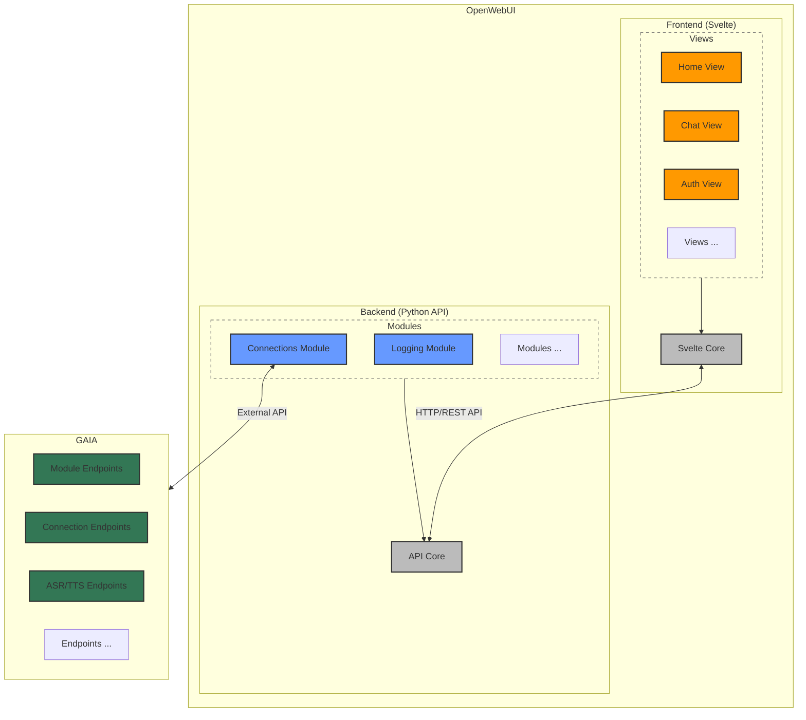

# Architecture
This diagram illustrates the architecture of OpenWebUI and its integration with GAIA. 

The architecture consists of two main components:

1. **Frontend**: Built with Svelte, providing various interface views:
    - Home View
    - Chat View
    - Authentication View
    - Other custom views

2. **Backend**: A Python-based API with specialized modules:
    - Connections Module: Handles external API communication with GAIA
    - Logging Module: Manages system logs and events
    - Additional modules for extended functionality

The OpenWebUI system communicates internally via HTTP/REST API calls between frontend and backend components. The Connections Module integrates closely with GAIA, which serves as the core foundation providing various endpoints for modules, connections, ASR/TTS (Automatic Speech Recognition/Text-to-Speech), and other essential services. While architecturally distinct, OpenWebUI and GAIA function as a cohesive system with tight integration.

This architecture enables a clean separation of concerns while maintaining efficient communication between user interface components and backend services.

