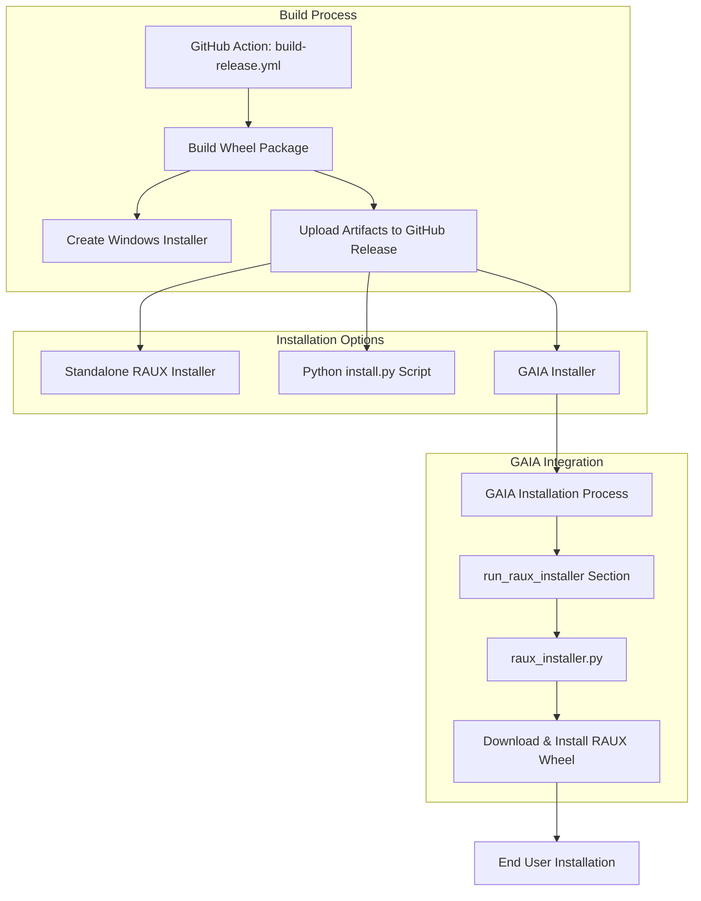
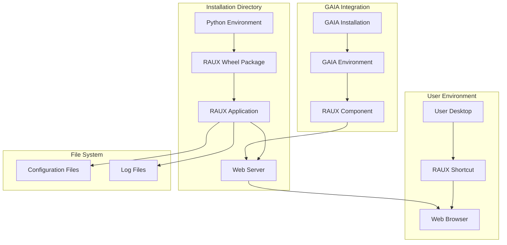

# RAUX Integration with GAIA

This document describes how RAUX (Open WebUI) integrates with [GAIA](https://github.com/amd/gaia), including the build process, installation options, and how the components fit together.

## Architecture Overview

RAUX (Open WebUI) can be installed in three different ways:

1. Using the standalone RAUX installer (Installer-UX.nsi)
2. Using the standalone Python installation script (install.py)
3. As part of the [GAIA](https://github.com/amd/gaia) installation process (Installer.nsi)

The diagram below illustrates how these components fit together:



## Build Process

The build process for RAUX is managed by the GitHub Actions workflow defined in `.github/workflows/build-release.yml`. This workflow automates the building and packaging of RAUX.

### Key Steps in the Build Process:

1. **Wheel Package Creation**:

   - The workflow builds a Python wheel package (.whl) containing the RAUX application
   - This wheel file is the primary artifact used for all installation methods

2. **Windows Installer Creation**:

   - The workflow uses NSIS (Nullsoft Scriptable Install System) to create a Windows installer
   - The installer is built using the `Installer-UX.nsi` script
   - The installer bundles the wheel file and necessary installation scripts

3. **Artifact Publishing**:
   - The wheel file and installer are uploaded to GitHub Releases
   - These artifacts are then available for download and installation

## Installation Options

### 1. Standalone RAUX Installer (Installer-UX.nsi)

The standalone RAUX installer provides a user-friendly way to install RAUX on Windows systems. The installer:

- Creates a conda environment for RAUX
- Downloads and installs the RAUX wheel package
- Creates desktop shortcuts for easy access
- Handles dependencies and environment setup

The installer is built using the `Installer-UX.nsi` script, which defines the installation process and user interface.

### 2. Standalone Python Installation (install.py)

For more flexibility, RAUX can be installed using the Python installation script (`install.py`). This script:

- Can be run directly with Python
- Downloads the latest RAUX wheel from GitHub
- Installs RAUX and its dependencies
- Provides options for customizing the installation

This method is useful for advanced users or automated deployments.

#### How to Invoke the Standalone Python Installation Script

To install RAUX using the standalone Python script, follow these steps:

1. Download the `install.py` script from the installer directory
2. Open a command prompt or terminal
3. Navigate to the directory containing the script
4. Run the script with Python using one of the following commands:

```bash
# Basic installation with default settings
python install.py

# Installation with a custom installation directory
python install.py --install-dir C:\path\to\install\directory

# Installation with debug logging enabled
python install.py --debug

# Installation with all options specified
python install.py --install-dir C:\path\to\install\directory --yes --force --debug
```

Available command-line options:

- `--install-dir`: Specify the installation directory (default: %LOCALAPPDATA%\raux)
- `--yes` or `-y`: Automatically answer 'yes' to all prompts
- `--force`: Force installation even if files are in use
- `--debug`: Enable detailed debug logging

### 3. GAIA Integration (Installer.nsi)

RAUX is also integrated into the [GAIA](https://github.com/amd/gaia) installation process. When installing GAIA, the installer:

1. Performs the main GAIA installation steps
2. Reaches the `run_raux_installer` section in `Installer.nsi`
3. Creates a temporary directory for RAUX installation
4. Copies the `raux_installer.py` script to this directory
5. Executes the script to download and install the RAUX wheel

The `raux_installer.py` script is a simplified version that:

- Downloads the latest RAUX wheel from GitHub releases
- Installs the wheel using pip
- Logs the installation process

## How the Components Work Together

The following diagram illustrates how the components exist in the environment after installation:



### Wheel Package (.whl)

The wheel package is the central artifact that contains the RAUX application code. It is:

- Built by the GitHub Actions workflow
- Used by all installation methods
- Downloaded during installation (either pre-bundled or from GitHub)

### raux_installer.py

This Python script is the core component that handles the actual installation of RAUX. It:

- Is used by both the standalone installer and the [GAIA](https://github.com/amd/gaia) installer
- Handles downloading the wheel package (if not already available)
- Manages the installation process using pip
- Provides logging and error handling

### GAIA Integration

The integration with [GAIA](https://github.com/amd/gaia) happens in the `run_raux_installer` section of `Installer.nsi`. This section:

- Creates a temporary directory for RAUX installation
- Copies the `raux_installer.py` script
- Executes the script to perform the installation
- Intentionally leaves the temporary directory for system cleanup

## Versioning Scheme for Build and Packaging

RAUX uses a dual-versioning scheme to support both rich semantic versioning for npm/GitHub and strict numeric versioning for Electron/Windows packaging:

- **Product version**: This is the full version string (e.g., `0.6.5+raux.0.1.1`) and is set in the root `package.json`. The first part (`0.6.5`) is pegged to the original Open-WebUI version, giving credit and thanks to Open-WebUI and its creator, Timothy Jaeryang Baek (Tim). The second part (`raux.0.1.1`) is the RAUX-specific version, tracking changes made in this fork.

- **Electron version**: This is a simplified, strictly numeric version (e.g., `0.1.1`) and is set in `raux-electron/package.json`. It is derived from the RAUX-specific portion of the product version. This separation is necessary because Electron/Windows packaging requires a version string in the format `Major.Minor.Patch[.Build]` (numbers and dots only), and does not support the richer semantic versioning or build metadata used in npm/GitHub.

**Why this split?**
- The product version allows us to both credit upstream work and clearly track RAUX's own changes, while remaining compatible with npm and GitHub's versioning systems.
- The electron version is required because Windows and Electron installers will fail if the version string contains anything other than numbers and dots. By pegging the electron version to the RAUX-specific portion (e.g., `0.1.1` from `raux.0.1.1`), we maintain a clear mapping between the two.

The GitHub Actions workflow (`.github/workflows/build-electron.yml`) takes both versions as inputs:

- `product-version`: Used for the root package.json and release tagging.
- `electron-version`: Used for the Electron app packaging.

This ensures compatibility with all distribution channels and avoids build errors during Electron packaging. When triggering a build, always supply both versions as workflow inputs.

## Conclusion

The RAUX integration with [GAIA](https://github.com/amd/gaia) provides a seamless installation experience for users. By leveraging the wheel package and installation scripts, RAUX can be installed either as a standalone application or as part of the GAIA ecosystem.

The modular design allows for flexibility in how RAUX is deployed while ensuring a consistent installation process across different methods.

