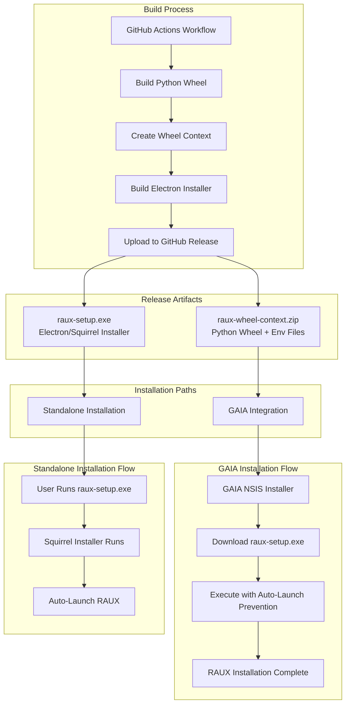
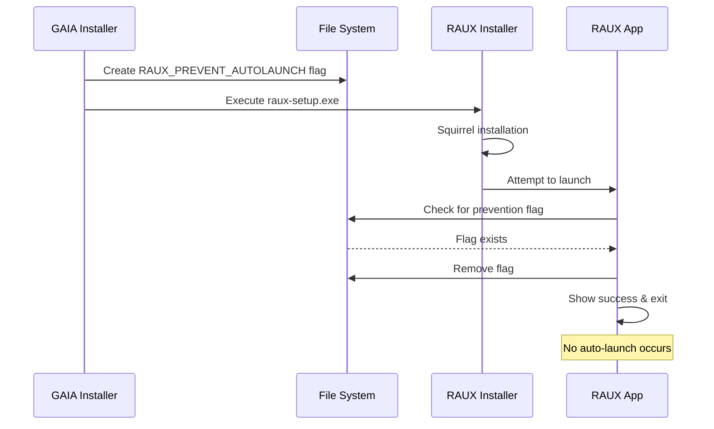

# RAUX Integration with GAIA

This document describes how RAUX (AMD's fork of Open WebUI) integrates with [GAIA](https://github.com/amd/gaia), including the build process, installation options, and how the components fit together.

## Architecture Overview

RAUX is an Electron-based desktop application that can be installed in two primary ways:

1. **Standalone Installation**: Using the RAUX Electron installer (`raux-setup.exe`)
2. **GAIA Integration**: As part of the [GAIA](https://github.com/amd/gaia) installation process

The diagram below illustrates how these components fit together:



## Build Process

The build process for RAUX is managed by GitHub Actions workflows. The key workflow creates both the Electron installer and the wheel context for GAIA integration.

### Key Build Artifacts:

1. **Python Wheel Package (.whl)**:
   - Contains the backend Python code
   - Includes the built frontend static files
   - Packaged with environment configuration files

2. **Wheel Context (raux-wheel-context.zip)**:
   - Contains the Python wheel
   - Includes `raux-hybrid.env` (for Lemonade integration)
   - Includes `raux-generic.env` (for standalone mode)
   - Used by the Electron installer for Python environment setup

3. **Electron Installer (raux-setup.exe)**:
   - Built using Electron Forge with Squirrel
   - Self-contained Windows installer
   - Handles installation, updates, and uninstallation
   - Auto-launches RAUX after installation (unless prevented)

## Installation Architecture

### Installer Types

RAUX uses different installer technologies for different purposes:

- **RAUX Installer**: Uses **Squirrel** (Electron Forge's auto-updater/installer)
  - Modern, lightweight installer for Electron apps
  - Supports auto-updates and seamless installation
  - Auto-launches the application after installation by default

- **GAIA Installer**: Uses **NSIS** (Nullsoft Scriptable Install System)
  - Traditional Windows installer system
  - More control over installation process
  - Downloads and invokes the RAUX Squirrel installer

### Installation Options

#### 1. Standalone RAUX Installation

When users run `raux-setup.exe` directly:

1. **Squirrel Installer Execution**:
   - Handles Windows installation events
   - Creates desktop shortcuts
   - Installs to user's local app data

2. **First Launch Setup**:
   - Detects missing Python environment
   - Downloads `raux-wheel-context.zip` from GitHub
   - Extracts and installs Python environment
   - Installs RAUX wheel package

3. **Environment Detection**:
   - Checks for Lemonade/GAIA presence
   - Selects appropriate configuration:
     - **Hybrid Mode**: If Lemonade detected → uses `raux-hybrid.env`
     - **Generic Mode**: Otherwise → uses `raux-generic.env`

4. **Auto-Launch**:
   - Application automatically starts after installation
   - Shows progress during Python setup
   - Opens browser when backend is ready

#### 2. GAIA Integration

When RAUX is installed as part of GAIA:

1. **GAIA Installer Process**:
   - GAIA NSIS installer runs its installation
   - Downloads `raux-setup.exe` from GitHub releases
   - Creates auto-launch prevention flag
   - Executes RAUX installer

2. **Auto-Launch Prevention**:
   - GAIA creates `RAUX_PREVENT_AUTOLAUNCH` flag file
   - RAUX installer detects flag and skips auto-launch
   - Shows success message and exits cleanly
   - User can launch RAUX later from desktop shortcut

3. **Integration Benefits**:
   - Seamless installation experience
   - No duplicate RAUX windows during GAIA install
   - Automatic hybrid mode configuration
   - Integrated with GAIA's Lemonade server

## Environment Modes

RAUX automatically configures itself based on the detected environment:

### Hybrid Mode (GAIA/Lemonade Integration)

**Activation Conditions**:
- `GAIA_MODE=HYBRID` environment variable is set
- OR Lemonade executable found in PATH or USERPROFILE

**Configuration**:
- Uses `raux-hybrid.env` configuration file
- Connects to Lemonade API at `http://localhost:8000/api/v0`
- Integrates with GAIA's AI infrastructure

### Generic Mode (Standalone)

**Activation Conditions**:
- Default when Lemonade is not detected
- No GAIA environment variables set

**Configuration**:
- Uses `raux-generic.env` configuration file
- Connects to Ollama at `http://localhost:11434`
- Operates independently of GAIA

## Technical Implementation Details

### Auto-Launch Prevention Mechanism

The auto-launch prevention ensures RAUX doesn't automatically start when installed via GAIA:



### Installation Flow Components

1. **Squirrel Events Handler** (`squirrelEvents.ts`):
   - Handles `--squirrel-install`, `--squirrel-updated`, `--squirrel-uninstall`
   - Creates/removes shortcuts
   - Patches Python configuration

2. **RAUX Setup** (`rauxSetup.ts`):
   - Downloads wheel context from GitHub
   - Extracts Python environment
   - Installs RAUX wheel via pip
   - Configures environment files

3. **Main Process** (`index.ts`):
   - Checks for auto-launch prevention
   - Verifies installation status
   - Manages backend process lifecycle
   - Handles IPC communication

4. **Python Execution** (`pythonExec.ts`):
   - Manages Python subprocess
   - Configures Python paths
   - Handles process communication

## Versioning Scheme

RAUX uses a dual-versioning scheme:

- **Product Version**: Full semantic version (e.g., `0.6.5+raux.0.2.0`)
  - First part (`0.6.5`): Original Open-WebUI version
  - Second part (`raux.0.2.0`): RAUX-specific changes

- **Electron Version**: Numeric only (e.g., `0.2.0`)
  - Required for Windows/Electron compatibility
  - Derived from RAUX portion of product version
  - Used in `raux-electron/package.json`

## File Structure

Key files in the Electron implementation:

```
raux-electron/
├── src/
│   ├── index.ts              # Main process entry point
│   ├── rauxSetup.ts          # Installation orchestration
│   ├── pythonExec.ts         # Python environment management
│   ├── squirrelEvents.ts     # Squirrel installer handlers
│   ├── windowManager.ts      # Electron window management
│   └── ipc/                  # Inter-process communication
│       ├── ipcChannels.ts
│       ├── ipcManager.ts
│       └── ipcTypes.ts
├── forge.config.ts           # Electron Forge configuration
└── package.json              # Electron app configuration
```

## Conclusion

The new Electron-based RAUX installer provides a modern, seamless installation experience that works both as a standalone application and as part of the GAIA ecosystem. The Squirrel installer handles Windows integration efficiently, while the intelligent environment detection ensures RAUX configures itself appropriately for its runtime context.

The auto-launch prevention mechanism enables smooth integration with GAIA's NSIS installer, preventing duplicate windows during installation while maintaining the convenient auto-launch behavior for standalone installations.