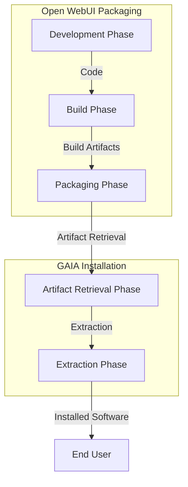

# Installation

The installation process for this solution consists of two main components working together:

## Installation Flow

1. **Open WebUI Packaging**:
   - Development phase where the source code is created and modified
   - Build phase that compiles and prepares the code
   - Packaging phase that creates a Python wheel artifact

2. **GAIA Installation**:
   - Artifact Retrieval phase where the GAIA installer pulls the Python wheel
   - Extraction phase where the wheel contents are unpacked
   - Final deployment to the end user's system

The diagram below illustrates this process:

