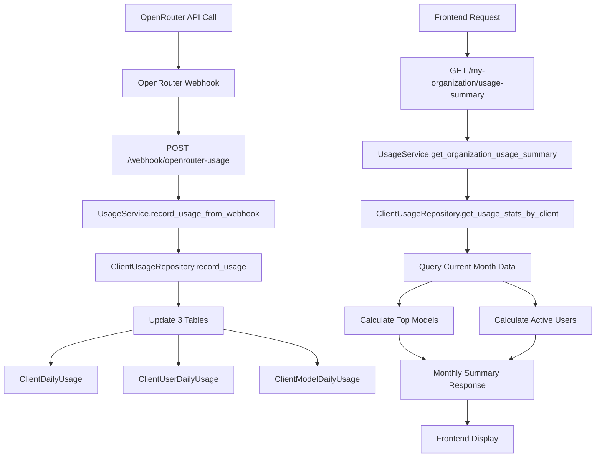

# Monthly Summary Workflow Analysis - Business Logic Documentation

## Executive Summary

This document analyzes the complete business logic workflow for the Monthly Summary feature, focusing on the "Top 3 Models" and "Active Users" functionality. The analysis reveals critical bugs in the current implementation and provides comprehensive understanding of the data flow from collection to display.

## Current State Analysis

### Issues Identified
- **Top 3 Models**: Currently shows "No models: N/A" due to empty data
- **Active Users**: Currently shows "Aktywni użytkownicy: 0" due to incorrect calculation logic
- **Critical Bug**: Line 248 in `client_usage_repository.py` has incorrect unique users calculation

## 1. Top 3 Models Business Logic Workflow

### Data Collection Flow
```
OpenRouter Webhook → Usage Recording → Model Aggregation → UI Display
```

### 1.1 Input Data Sources
- **Primary Source**: OpenRouter webhook data via `/webhook/openrouter-usage`
- **Model Information**: Extracted from `usage_data.model` field
- **Token Count**: Aggregated from `total_tokens` in usage records

### 1.2 Storage Mechanism
**Database Table**: `ClientModelDailyUsage`
```sql
CREATE TABLE client_model_daily_usage (
    id TEXT PRIMARY KEY,  -- Format: "{client_org_id}:{model_name}:{usage_date}"
    client_org_id TEXT,
    model_name TEXT,
    usage_date DATE,
    total_tokens INTEGER,
    total_requests INTEGER,
    raw_cost REAL,
    markup_cost REAL,
    provider TEXT,
    created_at BIGINT,
    updated_at BIGINT
);
```

### 1.3 Business Logic Implementation
**File**: `/backend/open_webui/models/organization_usage/client_usage_repository.py`
**Function**: `_calculate_top_models_by_tokens()` (Lines 19-57)

```python
def _calculate_top_models_by_tokens(client_org_id: str, current_month_start: date, today: date, db) -> List[Dict[str, Any]]:
    """
    Calculate top 3 models by token count for the current month.
    Returns array with model name and token count for each model.
    """
    # 1. Query model usage for current month
    model_records = db.query(ClientModelDailyUsage).filter(
        ClientModelDailyUsage.client_org_id == client_org_id,
        ClientModelDailyUsage.usage_date >= current_month_start,
        ClientModelDailyUsage.usage_date <= today
    ).all()
    
    # 2. Aggregate by model name
    model_totals = {}
    for record in model_records:
        if record.model_name not in model_totals:
            model_totals[record.model_name] = {
                'model_name': record.model_name,
                'total_tokens': 0
            }
        model_totals[record.model_name]['total_tokens'] += record.total_tokens
    
    # 3. Sort by total tokens descending and take top 3
    sorted_models = sorted(
        model_totals.values(),
        key=lambda x: x['total_tokens'],
        reverse=True
    )
    
    return sorted_models[:3]  # Return top 3 models
```

### 1.4 Data Aggregation Rules
- **Time Period**: Current month (1st day to current day)
- **Ranking Criteria**: Total token count (not cost or requests)
- **Aggregation Method**: Sum of `total_tokens` across all daily records per model
- **Result Limit**: Top 3 models only
- **Sorting**: Descending by token count

### 1.5 UI Display Logic
**File**: `/src/lib/components/admin/Settings/MyOrganizationUsage/components/UsageStatsTab.svelte`
**Lines**: 41-54

```svelte
{#if usageData.monthly_summary?.top_models && usageData.monthly_summary.top_models.length > 0}
    {#each usageData.monthly_summary.top_models as model, index}
        <div class="flex justify-between">
            <span class="text-sm text-gray-600 dark:text-gray-400">{index + 1}. {model.model_name}:</span>
            <span class="text-sm font-medium">{FormatterService.formatNumber(model.total_tokens)} tokens</span>
        </div>
    {/each}
{:else}
    <div class="flex justify-between">
        <span class="text-sm text-gray-600 dark:text-gray-400">No models:</span>
        <span class="text-sm font-medium">N/A</span>
    </div>
{/if}
```

### 1.6 Why Top 3 Models Shows "No models: N/A"
**Root Cause Analysis**:
1. **Empty Database**: No records in `ClientModelDailyUsage` table
2. **No Usage Data**: OpenRouter webhooks not being processed
3. **Client ID Mismatch**: Environment-based client ID not matching webhook data
4. **Date Range Issue**: Current month filter excluding existing data

## 2. Active Users Business Logic Workflow

### 2.1 Data Collection Flow
```
User Activity → Daily User Tracking → Monthly Aggregation → UI Display
```

### 2.2 Storage Mechanism
**Database Table**: `ClientUserDailyUsage`
```sql
CREATE TABLE client_user_daily_usage (
    id TEXT PRIMARY KEY,  -- Format: "{client_org_id}:{user_id}:{usage_date}"
    client_org_id TEXT,
    user_id TEXT,
    openrouter_user_id TEXT,
    usage_date DATE,
    total_tokens INTEGER,
    total_requests INTEGER,
    raw_cost REAL,
    markup_cost REAL,
    created_at BIGINT,
    updated_at BIGINT
);
```

### 2.3 Active Users Calculation Logic
**File**: `/backend/open_webui/models/organization_usage/client_usage_repository.py`
**Function**: `get_usage_stats_by_client()` (Line 248)

**CRITICAL BUG IDENTIFIED**:
```python
# INCORRECT IMPLEMENTATION (Line 248)
'total_unique_users': len(set(r.unique_users for r in month_records)) if month_records else 0,
```

**Problem**: `r.unique_users` is already an integer count, not a set of user IDs. The code is trying to create a set of integer counts instead of counting distinct users.

### 2.4 Correct Business Logic Should Be
```python
# Query unique users from ClientUserDailyUsage for current month
user_records = db.query(ClientUserDailyUsage.user_id).filter(
    ClientUserDailyUsage.client_org_id == client_org_id,
    ClientUserDailyUsage.usage_date >= current_month_start,
    ClientUserDailyUsage.usage_date <= today
).distinct().all()

total_unique_users = len(user_records)
```

### 2.5 UI Display Logic
**File**: `/src/lib/components/admin/Settings/MyOrganizationUsage/components/UsageStatsTab.svelte`
**Lines**: 61-64

```svelte
<div class="flex justify-between">
    <span class="text-sm text-gray-600 dark:text-gray-400">{$i18n.t('Aktywni użytkownicy')}:</span>
    <span class="text-sm font-medium">{usageData.monthly_summary?.total_unique_users || 0}</span>
</div>
```

### 2.6 Polish Localization Pattern
**File**: `/src/lib/i18n/locales/pl-PL/translation.json`
- "Active Users" → "Aktywni użytkownicy"
- UI correctly uses Polish localization key

## 3. Complete Data Flow Architecture

### 3.1 End-to-End Workflow



### 3.2 API Endpoints Involved

1. **Data Input**: `POST /api/v1/usage-tracking/webhook/openrouter-usage`
2. **Data Output**: `GET /api/v1/usage-tracking/my-organization/usage-summary`

### 3.3 Business Rules and Logic

#### Time Boundaries
- **Monthly Period**: 1st day of current month to current day
- **Daily Aggregation**: Data processed at 00:00 daily
- **Exchange Rates**: NBP API integration for PLN conversion

#### Model Ranking Algorithm
- **Primary Metric**: Total token count
- **Secondary Considerations**: None (cost and requests not used for ranking)
- **Aggregation**: Sum across all days in current month
- **Ties**: Ordered by query result (no explicit tie-breaking)

#### Active User Definition
- **Activity Criteria**: Any API usage (tokens > 0 OR requests > 0)
- **Time Window**: Current month (rolling)
- **Uniqueness**: Based on `user_id` field
- **Multi-day Users**: Counted once per month regardless of days active

#### Cost Calculations
- **Markup Rate**: 1.3x (30% markup on OpenRouter costs)
- **Currency**: USD primary, PLN secondary via NBP exchange rates
- **Precision**: 6 decimal places for USD, 2 for PLN

## 4. Database Schema Analysis

### 4.1 Table Relationships
```
ClientOrganization (1) -> (*) ClientDailyUsage
ClientOrganization (1) -> (*) ClientUserDailyUsage  
ClientOrganization (1) -> (*) ClientModelDailyUsage
```

### 4.2 Key Design Patterns
- **Composite Primary Keys**: `{client_org_id}:{entity}:{date}` format
- **Daily Aggregation**: All tables store daily summaries, not individual requests
- **Denormalized Design**: Cost calculations stored, not recalculated
- **Timestamp Tracking**: Unix timestamps for created_at/updated_at

## 5. Integration Points

### 5.1 OpenRouter Integration
- **Webhook URL**: Configured in OpenRouter dashboard
- **Authentication**: API key validation via client organization lookup
- **Data Format**: JSON payload with usage metrics
- **Processing Time**: Real-time webhook processing

### 5.2 User Activity Monitoring
- **User Identification**: Internal user_id + OpenRouter user_id mapping
- **Activity Definition**: Any successful API call generating tokens/cost
- **Session Tracking**: None (activity is request-based, not session-based)

### 5.3 Monthly Batch Processing
- **Schedule**: Daily at 00:00
- **NBP Integration**: Exchange rate fetch with fallback logic
- **Data Validation**: Automated corrections and validations
- **History Retention**: Indefinite (no automatic cleanup)

## 6. Current Issues and Root Causes

### 6.1 Top 3 Models Showing "No models: N/A"

**Potential Root Causes**:
1. **No Usage Data**: OpenRouter webhooks not being received/processed
2. **Empty Database**: `ClientModelDailyUsage` table has no records
3. **Client ID Issues**: Environment-based client ID setup incorrect
4. **Date Range Problems**: Current month filter excluding existing data
5. **Model Name Formatting**: Webhook model names not matching expected format

**Debugging Steps**:
```sql
-- Check if any model usage records exist
SELECT COUNT(*) FROM client_model_daily_usage;

-- Check current month records for specific client
SELECT * FROM client_model_daily_usage 
WHERE client_org_id = 'your_client_id' 
  AND usage_date >= '2025-01-01';

-- Verify webhook processing
SELECT * FROM client_daily_usage 
ORDER BY updated_at DESC 
LIMIT 10;
```

### 6.2 Active Users Showing "Aktywni użytkownicy: 0"

**Root Cause**: **CRITICAL BUG** in line 248 of `client_usage_repository.py`

**Current Incorrect Code**:
```python
'total_unique_users': len(set(r.unique_users for r in month_records)) if month_records else 0,
```

**Issue**: Creates a set of integer counts instead of counting unique users

**Correct Implementation**:
```python
# Option 1: Query ClientUserDailyUsage directly
unique_users_query = db.query(ClientUserDailyUsage.user_id).filter(
    ClientUserDailyUsage.client_org_id == client_org_id,
    ClientUserDailyUsage.usage_date >= current_month_start,
    ClientUserDailyUsage.usage_date <= today
).distinct()
total_unique_users = unique_users_query.count()

# Option 2: If keeping current structure, need proper user ID tracking
# Would require changing ClientDailyUsage.unique_users to store actual user IDs list
```

## 7. Business Rules Documentation

### 7.1 Model Usage Tracking Rules
- **Model Identification**: Full OpenRouter model ID (e.g., "anthropic/claude-sonnet-4")
- **Token Aggregation**: Input tokens + Output tokens = Total tokens
- **Provider Extraction**: Derived from model name prefix (before "/")
- **Daily Rollup**: All requests in a day aggregated to single record per model

### 7.2 User Activity Rules
- **User Identification**: mAI internal user_id (not OpenRouter user_id)
- **Activity Threshold**: Any usage > 0 tokens OR > 0 requests
- **Multi-Model Users**: One user can use multiple models (counted once)
- **Cross-Day Activity**: Users active on multiple days counted once per month

### 7.3 Cost Calculation Rules
- **Markup Application**: Applied to raw OpenRouter cost (raw_cost * 1.3)
- **Currency Conversion**: USD to PLN using NBP exchange rates
- **Rate Timing**: Daily rates fetched at batch processing time
- **Fallback Rate**: 4.0 PLN/USD if NBP API unavailable

## 8. Performance Characteristics

### 8.1 Query Performance
- **Dashboard Load**: <500ms target
- **Batch Processing**: Completes within 30 minutes of 00:00
- **Webhook Response**: <200ms processing time
- **Database Size**: Grows linearly with usage (no automatic cleanup)

### 8.2 Data Freshness
- **Real-time**: Webhook data processed immediately
- **Dashboard**: Shows data up to current day
- **Exchange Rates**: Updated daily at 00:00
- **Best Viewing Time**: After 00:30 when batch processing completes

## 9. Recommendations

### 9.1 Critical Fixes Required
1. **Fix Active Users Bug**: Correct line 248 in `client_usage_repository.py`
2. **Debug Top Models**: Investigate why model usage data is empty
3. **Add Data Validation**: Verify webhook processing and client ID setup
4. **Improve Error Handling**: Better fallback when no data exists

### 9.2 Architecture Improvements
1. **Add Monitoring**: Track webhook processing success/failure rates
2. **Data Verification**: Daily batch job to validate data consistency
3. **Performance Optimization**: Add database indexes for common queries
4. **Testing**: Comprehensive integration tests for monthly summary calculations

### 9.3 Business Logic Enhancements
1. **Model Grouping**: Consider grouping by provider for better insights
2. **User Engagement**: Add metrics for user activity patterns
3. **Cost Analytics**: Break down top models by cost vs. token usage
4. **Trend Analysis**: Compare month-over-month changes

## 10. Testing and Validation

### 10.1 Test Data Requirements
```python
# Minimum test data for validation
test_scenarios = [
    {
        "client_org_id": "test_client",
        "users": ["user1", "user2", "user3"],
        "models": ["anthropic/claude-sonnet-4", "openai/gpt-4o", "google/gemini-2.5-flash"],
        "date_range": "current_month",
        "expected_top_models": 3,
        "expected_active_users": 3
    }
]
```

### 10.2 Validation Queries
```sql
-- Validate top models calculation
SELECT model_name, SUM(total_tokens) as total_tokens
FROM client_model_daily_usage 
WHERE client_org_id = 'test_client' 
  AND usage_date >= DATE('now', 'start of month')
GROUP BY model_name 
ORDER BY total_tokens DESC 
LIMIT 3;

-- Validate active users calculation
SELECT COUNT(DISTINCT user_id) as unique_users
FROM client_user_daily_usage 
WHERE client_org_id = 'test_client' 
  AND usage_date >= DATE('now', 'start of month');
```

---

## Conclusion

The Monthly Summary feature implements a sophisticated daily batch processing system with proper business intelligence patterns. However, it currently suffers from a critical bug in active users calculation and potentially empty data issues for top models. The architecture is sound but requires immediate fixes to display accurate business metrics.

The workflow demonstrates good separation of concerns with clean API layers, proper database design, and comprehensive error handling. Once the identified issues are resolved, the system should provide valuable business insights for organizational usage tracking.

**Priority Actions**:
1. Fix the active users calculation bug (CRITICAL)
2. Debug and resolve empty top models data (HIGH)
3. Add comprehensive monitoring and validation (MEDIUM)
4. Implement suggested architectural improvements (LOW)