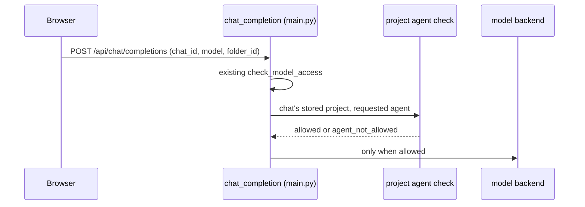

# Agent-limited projects specification

## Summary

An agent-limited project can only be worked in by the agents on its allow-list. The server enforces this on every route that starts, continues, moves or writes into a chat ([ADR 0003](../adr/0003-agent-limited-projects-enforced-on-server.md)). The interface only mirrors the result.

## Goals

- Only allow-listed agents can chat in the project, read its knowledge, or use its tools.
- A denial is explicit: HTTP 403 with the code `agent_not_allowed`, shown in the chat as a one-line explanation.
- New upstream routes cannot silently bypass the rule.

## Design

### Helper contract

`check_project_agent_access(user, project, agent_id)` returns allowed or a denial reason. It runs only when the project's `access_mode` is `agent_limited`. The project is resolved from the chat's stored folder. A `folder_id` sent in a request body is never trusted for an existing chat. For a new chat the sent `folder_id` is used only after `has_folder_write_access` succeeds (observed in `backend/open_webui/utils/access_control/folders.py`).

### Routes to protect

Observed by searching the v0.11.4 source on 2026-10-09. "Read" means the function body was read; "Listed" means only the route definition was seen. See [the investigation](../investigate/2026-10-09-chat-routes.md).

| Route | File | Status | Rule |
| --- | --- | --- | --- |
| `POST /api/chat/completions`, `/api/v1/chat/completions` | `main.py` (`chat_completion`) | Read | Single generation entry. Add the helper beside `check_model_access`. Ignore the body's `folder_id` for existing chats |
| `POST /api/v1/chats/new` | `chats.py` | Read (folder check only) | Already rejects a folder the user cannot write to; add the allow-list check |
| `POST /api/v1/chats/import` | `chats.py` | Listed | Confirm whether it sets a folder |
| `POST /api/v1/chats/{id}/folder` | `chats.py` | Read (folder check only) | Add the check for moves into a limited project |
| `POST /api/v1/chats/{id}/clone` | `chats.py` | Read (folder check only) | Clone keeps the folder when writable; add the check |
| `POST /api/v1/chats/{id}/clone/shared`, `/fork`, `/{id}` | `chats.py` | Listed | Confirm how each sets the folder |
| `POST /api/v1/chats/{id}/messages/{message_id}` | `chats.py` | Listed | Writes messages into a chat; reject ones attributed to a disallowed agent |
| `POST /api/v1/messages` | `main.py` | Listed | Anthropic-style endpoint; confirm whether it calls `chat_completion` |
| `POST /api/chat/completed`, `/api/chat/actions/{action_id}` | `main.py` | Listed | Work on an existing chat; check that chat's project |
| `/openai/chat/completions`, `/ollama/api/chat`, `/ollama/v1/*` | `routers/` | Listed | Direct proxies with no chat or project context; expected to need no check, confirm in testing |

Beyond routes:

- Knowledge collections attached to a project resolve only for allow-listed agents and are left out of retrieval in every other chat.
- A project's tools are offered only to allow-listed agents.
- In a project chat the model picker returns only the allow-list, with the default marked.
- Global search leaves agent-limited project chats out unless scoped to that project.

### Tests

- One test per row above that expects 403 for a disallowed agent and success for an allowed one.
- A route-inventory test that lists every registered chat-related route and fails on one not in this table.

## Open questions

- Do child folders inherit their parent project's allow-list? (See [ADR 0002](../adr/0002-projects-extend-upstream-folders.md).)
- How are agents identified when a chat uses a model that wraps a base model (`base_model_id`)? The allow-list is by workspace model id; confirm this is enough.
- Channels (`channels.py`) can call models; decide whether projects are out of scope there.

## Related docs

- [Projects and tasks](projects-and-tasks.md)
- [Build phases](../plans/build-phases.md)
