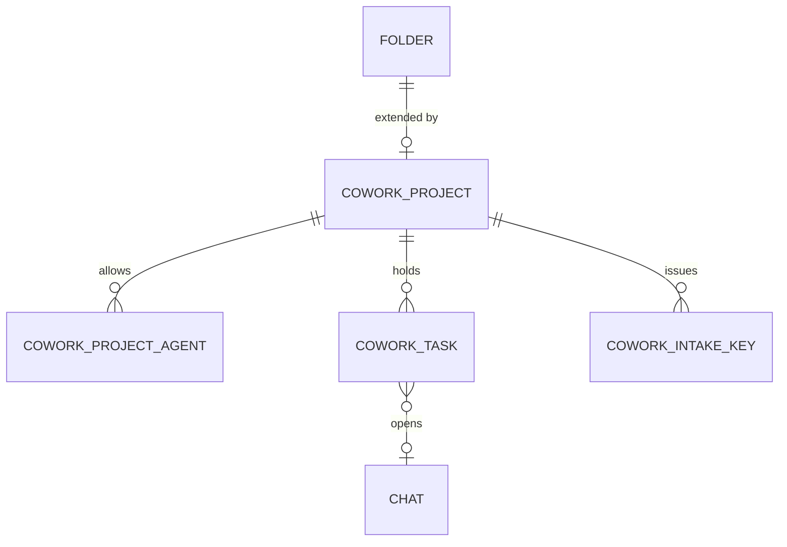

# Projects and tasks specification

## Summary

Projects group chats, instructions, knowledge and a default agent. Tasks are issues that backend processes push into an inbox; opening a task starts a chat in the task's project with the right agent. Both build on upstream folders ([ADR 0002](../adr/0002-projects-extend-upstream-folders.md)).

## Goals

- Add projects and tasks with new tables and routes only; change no upstream table.
- Let any backend process push a task with one authenticated HTTP call.
- Show new and changed tasks in the sidebar live.

## Design

### Data model

| Table | Key columns | Purpose |
| --- | --- | --- |
| `cowork_project` | `folder_id` (primary key, the upstream folder), `access_mode` (`private`, `agent_limited`, `shared`), `default_agent_id`, `isolate_knowledge`, `isolate_tools`, timestamps | Turns a folder into a project |
| `cowork_project_agent` | `project_id`, `agent_id` (an upstream model id), `created_at`; unique on the pair | Allow-list for agent-limited projects |
| `cowork_task` | `id`, `project_id`, `title`, `body`, `severity` (`critical`, `warning`, `info`), `status` (`open`, `agent_working`, `snoozed`, `resolved`), `source`, `payload` (JSON), `chat_id`, `agent_id`, `external_key`, `snoozed_until`, timestamps, `resolved_by` | The inbox; `external_key` is unique per project |
| `cowork_intake_key` | `id`, `project_id`, `name`, `key_hash`, `key_prefix`, `created_by`, `created_at`, `last_used_at`, `revoked_at` | Scoped keys; only the hash is stored |
| `cowork_setting` | `key`, `value` (JSON) | Theme and branding settings (see [theme spec](theme-and-branding.md)) |

People-sharing for the `shared` and `private` modes reuses upstream access grants on the folder (resource type `folder`), so no sharing table is added.

Migration: upstream uses Alembic (`backend/open_webui/migrations/versions`). Observed on 2026-10-09: one head, `d4c1a8e37b62`. The new migration must set its `down_revision` to whatever the head is when the file is written.

### API

All routes are under `/api/v1/cowork/` ([ADR 0004](../adr/0004-cowork-api-prefix-and-scoped-intake-keys.md)).

| Route | Auth | Purpose |
| --- | --- | --- |
| `POST /tasks` | Intake key | Push a task into the key's project; a repeated `external_key` updates instead of duplicating |
| `GET /tasks` | User | List visible tasks, filtered by project, severity and status |
| `PATCH /tasks/{id}` | User | Snooze, resolve or reopen |
| `POST /tasks/{id}/open-chat` | User | Create a chat in the project, seeded with the payload and the project's agent; store `chat_id`; set status to `agent_working` |
| `GET /projects`, `POST /projects` | User | List and create projects (a folder plus its extension row) |
| `PATCH /projects/{folder_id}` | Project write access | Change access mode, default agent and isolation switches |
| `PUT /projects/{folder_id}/agents` | Project write access | Replace the allow-list |
| `GET`, `POST`, `DELETE /projects/{folder_id}/intake-keys` | Project write access | Create, list and revoke scoped keys; the raw key is shown once |

Intake pushes send `Authorization: Bearer cw_...`. A dedicated dependency hashes the key, finds the project, and rejects any body naming another project.

### Live updates

After a task changes, the router emits a `cowork:task` event to every user who can see the project. Observed: `emit_to_users(event, data, user_ids)` exists in `backend/open_webui/socket/main.py`, so no new transport is needed. The sidebar badge and inbox list subscribe to the event.

## Open questions

- Are projects limited to top-level folders, or can a child folder inherit its parent project? See [agent-limited projects](agent-limited-projects.md).
- Does deleting an upstream folder need a hook, or is a foreign key with cascade enough?
- How are "who can see a project" user ids computed for the socket event (owner plus grants plus groups)?

## Related docs

- [Build phases](../plans/build-phases.md)
