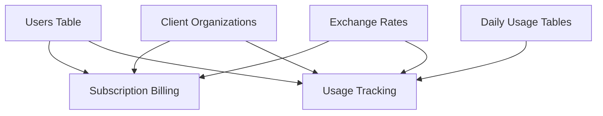

# Subscription Billing System - Business Logic Workflow Analysis

## Executive Summary

The mAI subscription billing system implements a sophisticated tier-based pricing model with proportional billing calculations for mid-month user additions. The system operates on a calendar month billing cycle with four pricing tiers based on user count, featuring automatic tier determination and proportional cost calculation for users added mid-month.

### Key Features
- **Tier-based pricing**: 4 tiers (1-3, 4-9, 10-19, 20+ users) with decreasing per-user costs
- **Proportional billing**: Users pay only for remaining days when added mid-month
- **Calendar month cycles**: Billing aligns to calendar months (1st to last day)
- **Environment-based multi-tenancy**: All users in a container belong to the same organization
- **Real-time calculations**: Dynamic billing updates based on current user count and addition dates

## System Architecture Overview

### Core Components
```
Frontend (Svelte)
├── BillingTab.svelte - Main billing display component
├── billing.ts - TypeScript type definitions
└── billingStore.ts - State management

Backend (FastAPI)
├── billing_service.py - Core billing business logic
├── billing_router.py - HTTP API endpoints
├── client_repository.py - Organization data access
└── usage_repository.py - Usage tracking integration

Database (SQLite)
├── users - User management and creation dates
├── client_organizations - Organization configuration
└── usage tracking tables - Integration with usage monitoring
```

## Detailed Workflow Analysis

### 1. Total Users Calculation and Billing Methodology

**Function**: `get_subscription_billing()` in `billing_service.py`

#### Input Processing
- **Data Source**: `Users.get_users()` - retrieves all system users
- **User Count**: `len(all_users)` - total active users in the environment
- **Date Context**: Current system date for monthly calculations

#### Business Logic Flow
```python
# 1. Retrieve all users from the system
users_response = Users.get_users()
all_users = users_response.users if hasattr(users_response, 'users') else []
total_users = len(all_users)

# 2. Determine current month context
now = datetime.now()
current_month = now.month
current_year = now.year
days_in_month = calendar.monthrange(current_year, current_month)[1]
```

#### User Data Enhancement
Each user record includes:
- **user_id**: Internal user identifier
- **user_name**: Display name
- **user_email**: Contact information
- **created_date**: User addition timestamp for proportional billing
- **days_remaining_when_added**: Days left in month when user was added
- **billing_proportion**: Percentage of month to bill (0.0-1.0)
- **monthly_cost_pln**: Calculated cost for the user

### 2. Current Tier Determination (79 PLN Baseline)

**Pricing Tier Structure**:
```python
pricing_tiers = [
    {"min": 1, "max": 3, "price": 79},     # 1-3 users: 79 PLN/user/month
    {"min": 4, "max": 9, "price": 69},     # 4-9 users: 69 PLN/user/month  
    {"min": 10, "max": 19, "price": 59},   # 10-19 users: 59 PLN/user/month
    {"min": 20, "max": float('inf'), "price": 54}  # 20+ users: 54 PLN/user/month
]
```

#### Tier Determination Logic
```python
def determine_pricing_tier(total_users: int) -> int:
    """Determine pricing tier based on user count"""
    for tier in pricing_tiers:
        if tier["min"] <= total_users <= tier["max"]:
            return tier["price"]
    return 79  # Default fallback
```

#### Volume Discount Strategy
- **Tier 1 (1-3 users)**: Premium pricing at 79 PLN - suitable for small teams
- **Tier 2 (4-9 users)**: 13% discount at 69 PLN - mid-size team pricing
- **Tier 3 (10-19 users)**: 25% discount at 59 PLN - department-level pricing
- **Tier 4 (20+ users)**: 32% discount at 54 PLN - enterprise-level pricing

### 3. Monthly Total Calculation with Proportional Billing

#### Proportional Billing Formula
```python
def calculate_billing_proportion(created_date: datetime, billing_month: datetime) -> float:
    """Calculate billing proportion for mid-month additions"""
    if created_date.year == billing_month.year and created_date.month == billing_month.month:
        # User added this month - calculate proportional billing
        days_in_month = calendar.monthrange(billing_month.year, billing_month.month)[1]
        days_remaining = days_in_month - created_date.day + 1
        return days_remaining / days_in_month
    else:
        # User added in previous months - full month billing
        return 1.0
```

#### Total Cost Calculation
```python
total_cost = 0.0
for user_obj in all_users:
    # Get user's creation timestamp
    created_date = datetime.fromtimestamp(user_obj.created_at)
    
    # Calculate proportional billing
    billing_proportion = calculate_billing_proportion(created_date, now)
    
    # Apply current tier price
    user_cost = current_tier_price * billing_proportion
    total_cost += user_cost
```

### 4. Pricing Tiers Structure and Logic

#### Tier Breakdown Display
```typescript
interface TierBreakdown {
    tier_range: string;           // "1-3 users", "4-9 users", etc.
    price_per_user_pln: number;   // Price in PLN
    is_current_tier: boolean;     // Highlight active tier
}
```

#### Business Rules for Tier-Based Pricing
1. **Single Tier Application**: All users in an organization use the same tier price
2. **Instant Tier Changes**: Adding/removing users immediately affects the tier
3. **No Prorating Between Tiers**: Tier changes apply to the entire month
4. **Volume Incentive**: Higher user counts receive better per-user pricing

### 5. User Billing Details with Proportional Calculations

#### Individual User Billing Record
```python
user_detail = {
    "user_id": user_obj.id,
    "user_name": user_obj.name,
    "user_email": user_obj.email,
    "created_date": created_date.strftime("%Y-%m-%d"),
    "days_remaining_when_added": days_remaining,
    "billing_proportion": billing_proportion,
    "monthly_cost_pln": round(user_cost, 2)
}
```

#### Proportional Calculation Examples
**Example 1: User added on February 15th (28-day month)**
- Days remaining: 28 - 15 + 1 = 14 days
- Billing proportion: 14/28 = 0.5 (50%)
- Cost (69 PLN tier): 69 * 0.5 = 34.50 PLN

**Example 2: User added on January 31st (31-day month)**
- Days remaining: 31 - 31 + 1 = 1 day
- Billing proportion: 1/31 = 0.032 (3.2%)
- Cost (69 PLN tier): 69 * 0.032 = 2.23 PLN

### 6. Mid-Month Billing Adjustment Procedures

#### Addition Handling
```python
# When user is added mid-month
if created_date.year == current_year and created_date.month == current_month:
    days_remaining = days_in_month - created_date.day + 1
    billing_proportion = days_remaining / days_in_month
else:
    # Full month billing for existing users
    billing_proportion = 1.0
```

#### Key Business Rules
- **Day of Addition Counts**: User added on day X pays for days X through end of month
- **Same-Day Addition**: Users added on the last day still pay for that full day
- **No Partial Day Billing**: Billing is calculated in full-day increments
- **Monthly Boundary**: New month resets all users to full billing (proportion = 1.0)

### 7. Integration with User Management and Organization Tracking

#### User Management Integration
```python
# Get all users from the main user system
all_users = Users.get_users()

# Extract user details and creation timestamps
for user_obj in all_users:
    created_date = datetime.fromtimestamp(user_obj.created_at)
    # Calculate billing based on creation date
```

#### Organization Context
```python
# Environment-based organization identification
client_org_id = self.client_repo.get_environment_client_id()
from open_webui.config import ORGANIZATION_NAME
organization_name = ORGANIZATION_NAME or "My Organization"
```

#### Data Flow Integration
1. **User Creation**: New users added via standard user management
2. **Billing Calculation**: Subscription service reads user creation timestamps
3. **Organization Context**: Environment variable determines organization identity
4. **Real-time Updates**: Billing recalculates on each page load/API call

## Database Schema for Billing and User Management

### Core Tables Used

#### users table
```sql
CREATE TABLE user (
    id VARCHAR PRIMARY KEY,
    name VARCHAR,
    email VARCHAR,
    role VARCHAR,
    profile_image_url TEXT,
    last_active_at BIGINT,
    updated_at BIGINT,
    created_at BIGINT,  -- Critical for proportional billing
    api_key VARCHAR UNIQUE,
    settings JSON,
    info JSON,
    oauth_sub TEXT UNIQUE
);
```

#### client_organizations table
```sql
CREATE TABLE client_organizations (
    id VARCHAR PRIMARY KEY,
    name VARCHAR NOT NULL,
    openrouter_api_key TEXT NOT NULL UNIQUE,
    openrouter_key_hash VARCHAR,
    markup_rate FLOAT DEFAULT 1.3,
    monthly_limit FLOAT,
    billing_email VARCHAR,
    timezone VARCHAR DEFAULT 'Europe/Warsaw',
    is_active INTEGER DEFAULT 1,
    created_at BIGINT,
    updated_at BIGINT
);
```

## API Endpoints and Data Flow Mapping

### Primary Billing Endpoint
```http
GET /api/usage-tracking/my-organization/subscription-billing
Authorization: Bearer <user_token>
```

#### Response Structure
```json
{
    "success": true,
    "subscription_data": {
        "current_month": {
            "month": 1,
            "year": 2024,
            "total_users": 5,
            "current_tier_price_pln": 69,
            "total_cost_pln": 345.00,
            "tier_breakdown": [
                {
                    "tier_range": "1-3 users",
                    "price_per_user_pln": 79,
                    "is_current_tier": false
                },
                {
                    "tier_range": "4-9 users", 
                    "price_per_user_pln": 69,
                    "is_current_tier": true
                }
            ],
            "user_details": [
                {
                    "user_name": "John Doe",
                    "user_email": "john@example.com",
                    "created_date": "2024-01-01",
                    "days_remaining_when_added": 31,
                    "billing_proportion": 1.0,
                    "monthly_cost_pln": 69.00
                }
            ]
        }
    }
}
```

### Data Flow Sequence
1. **Frontend Request**: BillingTab component requests billing data
2. **Router Processing**: billing_router.py handles HTTP request
3. **Service Logic**: billing_service.py calculates subscription billing
4. **Database Queries**: Users.get_users() retrieves user information
5. **Calculations**: Proportional billing and tier determination
6. **Response Formatting**: Structured JSON response with all billing details
7. **Frontend Display**: BillingTab renders pricing tiers, user details, and totals

## Business Rules for Tier-Based Pricing

### Tier Transition Rules
1. **Immediate Effect**: User count changes immediately affect tier pricing
2. **Monthly Application**: New tier pricing applies to entire current month
3. **No Retroactive Changes**: Previous months remain at their calculated costs
4. **Unified Pricing**: All users in organization pay same tier rate

### Billing Cycle Rules
1. **Calendar Month Basis**: Billing cycles follow calendar months (1st to last day)
2. **Mid-Month Proportional**: Users added mid-month pay proportionally
3. **No Partial Day Billing**: Minimum billing unit is one full day
4. **Creation Timestamp**: User billing starts from their creation date/time

### Error Handling and Edge Cases
1. **Invalid User Data**: Fallback to basic user information if detailed data unavailable
2. **Missing Creation Date**: Default to full month billing if timestamp missing
3. **Leap Year Handling**: `calendar.monthrange()` correctly handles February 29th
4. **Timezone Considerations**: All calculations use server timezone (Europe/Warsaw)

## Frontend Component Structure for Billing Display

### Component Hierarchy
```
BillingTab.svelte
├── Summary Cards
│   ├── Total Users Card (blue gradient)
│   ├── Current Tier Card (green gradient)  
│   └── Monthly Total Card (purple gradient)
├── Pricing Tiers Grid
│   └── 4 tier cards with current tier highlighting
└── User Details Table
    ├── User name and email
    ├── Added date
    ├── Days in month
    └── Monthly cost
```

### State Management
```typescript
// billingStore.ts
interface BillingState {
    subscriptionData: SubscriptionData | null;
    loading: LoadingState;
}

// Store actions for data updates
billingActions = {
    setSubscriptionData: (data: SubscriptionData) => void,
    setLoading: (loading: boolean, error?: string) => void,
    clear: () => void,
    clearError: () => void
}
```

## Integration Points with Usage Tracking System

### Shared Infrastructure
- **Database Connection**: Both systems use same SQLite database
- **User Management**: Shared user model and authentication
- **Organization Context**: Environment-based client identification
- **Currency Conversion**: Shared PLN/USD exchange rate utilities

### Data Relationships


### Service Integration
- **billing_service.py**: Handles subscription calculations
- **usage_repository.py**: Manages usage data access
- **client_repository.py**: Provides organization context
- **currency_converter.py**: Shared exchange rate functionality

## Performance Considerations and Optimization

### Calculation Efficiency
- **User Count Caching**: Could cache user count for frequently accessed data
- **Tier Lookup**: Simple array iteration for tier determination (O(1) for 4 tiers)
- **Date Calculations**: Uses efficient Python datetime and calendar modules
- **Database Queries**: Single query to retrieve all users

### Scalability Factors
- **User Volume**: Current design handles hundreds of users efficiently
- **Monthly Calculations**: Lightweight computations scale linearly with user count
- **Memory Usage**: Minimal memory footprint for billing calculations
- **API Response**: Structured data suitable for frontend rendering

### Potential Optimizations
1. **User Count Caching**: Cache user count between requests
2. **Tier Configuration**: Move pricing tiers to database configuration
3. **Batch Processing**: Pre-calculate billing data for improved response times
4. **Database Indexing**: Ensure users table has indexes on created_at field

## Error Handling and Monitoring

### Exception Management
```python
try:
    result = billing_service.get_subscription_billing()
    return BillingResponse(**result)
except Exception as e:
    import traceback
    print(f"Error in subscription billing: {e}")
    print(traceback.format_exc())
    return BillingResponse(
        success=False,
        error=str(e),
        subscription_data=None
    )
```

### Validation Rules
- **User Data Integrity**: Validate user creation timestamps
- **Tier Boundary Checks**: Ensure user count falls within expected ranges
- **Date Validation**: Verify month/year boundaries for calculations
- **Cost Precision**: Round monetary values to 2 decimal places

### Monitoring Points
- **API Response Times**: Track billing calculation performance
- **Error Rates**: Monitor exception frequency in billing calculations
- **Data Consistency**: Verify user count matches between systems
- **Tier Distribution**: Track organization distribution across pricing tiers

## Business Impact and Value Proposition

### Revenue Model Benefits
- **Predictable Revenue**: Subscription model provides steady monthly income
- **Volume Incentives**: Tier pricing encourages user growth
- **Fair Pricing**: Proportional billing ensures customers pay for actual usage
- **Transparent Costs**: Clear pricing structure builds customer trust

### Customer Experience
- **Clear Billing**: Detailed breakdown of costs and user contributions
- **Fair Mid-Month Pricing**: Proportional billing for new user additions
- **Real-Time Updates**: Immediate visibility into current billing status
- **Predictable Costs**: Tier-based pricing allows for budget planning

### Operational Efficiency
- **Automated Calculations**: No manual billing adjustments required
- **Environment-Based**: Simplified multi-tenant architecture
- **Integration**: Seamless connection with usage tracking system
- **Audit Trail**: Complete user billing history and calculations

---

## Summary

The mAI subscription billing system demonstrates sophisticated business logic for handling tier-based pricing with proportional billing calculations. The system successfully balances customer fairness (proportional mid-month billing) with business efficiency (automated tier-based pricing) while maintaining full integration with the broader usage tracking ecosystem.

Key strengths include accurate proportional billing calculations, transparent tier-based pricing, real-time billing updates, and comprehensive frontend display of billing information. The system's architecture supports scalability while maintaining clear separation of concerns between billing logic, data access, and user interface components.