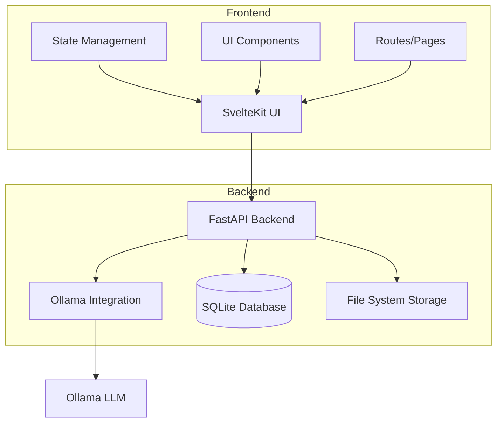
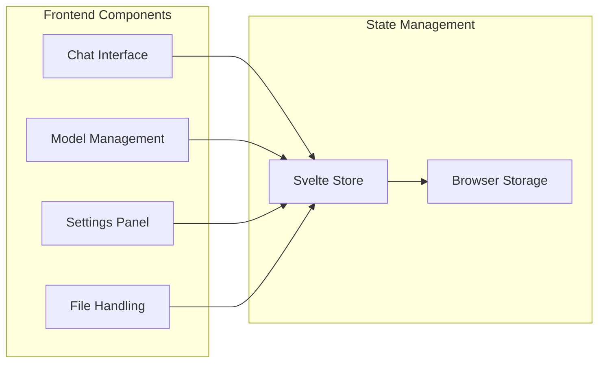
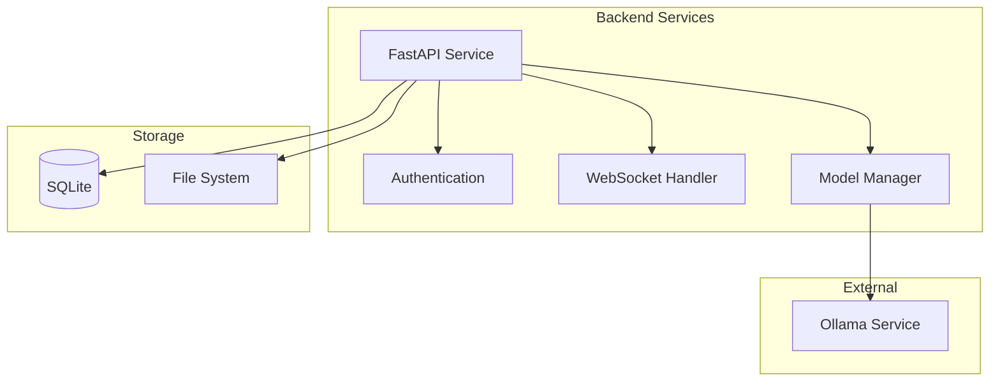
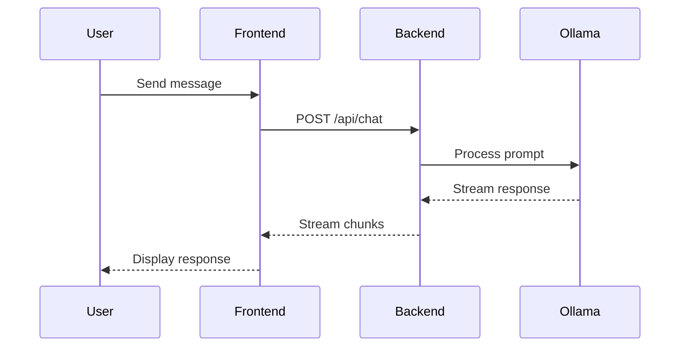
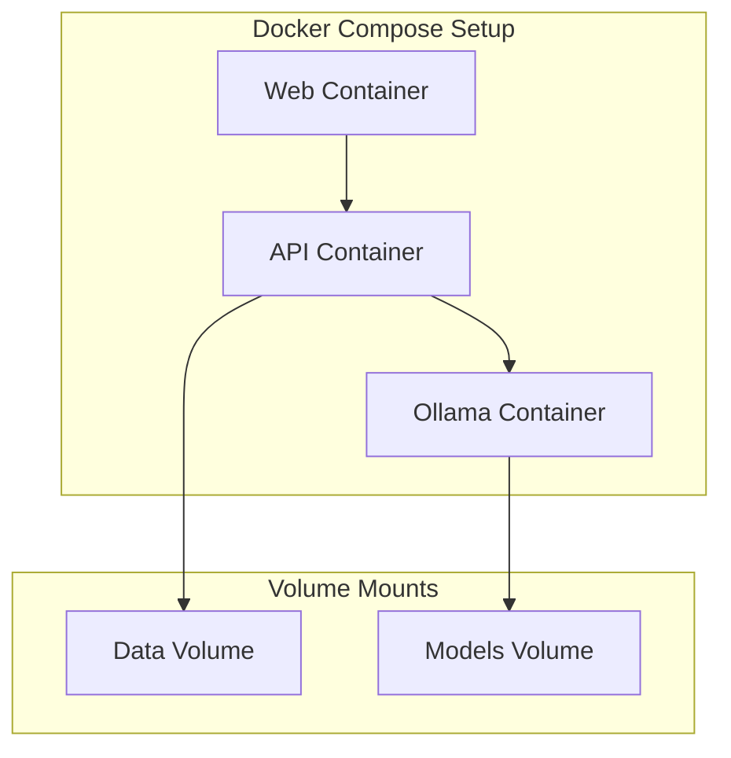

# Open WebUI Architecture Documentation

## Overview

Open WebUI is a modern web interface for Ollama, designed to provide a user-friendly interface for interacting with large language models. The application follows a client-server architecture with a clear separation between frontend and backend components.

## System Architecture

## Frontend Architecture

The frontend is built using SvelteKit, a modern web application framework that provides excellent developer experience and optimal performance.

### Key Components

1. **UI Layer**
   - Built with SvelteKit
   - Tailwind CSS for styling
   - Responsive design
   - Dark/Light theme support

2. **State Management**
   - Svelte stores for global state
   - Local component state
   - Persistent storage for user preferences

3. **Main Features**
   - Chat interface
   - Model management
   - Settings configuration
   - File upload/download
   - Internationalization support

## Backend Architecture

The backend is implemented using FastAPI, providing a robust and high-performance API server.

### Components

1. **API Layer**
   - FastAPI framework
   - RESTful endpoints
   - WebSocket support for real-time communication
   - Authentication and authorization

2. **Database**
   - SQLite for data persistence
   - Stores user preferences
   - Chat history
   - Model configurations

3. **Ollama Integration**
   - Model management
   - Chat completion
   - Prompt handling
   - Stream processing

## Data Flow

### Chat Workflow

1. User sends a message through the UI
2. Frontend validates and formats the message
3. Message is sent to backend via WebSocket/REST API
4. Backend processes the message and sends to Ollama
5. Ollama generates response
6. Response is streamed back to frontend
7. Frontend renders the response in real-time

### Model Management Workflow

1. User requests available models
2. Backend queries Ollama for model list
3. Models are displayed in UI
4. User can pull/remove models
5. Changes are synchronized with Ollama

## Deployment Architecture

The application supports multiple deployment options:

1. **Docker Compose**
   - Containerized deployment
   - Easy scaling
   - Environment isolation

2. **Kubernetes**
   - Production-grade deployment
   - High availability
   - Load balancing

## Security Considerations

1. **Authentication**
   - Optional user authentication
   - API key management
   - Session handling

2. **Data Protection**
   - Secure WebSocket connections
   - Input validation
   - Rate limiting

3. **Model Security**
   - Controlled model access
   - Resource usage limits
   - Safe prompt handling

## Development Workflow

1. **Local Development**
   - Hot reloading
   - Development server
   - Debug tools

2. **Testing**
   - Unit tests
   - Integration tests
   - E2E tests with Cypress

3. **CI/CD**
   - GitHub Actions
   - Automated testing
   - Docker image builds

## Extensibility

The architecture is designed to be extensible:

1. **Plugin System**
   - Custom model integrations
   - Additional features
   - UI customizations

2. **API Extensions**
   - New endpoints
   - Custom handlers
   - Additional services

3. **UI Themes**
   - Customizable styling
   - Component theming
   - Layout modifications 