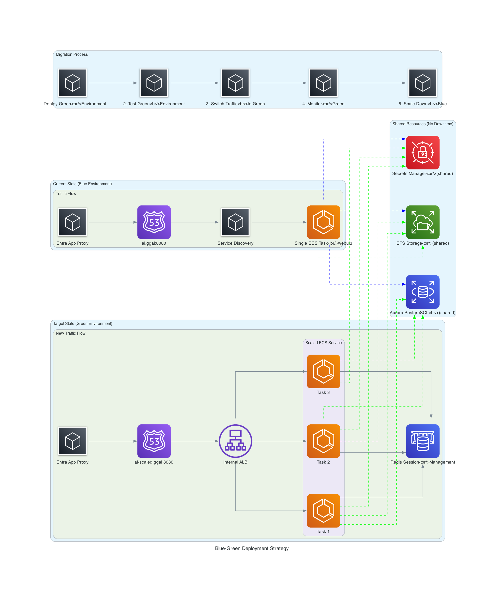

# OpenWebUI Horizontal Scaling with Terraform

This Terraform configuration implements horizontal scaling for OpenWebUI using a blue-green deployment strategy with zero downtime.

## Architecture Overview

```
Microsoft Entra App Proxy → Internal ALB → ECS Service (3 instances) → Aurora PostgreSQL
                                     ↓            ↓
                               Redis Cluster  EFS Storage
```

## Key Components

- **Internal ALB**: Routes traffic to multiple ECS instances with sticky sessions
- **ElastiCache Redis**: Session management and WebSocket coordination
- **ECS Service**: `webui3-scaled` with 3 Fargate instances (2 vCPU, 8GB each)
- **Auto Scaling**: CPU-based scaling from 2-10 instances
- **Monitoring**: CloudWatch dashboards and alarms

## Prerequisites

1. Terraform >= 1.0
2. AWS CLI configured with profile `908027381725_AdministratorAccess`
3. Existing OpenWebUI infrastructure running

## Remote Backend Configuration

This Terraform configuration uses an S3 remote backend for state management with DynamoDB for state locking, providing team collaboration and state consistency.

### Backend Configuration Details

```hcl
backend "s3" {
  bucket         = "gg-ai-terraform-states"
  key            = "production/gravity-ai-chat/terraform.tfstate"
  region         = "us-east-1"
  profile        = "908027381725_AdministratorAccess"
  dynamodb_table = "terraform-state-locks"
  encrypt        = true
}
```

### Key Features

- **S3 Bucket**: `gg-ai-terraform-states` - Centralized state storage
- **State Path**: `production/gravity-ai-chat/terraform.tfstate` - Environment-specific state file
- **Encryption**: Server-side encryption enabled for state file security
- **State Locking**: DynamoDB table `terraform-state-locks` prevents concurrent modifications
- **Profile-based Access**: Uses AWS profile `908027381725_AdministratorAccess` for authentication

### Backend Initialization

The backend is automatically configured when you run `terraform init`. However, ensure:

1. **S3 bucket exists**: The `gg-ai-terraform-states` bucket must be created beforehand
2. **DynamoDB table exists**: The `terraform-state-locks` table must exist with:
   - Primary key: `LockID` (String)
   - Billing mode: On-demand or provisioned
3. **AWS credentials**: Your profile `908027381725_AdministratorAccess` has appropriate permissions:
   - S3: `GetObject`, `PutObject`, `DeleteObject` on the state bucket
   - DynamoDB: `GetItem`, `PutItem`, `DeleteItem` on the locks table

### Troubleshooting Backend Issues

**Error: "NoSuchBucket"**
```bash
# Verify bucket exists
aws s3 ls s3://gg-ai-terraform-states --profile "908027381725_AdministratorAccess"
```

**Error: "ResourceNotFoundException" (DynamoDB)**
```bash
# Verify DynamoDB table exists
aws dynamodb describe-table \
  --table-name terraform-state-locks \
  --profile "908027381725_AdministratorAccess" \
  --region us-east-1
```

**Error: "AccessDenied"**
```bash
# Verify AWS profile configuration
aws sts get-caller-identity --profile "908027381725_AdministratorAccess"
```

## Deployment Steps

### Phase 1: Infrastructure Deployment

```bash
# 1. Initialize Terraform
cd terraform/openwebui-horizontal-scaling
terraform init

# 2. Review the plan
terraform plan

# 3. Deploy infrastructure
terraform apply
```

### Phase 2: Testing and Validation

```bash
# 1. Get ALB DNS name
ALB_DNS=$(terraform output -raw alb_dns_name)

# 2. Test health endpoint
curl -H "Host: ai-glondon.msappproxy.net" http://$ALB_DNS/health

# 3. Monitor service health
aws ecs describe-services \
  --cluster webUIcluster2 \
  --services webui3-scaled \
  --profile "908027381725_AdministratorAccess" \
  --region us-east-1
```

### Phase 3: Traffic Switch

1. **Update Entra App Proxy backend URL**:
   - FROM: Current service discovery endpoint
   - TO: `http://<alb-dns-name>` (from terraform output)

2. **Monitor the dashboard**:
   ```bash
   echo $(terraform output -raw dashboard_url)
   ```

3. **After validation, scale down old service**:
   ```bash
   aws ecs update-service \
     --cluster webUIcluster2 \
     --service webui3 \
     --desired-count 0 \
     --profile "908027381725_AdministratorAccess" \
     --region us-east-1
   ```

## Configuration Details

### Resource Allocation

| Component | Specification |
|-----------|---------------|
| ECS Instances | 3x (2 vCPU, 8GB RAM) |
| Redis | cache.t3.micro, encrypted |
| ALB | Internal, sticky sessions |
| Auto Scaling | 2-10 instances, 70% CPU target |

### Environment Variables Added

```bash
WEBSOCKET_MANAGER=redis
WEBSOCKET_REDIS_URL=<redis-endpoint>
ENABLE_WEBSOCKET_SUPPORT=true
WEBUI_SECRET_KEY=<shared-secret>
UVICORN_WORKERS=2
THREAD_POOL_SIZE=20
```

## Data Loss Prevention

✅ **Zero Data Loss Guarantee**:
- Database: Aurora PostgreSQL unchanged
- Files: EFS shared across all instances  
- Sessions: Redis-backed session storage
- Configuration: Database-backed syncing

## Cost Impact

| Resource | Monthly Cost |
|----------|--------------|
| ECS Fargate (3x smaller) | ~$400 |
| ElastiCache Redis | ~$17 |
| Internal ALB | ~$25 |
| **Total Increase** | **~$100/month** |

## Monitoring

### CloudWatch Dashboard

Access via: `terraform output dashboard_url`

**Metrics Tracked**:
- ECS CPU/Memory utilization
- ALB response times and error rates
- Redis performance metrics
- Auto scaling events

### Alarms

- **High CPU** (>85%): Scale out trigger
- **High Memory** (>90%): Resource pressure alert
- **ALB Response Time** (>2s): Performance degradation
- **Redis CPU** (>75%): Cache performance

## Cleanup

```bash
# Destroy infrastructure (keeps data)
terraform destroy

# Note: Aurora, EFS, and original service remain unchanged
```

## Security

- **Network**: Private subnets, security group isolation
- **Encryption**: Redis and EFS encryption enabled
- **Secrets**: AWS Secrets Manager for credentials
- **Access**: Internal ALB, no public internet exposure

# Blue-Green Deployment Strategy


---

**Important**: This deployment maintains the existing production service while adding horizontal scaling capability. Always test thoroughly before switching traffic.
