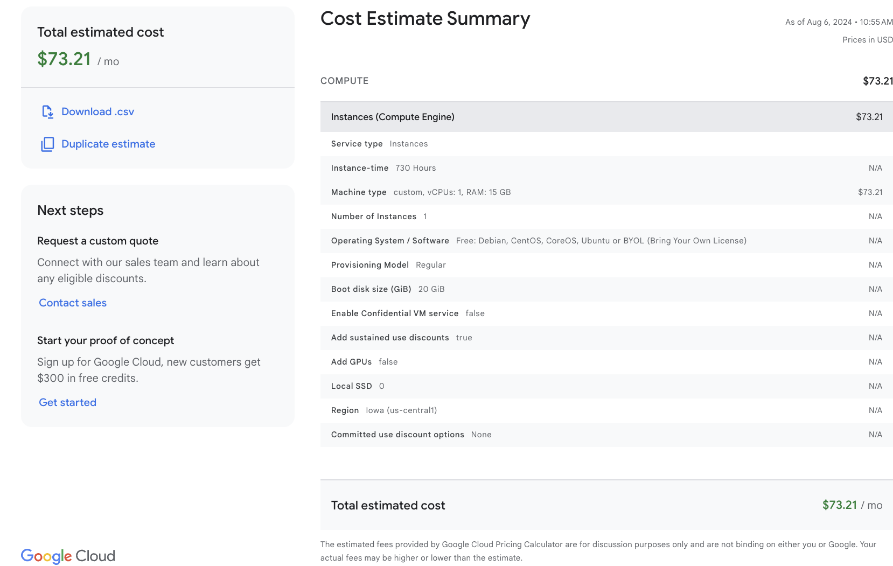
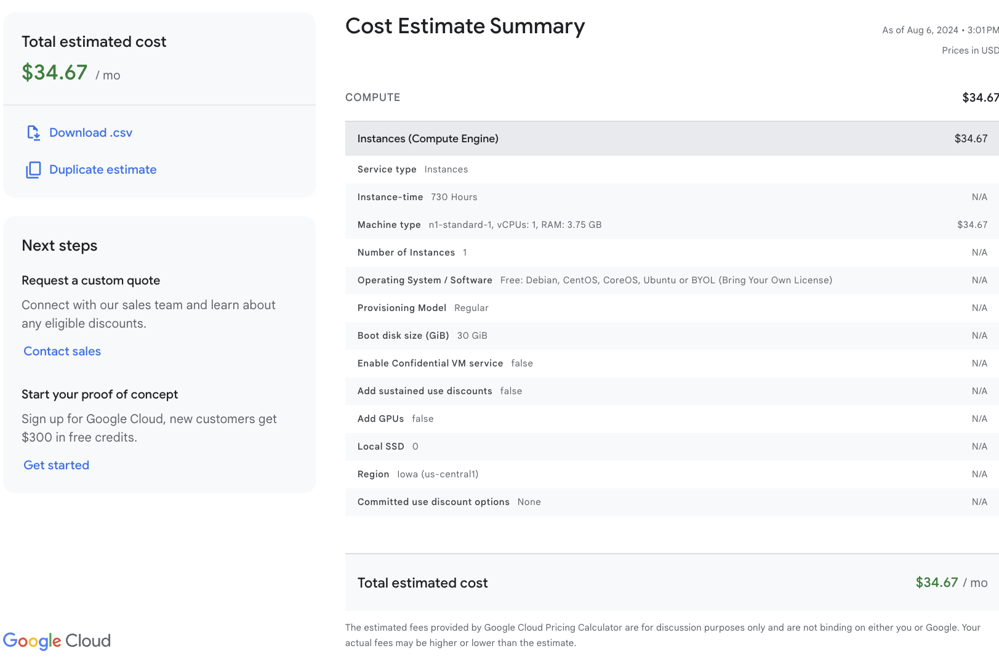
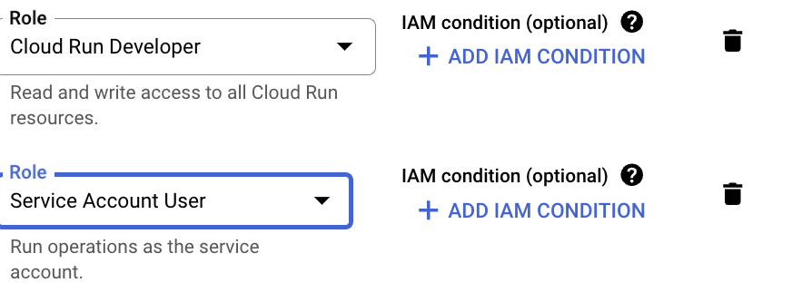
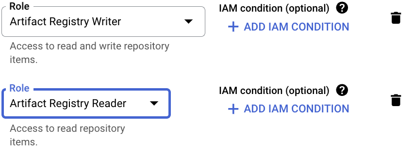
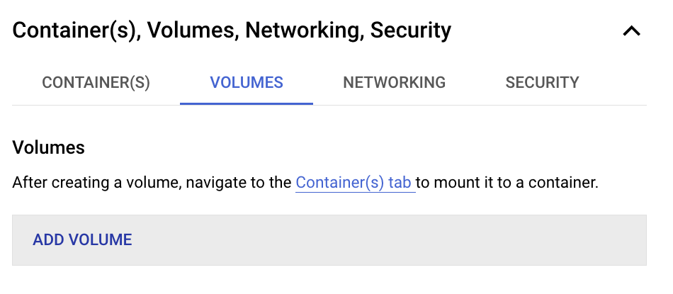
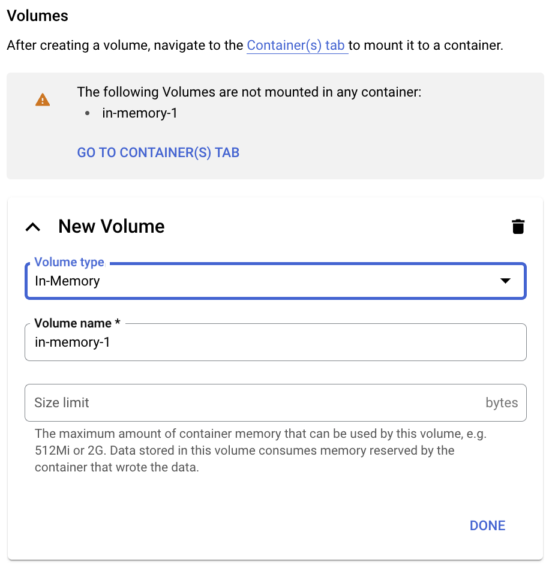
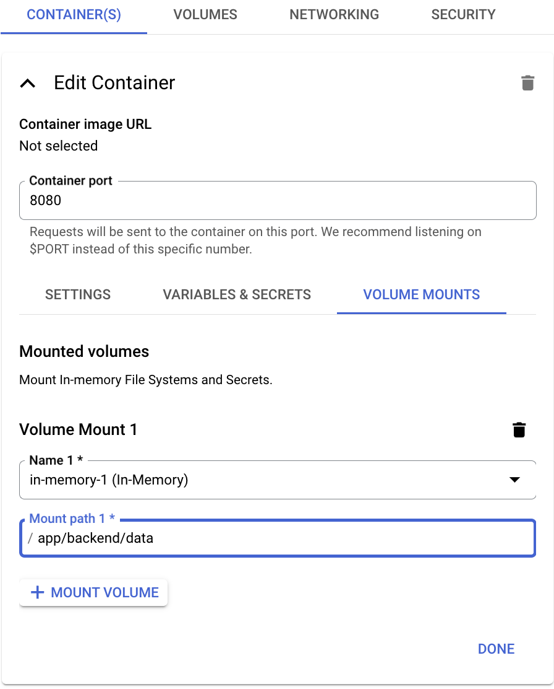

# Google Could Guide

## Cost Comparison

1. Hosting Ollama and Open WebUI together.
    

2. Hosting with [pipeline](https://docs.openwebui.com/pipelines/) features. This allows the application connecting to external model apis other than OpenAI and Ollama. It requires the developers to build pipeline themselves. See [example](https://github.com/open-webui/pipelines/tree/main/examples/pipelines). Additional API fees might apply based on the provider.

    

3. Hosting with OpenAI API endpoints only. Cost should be similar to above. Additional API fees might apply based on the provider.

## Deployment on GCR (cloud run)

### Step 1: upload image to Google Artifact Registry

The open-webui, open-webui-pipeline and modelearth-open-webui images are already uploaded to the org's registry. If you are interested how to do it, you could check out this [guide](https://cloud.google.com/artifact-registry/docs/docker/store-docker-container-images).

#### Reference Steps

1. Open the **Repositories** page in the Google Cloud console.
2. Click Create Repository
3. Specify `open-webui` as the repo name
4. Choose **Docker** as the format and **Standard** as mode
5. Choose **Region** as the Location Type and **us-central1** as the location
6. Click Create
7. Open Google Cloud Shell. Config it correctly. Checkout gcloud config documentation if needed.
8. Run the following:

    ```shell
    gcloud auth configure-docker us-central1-docker.pkg.dev
    docker pull ghcr.io/open-webui/open-webui:main
    docker images # check image id
    docker tag 79aef8c7e645 us-central1-docker.pkg.dev/openwebui-projects1/open-webui/open-webui-image:0.1
    docker push us-central1-docker.pkg.dev/[PROJECT_ID]/open-webui/open-webui-image:0.1
    ```

Repeat the step for pipeline images.

### Step 2: GCR

1. Grant Cloud Run Developer, Service Account User, Artifact Registry Reader, Artifact Registry Writer IAM roles:

&nbsp;&nbsp;&nbsp;{width=500}.
&nbsp;&nbsp;&nbsp;{width=500}
2. Follow [Deploying a service with sidecar containers](https://cloud.google.com/run/docs/deploying#sidecars).
3. Mount volume to the container

&nbsp;&nbsp;&nbsp;&nbsp;a. Under Container(s), Volumes, Networking, Security, select VOLUMES, ADD VOLUME
&nbsp;&nbsp;&nbsp;&nbsp;{width=500}
&nbsp;&nbsp;&nbsp;&nbsp;b. create new volume and then go to Containers Tab
&nbsp;&nbsp;&nbsp;&nbsp;{width=500}
&nbsp;&nbsp;&nbsp;&nbsp;c. Under Volume Mounts:
&nbsp;&nbsp;&nbsp;&nbsp;{width=500}

&nbsp;&nbsp;&nbsp;&nbsp;For the pipeline image, change the **mount path** to `app/pipelines`.

4. Then follow [adding pipelines features](https://docs.openwebui.com/pipelines/).
5. Good to go!

<!-- ## Deployment on GKE

A quick start [guide](https://www.youtube.com/watch?v=vIKy3pDz3jM) for a toy project.

## Deployment on GCE

1. Create an instance on GCE. Disk storage set to `40GB`
2. ssh the VM instance just created
3. make a working directory `mkdir webui-projects` and navigate to it `cd webui-projects`

**The following steps are for Ollama installation. You should alter it to suit your needs.** 
4. pull Ollama by

    sudo bash 
    curl -fsSL https://ollama.com/install.sh | sh


5. test if Ollama is intalled and start

    ```bash
    service ollama start
    ollama list
    ```

6. install a preferred model from Ollama

    ```bash
    ollama run mistral
    ```

1. Follow [Create Your Project](https://cloud.google.com/appengine/docs/standard/python3/building-app/creating-gcp-project) till Step 5
2. Run the following in your terminal

    ```bash
    gcloud config configurations create [CONFIG_NAME] --activate
    gcloud config configurations list # check if its created
    gcloud config set project [PROJECT_ID]
    gcloud config set account [YOUR_ACCOUNT]
    gcloud auth login
    gcloud config configurations list # check if the setting is correct
    gcloud app create
    ``` -->
