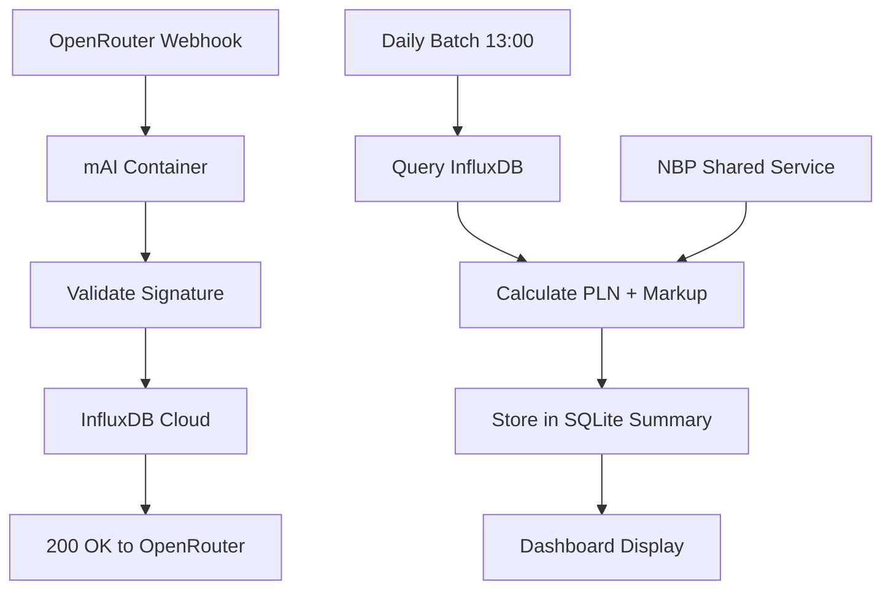

### Canvas: `Updated - Key Architectural Changes.md`

### New Data Architecture

**Data Flow with InfluxDB Cloud**



**Container Structure per Client**

```yaml
# docker-compose.template.yml
version: '3.8'
services:
  # Main mAI application per client (simplified)
  mai-{{CLIENT_ID}}:
    image: ghcr.io/your-org/mai-usage:{{IMAGE_VERSION}}
    container_name: mai-{{CLIENT_ID}}
    restart: unless-stopped

    environment:
      # Client isolation
      - CLIENT_ORG_ID={{CLIENT_ORG_ID}}
      - OPENROUTER_EXTERNAL_USER={{CLIENT_ORG_ID}}
      - OPENROUTER_API_KEY={{CLIENT_OPENROUTER_KEY}}
      - OPENROUTER_WEBHOOK_SECRET={{WEBHOOK_SECRET}}

      # InfluxDB Cloud (shared across all clients)
      - INFLUXDB_URL={{INFLUXDB_CLOUD_URL}}
      - INFLUXDB_TOKEN={{INFLUXDB_CLOUD_TOKEN}}
      - INFLUXDB_ORG={{INFLUXDB_ORG}}
      - INFLUXDB_BUCKET=mai-usage-tracking

      # NBP shared service
      - NBP_SERVICE_URL=http://mai-nbp-service:8001

      # Local databases (per client isolation)
      - DATABASE_URL=sqlite:///app/backend/data/webui.db
      - USAGE_SUMMARY_DB=sqlite:///app/backend/data/usage_summary.db

      # Daily batch processing (built-in, not separate container)
      - DAILY_BATCH_ENABLED=true
      - DAILY_BATCH_TIME=13:00
      - DAILY_BATCH_TIMEZONE=Europe/Warsaw

    volumes:
      # Complete data isolation per client
      - {{CLIENT_ID}}_data:/app/backend/data

    ports:
      - "{{CLIENT_PORT}}:8080"

    depends_on:
      - mai-nbp-service

    labels:
      - "mai.client.id={{CLIENT_ID}}"
      - "mai.client.org={{CLIENT_ORG_ID}}"
      - "mai.influxdb.measurement=usage_{{CLIENT_ID}}"

# SHARED SERVICES (per server, not per client)
  mai-nbp-service:
    image: ghcr.io/your-org/mai-nbp-service:latest
    container_name: mai-nbp-service
    restart: unless-stopped

    environment:
      - NBP_API_URL=https://api.nbp.pl/api/exchangerates/rates/a/usd/
      - FETCH_INTERVAL=3600  # 1 hour
      - CACHE_TTL=7200       # 2 hours cache
      - PORT=8001

    ports:
      - "8001:8001"

    healthcheck:
      test: ["CMD", "python3", "-c", "import urllib.request,sys;sys.exit(0 if urllib.request.urlopen('http://localhost:8001/health',timeout=3).getcode()==200 else 1)"]
      interval: 30s
      timeout: 5s
      retries: 3
      start_period: 15s

volumes:
  {{CLIENT_ID}}_data:
    driver: local
    labels:
      - "mai.client.id={{CLIENT_ID}}"
      - "mai.backup.enabled=true"
```

### InfluxDB Integration Code

**Webhook Handler with InfluxDB**

*Note: This code snippet illustrates the core concept. The final implementation includes more detailed error handling and logging.*

```python
# /routers/webhook_router.py
import asyncio
from influxdb_client import InfluxDBClient, Point
from influxdb_client.client.write_api import SYNCHRONOUS

class InfluxDBWebhookHandler:
    # ... (initialization) ...

    async def process_openrouter_webhook(self, webhook_data: dict):
        """
        Ultra-fast webhook processing - just write to InfluxDB and respond
        """
        try:
            point = Point("usage_tracking") \
                .tag("client_org_id", os.getenv("CLIENT_ORG_ID")) \
                .tag("model", webhook_data.get("model")) \
                .tag("user_email", webhook_data.get("user_email", "unknown")) \
                # ... (fields for tokens, cost, etc.) ...
                .time(datetime.utcnow())
            
            # ... (write to InfluxDB) ...
        except Exception as e:
            logger.error(f"InfluxDB write error: {e}")
```

**Daily Batch Processing and Manual Execution**

*Note: The following snippet illustrates the core data processing logic. The final implementation in `unified_batch_processor.py` includes detailed error handling, timezone management, and a command-line interface.*

```python
# /utils/unified_batch_processor.py
from influxdb_client import InfluxDBClient

class DailyBatchProcessor:
    # ... (initialization) ...

    async def process_daily_usage(self, date: datetime):
        """
        Query InfluxDB for aggregated daily data at 13:00 CET
        """
        # ... (query InfluxDB with correct timezone handling) ...
        # ... (get PLN rate from NBP service) ...
        # ... (calculate markup and PLN cost) ...
        # ... (store daily summary in SQLite) ...
```

**Manual Execution Trigger**

The `unified_batch_processor.py` script has been enhanced with a command-line interface to allow for manual execution, which is crucial for debugging and reprocessing historical data.

To run the batch process manually for a specific date (e.g., August 1st, 2025):

```bash
docker exec mai-backend-dev python3 -m open_webui.utils.unified_batch_processor --run-now --date 2025-08-01
```

  - `--run-now`: A mandatory flag to execute the process immediately.
  - `--date YYYY-MM-DD`: An optional flag to specify the processing date. Defaults to yesterday if not provided.

### NBP Shared Service

**Standalone NBP Service**
*Note: This snippet illustrates the core API logic.*

```python
# nbp-service/main.py
from fastapi import FastAPI
import httpx
import asyncio
from datetime import datetime, timedelta

app = FastAPI(title="mAI NBP Service")

# ... (caching logic) ...

@app.get("/api/usd-pln-rate")
async def get_usd_pln_rate():
    # ... (fetches rate from NBP, uses cache, handles errors) ...

@app.get("/health")
async def health_check():
    return {"status": "healthy", "service": "nbp-rate-service"}
```