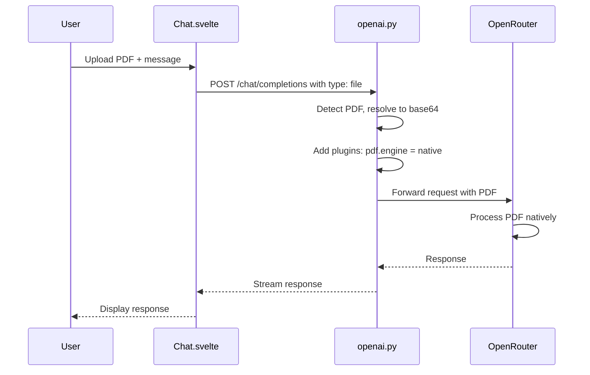
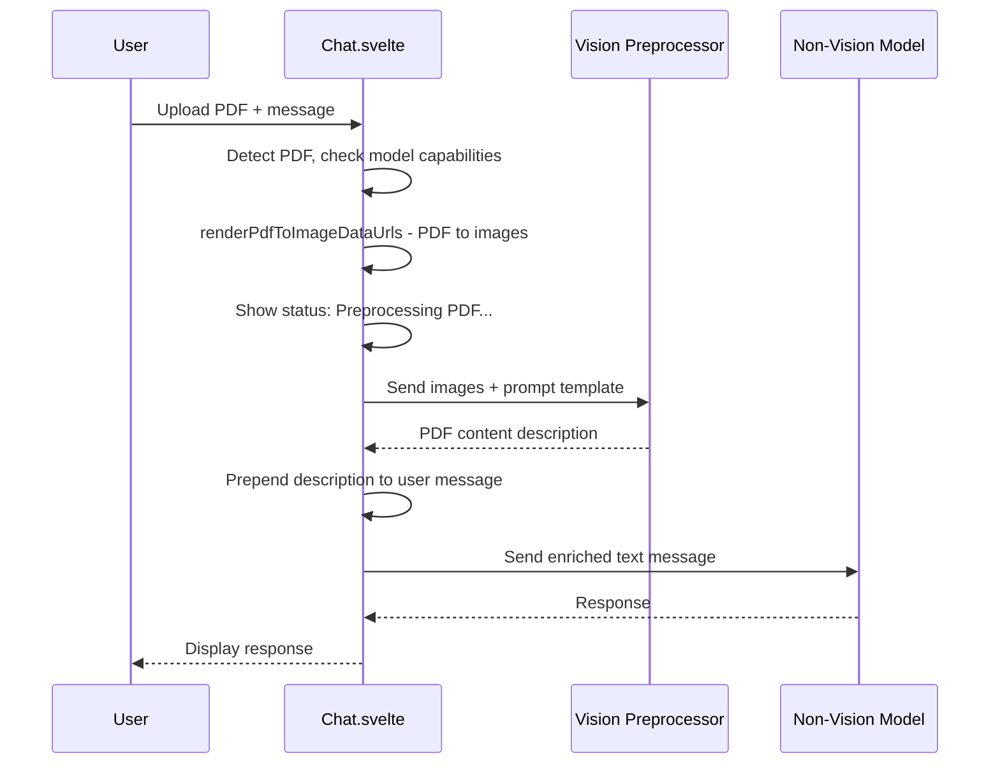

# PDF Handling Refactor Plan

## Overview

This plan outlines the changes needed to:
1. **Remove** the existing documents/RAG/knowledge base functionality
2. **Implement** direct PDF-to-model handling for vision-capable models via OpenRouter
3. **Implement** PDF preprocessing for non-vision models (PDF → images → vision model description)

## Current State Analysis

### Already Implemented

1. **PDF Detection in Backend** ([`backend/open_webui/routers/openai.py`](../backend/open_webui/routers/openai.py:1010-1075))
   - `has_pdf_files` flag detects PDFs in messages
   - File URLs resolved to base64 for `type: "file"` content parts
   - Content-type detection for PDFs

2. **OpenRouter Native Plugin** ([`backend/open_webui/routers/openai.py`](../backend/open_webui/routers/openai.py:1147-1168))
   - Sets `pdf.engine: "native"` for OpenRouter when PDFs detected
   - Plugin configuration structure in place

3. **Vision Preprocessor UI** ([`src/lib/components/workspace/Models/ModelEditor.svelte`](../src/lib/components/workspace/Models/ModelEditor.svelte:835-860))
   - `vision_preprocessor_model_id` configuration
   - `vision_preprocessor_prompt` template with `{query}` placeholder
   - Only shows when `!capabilities.vision`

4. **Image Vision Preprocessing** ([`src/lib/components/chat/Chat.svelte`](../src/lib/components/chat/Chat.svelte:1876-1986))
   - Detects images in messages via `hasImages`
   - Checks `hasNativeVision` and `hasPreprocessor`
   - Shows status: "Preprocessing images with vision model..."
   - Calls vision model, prepends analysis to user content

5. **PDF-to-Image Utility** ([`src/lib/utils/index.ts`](../src/lib/utils/index.ts:1499-1552))
   - `renderPdfToImageDataUrls()` function exists
   - Uses pdfjs-dist to render PDF pages to canvas
   - Returns `{ totalPages, renderedPages, images }` with data URLs

---

## Architecture

### Data Flow: Vision-Capable Model (Native PDF)



### Data Flow: Non-Vision Model (PDF Preprocessing)



---

## Phase 1: Remove Documents/RAG Functionality

### Files to Remove

#### Frontend Routes
- `src/routes/(app)/workspace/knowledge/` - entire directory
- `src/routes/(app)/workspace/knowledge/[id]/` - subdirectory
- `src/routes/(app)/workspace/knowledge/create/` - subdirectory

#### Frontend Components  
- `src/lib/components/workspace/Knowledge/` - entire directory
- `src/lib/components/workspace/Knowledge/KnowledgeBase/` - subdirectory

#### Frontend APIs (Partial)
- `src/lib/apis/knowledge/` - entire directory (if exists)
- `src/lib/apis/retrieval/index.ts` - KEEP web search functions, REMOVE:
  - `processFile` - document processing
  - `queryDoc` - document query
  - `queryCollection` - collection query
  - `resetUploadDir` - uploads reset
  - `resetVectorDB` - vector DB reset
  - Embedding/reranking config functions (maybe keep if needed for web search)

### Files to Modify

#### Backend
- `backend/open_webui/routers/retrieval.py`:
  - KEEP: Web search endpoints (`/process/web/search`, web config)
  - KEEP: YouTube processing (simple text extraction)
  - REMOVE: Document processing endpoints
  - REMOVE: Vector DB collection management
  - REMOVE: File processing for RAG

- `backend/open_webui/retrieval/` directory:
  - KEEP: `web/` - web search functionality
  - CONSIDER: `loaders/youtube.py` - YouTube transcript extraction
  - REMOVE/SIMPLIFY: Vector DB code if no longer needed
  - REMOVE: Document loaders for RAG (or keep minimal for web)

#### Frontend Components
- `src/lib/components/chat/Chat.svelte`:
  - Line 2320-2322: Remove `knowledge_search` status filtering
  - Line 66: Keep `processWeb`, `processWebSearch`, `processYoutubeVideo` imports

- `src/lib/components/chat/Messages/ResponseMessage/StatusHistory/StatusItem.svelte`:
  - Line 40-41: Remove or modify `knowledge_search` status handling

- Sidebar/Navigation:
  - Remove Knowledge workspace link from navigation menus

### Configuration Changes
- Admin settings: Remove any Knowledge/Documents settings panels
- Keep WebSearch settings (`src/lib/components/admin/Settings/WebSearch.svelte`)

---

## Phase 2: PDF Preprocessing for Non-Vision Models

### Implementation in Chat.svelte

Location: After line 1986 (after image preprocessing block), add PDF preprocessing:

```typescript
// PDF Preprocessing for non-vision models
const hasPdfs = createMessagesList(_history, parentId).some((message) =>
  message.files?.some((file) => 
    file.type === 'file' && 
    (file.name?.toLowerCase().endsWith('.pdf') || 
     file.file?.meta?.content_type === 'application/pdf')
  )
);

if (hasPdfs && !hasNativeVision && hasPreprocessor) {
  const preprocessorId = model.info.meta.vision_preprocessor_model_id;
  const preprocessorModel = $models.find((m) => m.id === preprocessorId);
  
  if (!preprocessorModel) {
    toast.error(`Vision preprocessor model not found: ${preprocessorId}`);
  } else {
    const userMessage = _history.messages[parentId];
    const userPdfs = userMessage.files?.filter((f) => 
      f.type === 'file' && f.name?.toLowerCase().endsWith('.pdf')
    ) || [];

    if (userPdfs.length > 0) {
      let responseMessage = _history.messages[responseMessageId];
      responseMessage.statusHistory = responseMessage.statusHistory || [];
      responseMessage.statusHistory.push({
        done: false,
        action: '📄',
        description: 'Preprocessing PDF with vision model...'
      });
      // Update history for UI
      _history.messages[responseMessageId] = responseMessage;
      history.messages[responseMessageId] = responseMessage;
      history = { ...history };

      // Convert PDFs to images
      const allPdfImages = [];
      for (const pdfFile of userPdfs) {
        try {
          // Fetch PDF data from file URL
          const pdfResponse = await fetch(pdfFile.url);
          const pdfData = await pdfResponse.arrayBuffer();
          
          const { images } = await renderPdfToImageDataUrls(pdfData, {
            maxPages: 10, // Limit pages to avoid token overflow
            scale: 1.5
          });
          
          allPdfImages.push(...images.map((img, idx) => ({
            url: img,
            pageNum: idx + 1,
            filename: pdfFile.name
          })));
        } catch (e) {
          console.error('Error converting PDF to images:', e);
        }
      }

      if (allPdfImages.length > 0) {
        const userContent = userMessage.content;
        const visionPrompt = (
          model.info.meta.vision_preprocessor_prompt ||
          'Extract all text and describe the contents of these PDF pages in the context of the user query: {query}'
        ).replace('{query}', userContent);

        const visionMessages = [
          { role: 'system', content: visionPrompt },
          {
            role: 'user',
            content: [
              { type: 'text', text: userContent },
              ...allPdfImages.map((img) => ({
                type: 'image_url',
                image_url: { url: img.url }
              }))
            ]
          }
        ];

        try {
          const visionRes = await generateOpenAIChatCompletion(
            localStorage.token,
            {
              model: preprocessorModel.id,
              messages: visionMessages,
              stream: false,
              params: { max_tokens: 4096 }
            },
            `${WEBUI_BASE_URL}/api`
          );

          const visionResponse = visionRes.choices[0].message.content;

          responseMessage = _history.messages[responseMessageId];
          responseMessage.statusHistory.push({
            done: true,
            action: '📄',
            description: 'PDF analysis complete',
            pdf_response: visionResponse
          });
          _history.messages[responseMessageId] = responseMessage;
          history.messages[responseMessageId] = responseMessage;

          // Prepend PDF analysis to user content
          userMessage.content = `[PDF Analysis:\n${visionResponse}\n]\n\n${userMessage.content}`;
          userMessage.pdf_processed = true;

          _history.messages[parentId] = userMessage;
          history.messages[parentId] = userMessage;
          history = { ...history };

          await saveChatHandler(_chatId, _history);
        } catch (pdfError) {
          console.error('PDF preprocessing failed:', pdfError);
          toast.error('PDF preprocessing failed. Sending without analysis.');

          responseMessage = _history.messages[responseMessageId];
          responseMessage.statusHistory.push({
            done: true,
            action: '📄❌',
            description: 'PDF preprocessing failed'
          });
          _history.messages[responseMessageId] = responseMessage;
          history.messages[responseMessageId] = responseMessage;
          history = { ...history };
        }
      }
    }
  }
}
```

### Status Display

Add PDF status icon to [`StatusItem.svelte`](../src/lib/components/chat/Messages/ResponseMessage/StatusHistory/StatusItem.svelte):

```svelte
{:else if status?.action === '📄' || status?.action === '📄❌'}
  <div class="flex flex-col justify-center -space-y-0.5">
    <div class="text-sm font-medium">{status.description}</div>
  </div>
```

---

## Phase 3: Native PDF Processing for Vision Models

### Backend Verification

The current implementation in [`openai.py`](../backend/open_webui/routers/openai.py:1147-1168) already handles this:

```python
if has_pdf_files and "openrouter.ai" in url:
    plugins = payload.get("plugins")
    if not isinstance(plugins, list):
        plugins = []

    file_parser_plugin = None
    for plugin in plugins:
        if isinstance(plugin, dict) and plugin.get("id") == "file-parser":
            file_parser_plugin = plugin
            break

    if file_parser_plugin is None:
        file_parser_plugin = {"id": "file-parser"}
        plugins.append(file_parser_plugin)

    pdf_plugin_config = file_parser_plugin.get("pdf")
    if not isinstance(pdf_plugin_config, dict):
        pdf_plugin_config = {}

    pdf_plugin_config["engine"] = "native"
    file_parser_plugin["pdf"] = pdf_plugin_config
    payload["plugins"] = plugins
```

### Message Format for PDFs

Ensure PDFs are sent with correct format:

```json
{
  "messages": [
    {
      "role": "user",
      "content": [
        {
          "type": "text",
          "text": "What are the main points in this document?"
        },
        {
          "type": "file",
          "file": {
            "filename": "document.pdf",
            "file_data": "data:application/pdf;base64,..."
          }
        }
      ]
    }
  ],
  "plugins": [
    {
      "id": "file-parser",
      "pdf": {
        "engine": "native"
      }
    }
  ]
}
```

---

## Phase 4: PDF Storage for Chat History

### File Upload Flow

PDFs should follow the existing file upload pattern:

1. User selects PDF → `uploadFile()` in [`files/index.ts`](../src/lib/apis/files/)
2. File stored via Storage provider
3. File metadata saved in `Files` model
4. Message includes file reference in `files` array
5. Chat saved with `chatFiles` including PDF references

### Message Structure

```typescript
{
  id: 'uuid',
  role: 'user',
  content: 'Analyze this document',
  files: [
    {
      type: 'file',
      file: { id: 'file-uuid', filename: 'doc.pdf' },
      id: 'file-uuid',
      url: '/api/v1/files/{id}/content',
      name: 'doc.pdf',
      status: 'uploaded'
    }
  ]
}
```

---

## Implementation Order

### Week 1: Phase 1 - Remove Documents/RAG
1. Remove Knowledge workspace routes and components
2. Modify navigation to remove Knowledge links
3. Clean up retrieval API (keep web search)
4. Clean up backend retrieval router
5. Remove/archive vector DB code

### Week 2: Phase 2 - PDF Preprocessing
1. Add PDF detection in Chat.svelte
2. Implement PDF-to-images conversion
3. Add preprocessing status messages
4. Implement vision model call for PDF analysis
5. Handle errors gracefully

### Week 3: Phase 3 & 4 - Native PDF & Storage
1. Verify OpenRouter native plugin
2. Test PDF format in messages
3. Verify file upload/storage works for PDFs
4. Test chat history with PDF attachments

### Week 4: Testing & Cleanup
1. End-to-end testing
2. Remove dead code
3. Documentation updates

---

## Testing Checklist

- [ ] Upload PDF to vision-capable model → Model receives PDF via OpenRouter native
- [ ] Upload PDF to non-vision model with preprocessor → PDF converted to images, analyzed, text prepended
- [ ] Upload PDF to non-vision model without preprocessor → Error message shown
- [ ] Reload chat with PDF → PDF attachment visible and usable
- [ ] Upload multiple PDFs → All processed correctly
- [ ] Large PDF (>10 pages) → Truncated to maxPages, still works
- [ ] Web search still works → Functionality preserved
- [ ] YouTube link processing still works → Functionality preserved
- [ ] Knowledge workspace routes → 404 (removed)

---

## Risks and Mitigations

| Risk | Impact | Mitigation |
|------|--------|------------|
| Breaking web search | High | Carefully identify dependencies before removal |
| Token overflow from PDF images | Medium | Limit maxPages, compress images |
| PDF conversion failures | Medium | Graceful error handling, fallback behavior |
| Chat history corruption | High | Backup testing, incremental changes |
| API compatibility | Medium | Test with multiple OpenRouter models |

---

## User Decisions (Confirmed)

1. **YouTube Processing**: ✅ Keep simplified (text extraction only, no RAG/vector DB)

2. **PDF Page Limits**: ✅ No limit (process all pages)

3. **Fallback Behavior**: ✅ Block message and show error if preprocessing fails

4. **Admin Settings**: ✅ Remove all Documents/Knowledge admin settings
