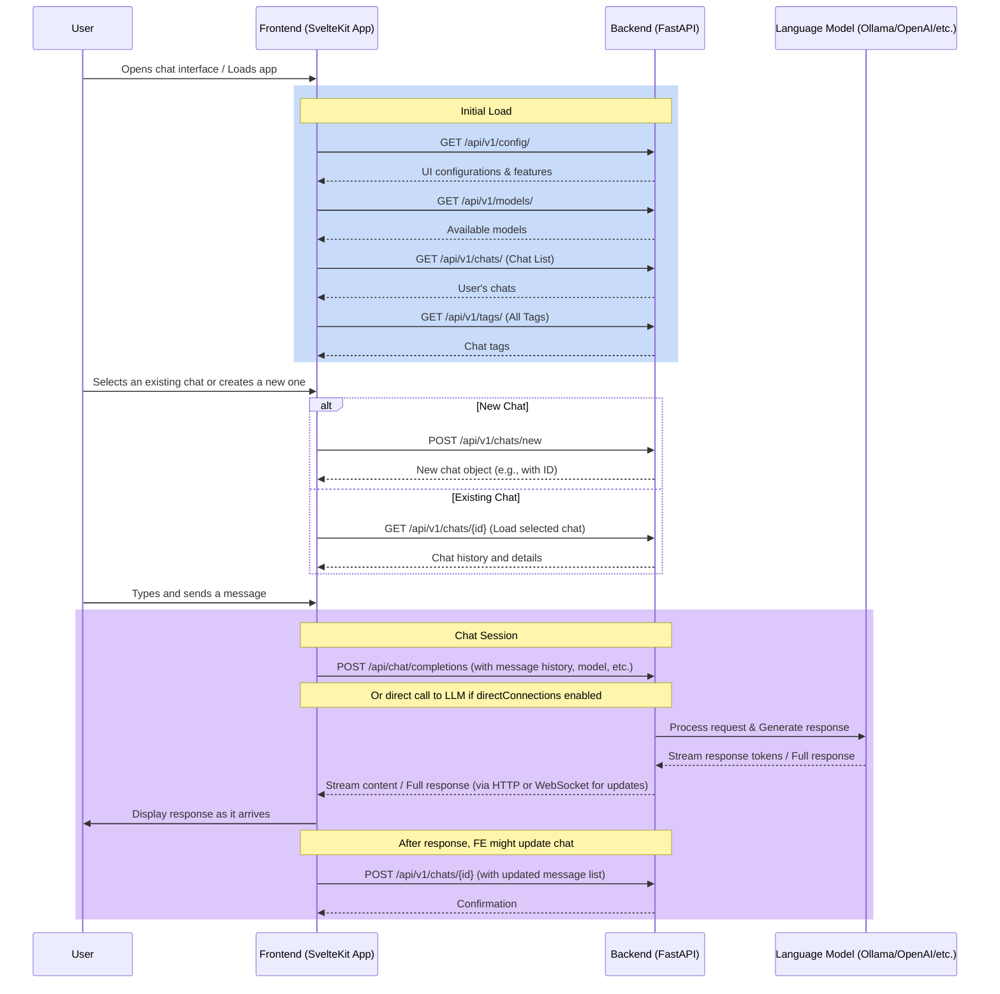
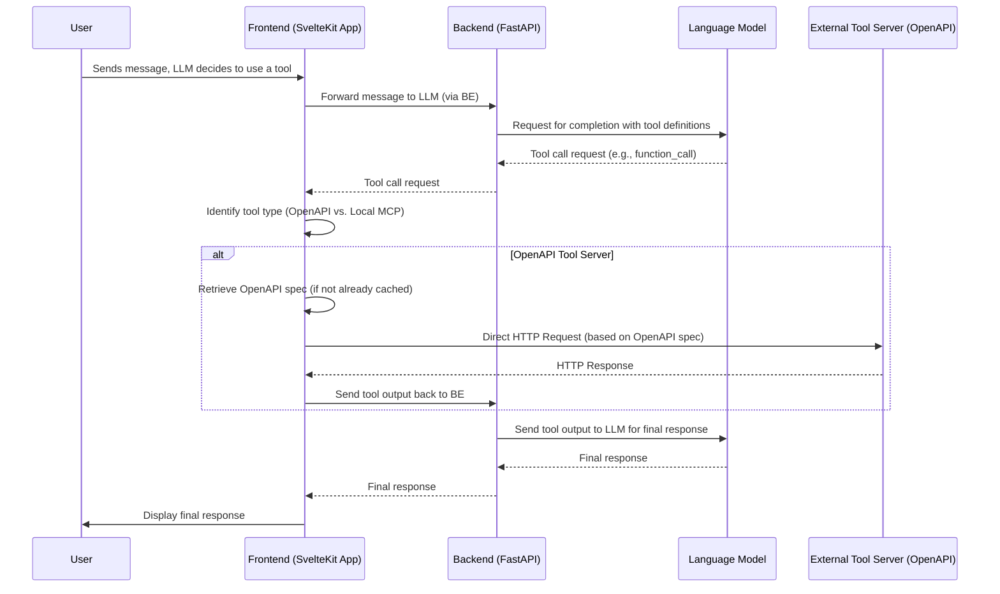
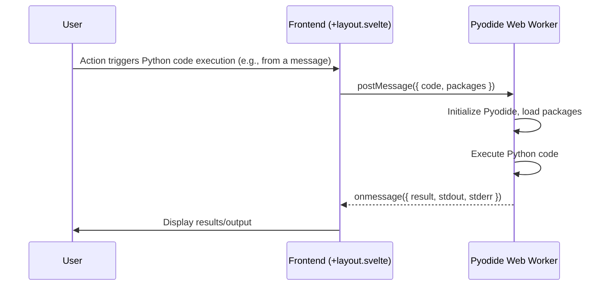
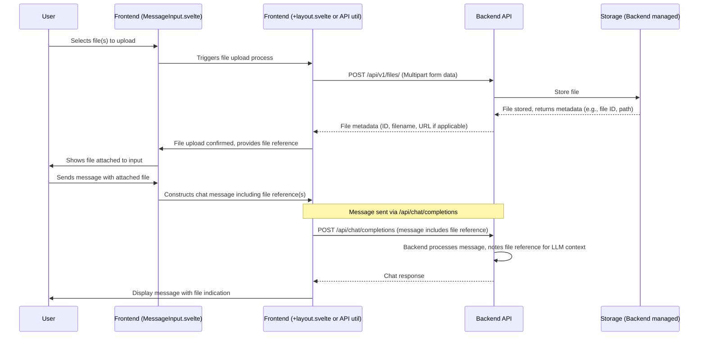

# Chat Flow Documentation

## Overview
This document describes the interaction flow between the frontend chat components, backend API endpoints, and external services like LLMs and Tool Servers in the OpenWebUI chat system.

## Frontend Components
Located in `src/lib/components/chat/` and related areas:

### Main Chat Interface Components
- **`Chat.svelte`**: Main chat container, orchestrates the chat experience. (Typically rendered by `src/routes/(app)/+page.svelte`)
- **`Messages.svelte`**: Displays the list of chat messages.
- **`MessageInput.svelte`**: User input area for composing messages, handling attachments, and triggering send.
- **`ChatControls.svelte`**: Contains action buttons relevant to the current chat (e.g., regenerate, copy, edit).
- **`ModelSelector.svelte`**: Allows users to select the AI model for the conversation.
- **`src/routes/+layout.svelte`**: Handles global aspects like WebSocket connections, Python code execution via Pyodide, and orchestrating calls to Tool Servers.

### Modals & Feature Components
- **`TagChatModal.svelte`**: For adding/editing tags associated with a chat.
- **`ShareChatModal.svelte`**: For generating a shareable link for a chat.
- **`SettingsModal.svelte`**: For user-specific and application-wide settings.
- **`ToolServersModal.svelte`**: Interface for users to configure connections to external Tool Servers.
- **File Upload**: Integrated into `MessageInput.svelte`, interacts with `POST /api/v1/files/`.

## Backend API Endpoints (Primarily from `backend/open_webui/routers/`)

Base path for most APIs: `/api/v1/`

### Configuration & General
- `GET /api/v1/config/`: Load UI and backend feature configurations.
- `GET /api/v1/models/`: Get list of all available/configured AI models.
- `GET /api/v1/tags/`: Get all unique tags used across chats.

### Chat Management (`chats.py`)
- `GET /api/v1/chats/`: Get user's chat list (can include filters for pinned, archived, folder_id).
- `POST /api/v1/chats/new`: Create a new chat session.
- `GET /api/v1/chats/{id}`: Get a specific chat by its ID.
- `POST /api/v1/chats/{id}`: Update a chat (e.g., its content, title, folder_id, archived status).
- `DELETE /api/v1/chats/{id}`: Delete a chat.

### Chat Features (`chats.py`)
- `POST /api/v1/chats/{id}/share`: Create a shareable link for a chat.
- `DELETE /api/v1/chats/{id}/share`: Remove a shareable link for a chat.
- `GET /api/v1/chats/share/{share_id}`: Access a publicly shared chat (implementation detail, actual endpoint might vary).
- `POST /api/v1/chats/{id}/tags`: Add a tag to a chat.
- `DELETE /api/v1/chats/{id}/tags/{tag_name}`: Remove a tag from a chat.
- `POST /api/v1/chats/{id}/pin`: Pin/unpin a chat.
- `POST /api/v1/chats/{id}/clone`: Clone an existing chat.
- `POST /api/v1/chats/{id}/archive`: Archive/unarchive a chat.

### LLM Interaction & Generation
- `POST /api/chat/completions`: Main endpoint for generating chat completions, handled in `main.py` and delegating to `open_webui.utils.chat`.
- Frontend can also make direct calls to OpenAI-compatible APIs if `directConnections` are configured in user settings (handled in `src/routes/+layout.svelte`).
- Ollama-specific (from `ollama.py` if Ollama is enabled):
    - `GET /api/tags`: Get Ollama-specific models.
    - `POST /api/chat`: Ollama-specific chat completion.
    - `POST /api/generate`: Ollama-specific text generation.
    - `POST /api/embeddings`: Ollama-specific embeddings generation.

### File Management (`files.py`)
- `POST /api/v1/files/`: Upload a new file.
- `GET /api/v1/files/`: List user's uploaded files.
- `GET /api/v1/files/{id}/content`: Download/access file content.

## Window Refresh / Initial Load API Flow
1.  **Load Configuration & Models:**
    *   `FE -> BE: GET /api/v1/config/` (Loads essential UI configurations and feature flags)
    *   `FE -> BE: GET /api/v1/models/` (Fetches list of available AI models)
2.  **Load User-Specific Chat Data (after authentication):**
    *   `FE -> BE: GET /api/v1/chats/` (Loads user's chat list, including pinned status)
    *   `FE -> BE: GET /api/v1/tags/` (Loads all unique chat tags for filtering)
4.  **If Navigating to an Existing Chat:**
    *   `FE -> BE: GET /api/v1/chats/{id}` (Loads the content of the specific chat)

## Interaction Flows

### Chat Initialization & Message Sending Flow

### Tool Execution Flow (Unified)
This flow describes how tools are executed, differentiating between external (backend-proxied) and local (frontend-direct) tool servers.

### Custom Python Tool Execution Flow (via Pyodide Worker)
This flow describes when frontend executes Python code using the integrated Pyodide worker.

### File Upload Flow

## Chat Window Components (Key Areas)

### Main Interface Structure
- **Sidebar (`AppSidebar.svelte` or similar):** Navigation for chat history, new chat, access to folders, tags, settings, etc.
- **Chat View Area:**
    - **Model Selector/Header:** Displays current model, options to change model, chat-specific actions.
    - **Message Display Area (`Messages.svelte`):** Shows the conversation history, including user messages, AI responses, and tool outputs.
    - **Input Area (`MessageInput.svelte`):** Text input field with support for attachments (files), rich text formatting, and sending messages.

### Core Action Buttons/Features
- **New Chat:** Initiates a new conversation session.
- **Send Message:** Submits the current input to the selected AI model.
- **Model Selection:** Allows changing the underlying language model.
- **File Upload:** Attach files to be included in the chat context or processed by tools.
- **Settings Access:** Opens modals for user, chat, or application settings.

### Tool & Function Integration
- **Code Execution:** Allows running Python code snippets within the chat (via Pyodide). Results are displayed back.
- **External Tool Servers:** Connects to and utilizes pre-configured external tools.
- **Knowledge Base Access:** (If RAG is enabled) Allows chat to reference documents from integrated knowledge bases.

### Organization & Management Features
- **Folders:** Group related chats for better organization.
- **Tags:** Label conversations with custom tags for easy filtering and identification.
- **Search:** Functionality to search through chat history or titles.
- **Pin/Archive/Delete:** Standard chat management actions.
- **Share Chat:** Generate shareable links for conversations.
